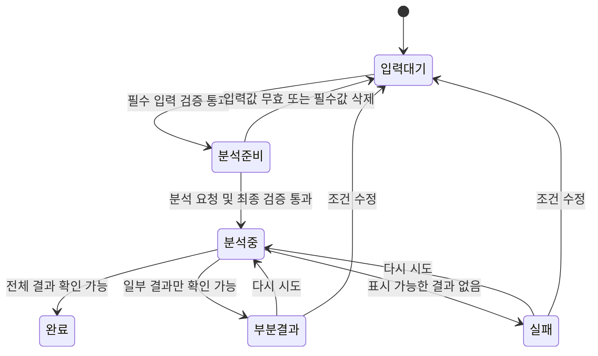
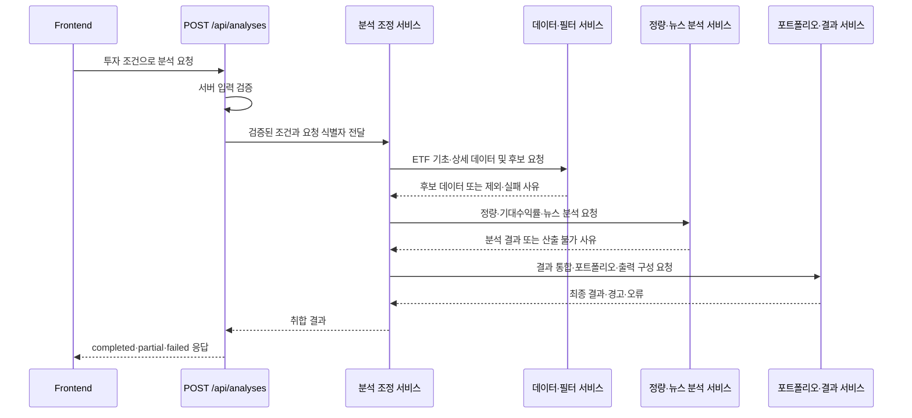
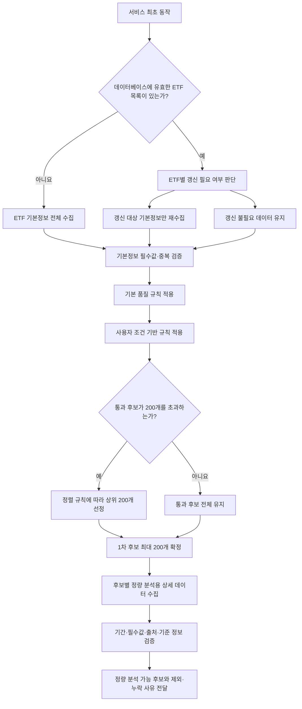
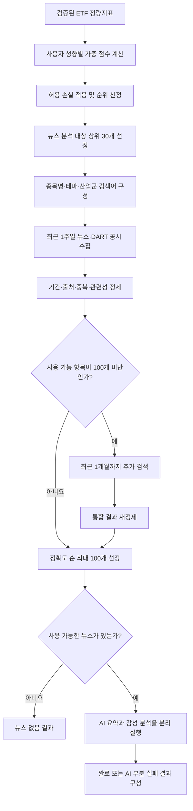
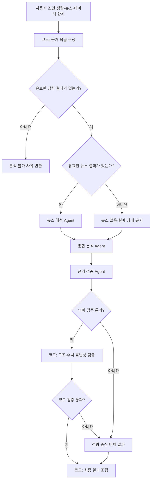

# 기능 분해표 — 사용자 화면, API, ETF 데이터, 정량분석 및 뉴스 분석 기능

## 1. 프로젝트 정보

| 항목 | 내용 |
| --- | --- |
| 프로젝트명 | AI 에이전트를 활용한 금융 데이터 분석 및 추천 시스템 |
| 기준 문서 | `docs/requirements.md` |
| 적용 템플릿 | `C:\Users\Miche\.codex\templates\function-breakdown-template.md` |
| 템플릿 적용 목적 | 사용자 화면·API·ETF 데이터·정량분석·뉴스 분석 기능을 입력·처리·출력 단위로 분해하기 위한 기본 표 구조 참조 |
| 작성일 | 2026-08-01 |
| 현재 작업 범위 | 투자 조건 입력·상태 표시 사용자 화면, 단일 공개 분석 API, Backend 내부 서비스 API, ETF 데이터 수집·필터링·정량분석 및 뉴스 수집·정제·AI 분석 기능 |
| ETF 시장 범위 | 국내 상장 ETF만 MVP 분석 대상으로 한다. |
| MVP 외부 서비스 | KRX, ETF 운용사 공식 자료, DART, 일반 뉴스 API와 AI 분석을 모두 포함한다. |

## 2. 범위 정의

### 2.1 포함 범위

- 투자 조건 입력 화면
- 필수 투자 조건 입력 영역
- 선택 분석 조건 입력 영역
- 필수값·자료형·허용 범위 검증
- 필드별 수정 안내 메시지
- 분석 요청 버튼과 버튼 상태
- 분석 전, 분석 중, 완료, 실패, 부분 결과 상태 표시의 기본 구조
- Frontend에서 Backend로 분석을 요청하는 `POST /api/analyses`
- Backend 내부 분석 단계별 서비스 API와 오류·부분 결과 전달 구조
- 서비스 최초 동작 시 ETF 기본정보 목록 존재 여부 확인
- ETF 기본정보의 선택적 갱신과 데이터베이스 반영
- 사용자 조건 기반 1차 규칙 필터링과 최대 200개 후보 제한
- 1차 후보 ETF의 정량 분석용 가격·거래·상품 분류 데이터 수집과 검증
- ETF 수수료·누적 수익률·변동성·MDD·샤프지수·유동성·종목 편입 비중·기대수익률 산출과 검증
- 사용자 위험 성향별 정량 가중 점수, 뉴스 분석 대상 상위 30개 선정, 뉴스·DART 수집, 정제·요약·감성 분석

### 2.2 제외 범위

- 정량·뉴스 결과를 이용한 최종 포트폴리오 구성과 상세 결과 화면
- 기대수익률, 포트폴리오 및 위험요인 결과의 상세 화면
- AI Agent 처리 흐름
- ETF 기본정보 외 데이터베이스 설계와 사용자 입력 저장
- 회원가입·로그인·결제·관리자 기능
- `POST /api/analyses` 이외의 Frontend 공개 Endpoint
- 실제 화면·API 코드와 스타일 구현

## 3. 사용자 화면 기능 분해표

| 대분류 | 세부 기능 | 입력 | 처리 | 출력 | 구현 우선순위 | 관련 Agent/API |
| --- | --- | --- | --- | --- | --- | --- |
| 화면 구성 | 투자 조건 입력 화면 기본 구조 | 없음 | 화면 제목, 입력 안내, 필수 조건 영역, 선택 조건 영역, 분석 요청 영역, 처리 상태 영역을 한 화면 흐름으로 배치한다. | 투자 조건을 순서대로 입력할 수 있는 화면 구조 | 높음 | Frontend |
| 필수 조건 입력 | 투자금 입력 | 원화 투자금 | 100만 원 이상 10억 원 이하의 숫자를 입력받고 원화(KRW)로 표시한다. | 입력된 원화 투자금 | 높음 | Frontend |
| 필수 조건 입력 | 투자 기간 입력 | 투자 기간 숫자, 기간 단위 | 1개월 이상 5년 이하 범위에서 월 또는 연 단위를 함께 입력받는다. | 입력된 투자 기간과 단위 | 높음 | Frontend |
| 필수 조건 입력 | 위험 성향 선택 | 안정형·중립형·공격형 중 하나 | 각 선택값의 의미를 짧게 안내하고 하나의 값만 선택하도록 한다. | 선택된 위험 성향 | 높음 | Frontend |
| 필수 조건 입력 | 허용 손실 입력 | 허용 손실 백분율 | 사용자가 감수할 수 있는 최대 손실 범위를 백분율로 입력하도록 한다. | 입력된 허용 손실률 | 높음 | Frontend |
| 선택 조건 입력 | 선호 자산 선택 | 주식형·채권형·배당형 | 사용자가 하나 이상의 선호 자산을 복수 선택하거나 선택하지 않고 넘어갈 수 있게 한다. 직접 입력은 허용하지 않는다. | 선택된 선호 자산 목록 또는 미선택 상태 | 높음 | Frontend |
| 선택 조건 입력 | 현금성 비중 입력 | 0~100%의 현금성 비중 | 사용자가 포트폴리오 투자금 중 현금성 자산으로 유지하려는 비율을 직접 선택하거나 미입력할 수 있게 한다. 미입력 시 시스템이 임의 기본값을 적용하지 않는다. | 사용자 선택 현금성 비중 또는 미선택 상태 | 높음 | Frontend |
| 입력 편의 | 필수·선택 항목 구분 | 각 입력 필드의 필수 여부 | 필수 필드에는 일관된 필수 표시를 하고 선택 필드에는 선택 사항임을 표시한다. | 사용자가 필수 입력을 식별할 수 있는 라벨 | 높음 | Frontend |
| 입력 검증 | 필수값 누락 검증 | 투자금, 통화, 투자 기간, 기간 단위, 위험 성향, 허용 손실 | 비어 있는 필수 필드를 한 번에 식별하고, 선택 조건의 미입력은 오류로 처리하지 않는다. | 필드별 누락 상태와 검증 결과 | 높음 | Frontend |
| 입력 검증 | 자료형 검증 | 각 필드의 입력값 | 투자금은 숫자, 투자 기간은 정수, 허용 손실은 숫자, 위험 성향과 단위는 정의된 선택값인지 확인한다. | 필드별 자료형 유효·무효 상태 | 높음 | Frontend |
| 입력 검증 | 허용 범위 검증 | 자료형 검증을 통과한 입력값 | 투자금은 100만 원 이상 10억 원 이하인지, 투자 기간은 1개월 이상 5년 이하인지, 허용 손실은 0 이상 100 이하인지 확인한다. | 필드별 범위 유효·무효 상태 | 높음 | Frontend |
| 입력 검증 | 선택값 검증 | 위험 성향, 기간 단위, 선호 자산 | 화면에서 제공한 선택값과 일치하는지 확인한다. | 선택값 유효·무효 상태 | 높음 | Frontend |
| 오류 안내 | 필드별 수정 안내 메시지 | 필드명, 오류 유형, 허용 형식·범위 | 오류가 발생한 필드 바로 아래에 원인과 수정 방법을 구체적으로 표시한다. 다른 유효 입력값은 유지한다. | 필드별 오류 메시지 | 높음 | Frontend |
| 오류 안내 | 오류 필드 강조 및 이동 지원 | 오류가 있는 필드 목록 | 오류 필드를 시각적으로 구분하고, 분석 요청 시 첫 번째 오류 필드로 확인 위치를 이동한다. | 사용자가 수정할 위치를 인식할 수 있는 화면 상태 | 높음 | Frontend |
| 오류 안내 | 오류 해제 | 사용자가 수정한 필드값 | 수정된 값을 다시 검증하고 유효해진 필드의 오류 메시지와 강조 상태만 해제한다. | 갱신된 필드 검증 상태 | 높음 | Frontend |
| 분석 요청 | 분석 요청 버튼 기본 표시 | 현재 입력값과 화면 상태 | 입력 영역 다음에 분석 요청 버튼을 표시하고 버튼의 목적을 명확히 표현한다. | 분석 요청 버튼 | 높음 | Frontend |
| 분석 요청 | 버튼 활성화 조건 | 필수 필드의 검증 상태, 현재 처리 상태 | 모든 필수 필드가 유효하고 분석 중이 아닐 때만 요청 가능 상태로 전환한다. | 활성 또는 비활성 버튼 상태 | 높음 | Frontend |
| 분석 요청 | 분석 요청 전 최종 검증 | 전체 필수·선택 입력값 | 버튼 선택 시 모든 필드를 다시 검증하고 오류가 있으면 요청 진행 상태로 전환하지 않는다. | 검증 완료 상태 또는 필드별 수정 안내 | 높음 | Frontend |
| 분석 요청 | 중복 요청 방지 | 분석 요청 동작, 현재 처리 상태 | 분석 중에는 버튼을 비활성화하고 반복 선택이 새로운 요청으로 처리되지 않도록 화면 상태를 유지한다. | 중복 요청이 차단된 분석 중 화면 | 높음 | Frontend |
| 상태 표시 | 분석 전 상태 | 초기 화면 또는 유효한 입력 완료 상태 | 입력 안내와 분석 요청 가능 여부를 표시하고 결과 영역은 비어 있는 기본 상태로 유지한다. | 입력 대기 또는 분석 준비 상태 | 높음 | Frontend |
| 상태 표시 | 분석 중 상태 | 분석 시작 상태, 선택적으로 제공되는 진행 단계명 | 진행 중임을 알리는 상태 문구와 표시 요소를 제공하고, 입력 변경 및 중복 요청 가능 여부를 명확히 표시한다. | 분석 중 상태와 진행 안내 | 높음 | Frontend |
| 상태 표시 | 분석 완료 상태 | 완료 상태, 결과 확인 가능 여부 | 분석이 완료되었음을 표시하고 결과를 확인할 수 있는 영역이 준비되었음을 안내한다. | 분석 완료 상태 안내 | 높음 | Frontend |
| 상태 표시 | 분석 실패 상태 | 실패 상태, 사용자에게 공개 가능한 실패 사유 | 실패한 단계와 다시 시도하거나 입력을 수정하는 등 다음 행동을 안내한다. 민감한 시스템 정보는 표시하지 않는다. | 실패 안내와 사용자 후속 행동 | 높음 | Frontend |
| 상태 표시 | 부분 결과 상태 | 부분 완료 상태, 성공 항목과 실패·누락 항목 요약 | 확인 가능한 결과가 일부 존재함을 표시하고, 제공 가능한 결과와 제공할 수 없는 결과를 구분한다. | 부분 결과 안내, 누락·실패 항목과 사유 | 높음 | Frontend |
| 상태 전환 | 상태별 화면 일관성 유지 | 분석 전·중·완료·실패·부분 결과 상태 | 한 시점에 하나의 대표 상태만 표시하고, 현재 상태와 맞지 않는 안내·버튼 상태가 함께 노출되지 않도록 한다. | 모순이 없는 화면 상태 | 높음 | Frontend |
| 접근성 | 상태와 오류의 텍스트 안내 | 필드 오류와 분석 상태 | 색상에만 의존하지 않고 필드명, 오류 원인, 현재 상태를 텍스트로도 전달한다. | 보조기술로도 식별 가능한 오류·상태 안내 | 중간 | Frontend |

## 4. 입력 필드 및 검증 기준

| 필드 | 필수 여부 | 입력 형식 | 유효 조건 | 오류 메시지 예시 |
| --- | --- | --- | --- | --- |
| 투자금 | 필수 | 숫자 | 1,000,000 이상 1,000,000,000 이하 | 투자금은 100만 원에서 10억 원 사이의 원화 금액으로 입력해 주세요. |
| 통화 | 필수 | 고정값 | KRW | 통화는 원화(KRW)만 지원합니다. |
| 투자 기간 | 필수 | 정수 | 월 환산 기준 1개월 이상 60개월 이하 | 투자 기간은 1개월에서 5년 사이로 입력해 주세요. |
| 기간 단위 | 필수 | 단일 선택값 | 월 또는 연 | 투자 기간의 단위를 선택해 주세요. |
| 위험 성향 | 필수 | 단일 선택값 | 안정형·중립형·공격형 중 하나 | 위험 성향을 선택해 주세요. |
| 허용 손실 | 필수 | 숫자·백분율 | 0 이상 100 이하 | 허용 손실은 0에서 100 사이의 숫자로 입력해 주세요. |
| 선호 자산 | 선택 | 복수 선택값 | 주식형·채권형·배당형 또는 미선택 | 제공되는 항목 중에서 선택해 주세요. 선택하지 않아도 분석할 수 있습니다. |
| 현금성 비중 | 선택 | 숫자·백분율 | 0 이상 100 이하 또는 미입력 | 현금성 비중은 0에서 100 사이로 입력해 주세요. 입력하지 않아도 분석할 수 있습니다. |

검증 시 공통 적용 기준:

- 앞뒤 공백은 값 검증 전에 제거한 것으로 취급한다.
- 숫자 필드에 숫자로 해석할 수 없는 문자가 포함되면 자료형 오류로 처리한다.
- 여러 필드에 오류가 있으면 첫 번째 오류만 표시하지 않고 모든 필드 오류를 함께 표시한다.
- 오류 수정 과정에서 오류가 없는 다른 필드의 입력값을 삭제하거나 변경하지 않는다.
- 선택 분석 조건이 비어 있다는 이유만으로 분석 요청을 차단하지 않는다.

## 5. 화면 상태 정의

| 상태 | 진입 조건 | 화면 표시 | 분석 요청 버튼 | 사용자 가능 행동 |
| --- | --- | --- | --- | --- |
| 입력 대기 | 초기 진입 또는 필수 입력 미완료 | 입력 안내와 미완료 필드 상태 | 비활성 | 조건 입력·수정 |
| 분석 준비 | 모든 필수 입력이 유효함 | 입력 완료 상태 | 활성 | 분석 요청 또는 조건 수정 |
| 분석 중 | 최종 검증을 통과한 분석 요청이 시작됨 | 진행 표시와 중복 요청 방지 안내 | 비활성 | 진행 상태 확인 |
| 완료 | 분석 결과 전체가 확인 가능한 상태 | 완료 안내와 결과 확인 가능 표시 | 재요청 정책 확정 전까지 비활성 | 결과 영역 확인 |
| 실패 | 표시 가능한 결과 없이 분석이 종료됨 | 실패 단계·사유·다음 행동 안내 | 입력값이 유효하면 다시 시도 가능 | 다시 시도 또는 조건 수정 |
| 부분 결과 | 일부 결과는 확인 가능하지만 하나 이상의 분석 항목이 실패하거나 누락됨 | 성공 결과와 누락 항목·사유를 구분한 안내 | 입력값이 유효하면 다시 시도 가능 | 부분 결과 확인, 다시 시도 또는 조건 수정 |



## 6. 화면 기능 완료 조건

| 구분 | 완료 조건 |
| --- | --- |
| 화면 구조 | 필수 조건, 선택 조건, 분석 요청, 처리 상태 영역이 구분되어 있다. |
| 입력 | 투자금·통화·투자 기간·기간 단위·위험 성향·허용 손실을 입력할 수 있고 선호 자산은 선택적으로 입력할 수 있다. |
| 검증 | 필수값, 자료형, 허용 범위와 선택값 검증 결과를 필드별로 확인할 수 있다. |
| 오류 안내 | 잘못된 각 필드에 원인과 수정 방법이 표시되고 다른 유효 입력값은 유지된다. |
| 분석 요청 | 필수 입력이 유효할 때만 요청할 수 있고 분석 중 중복 요청이 차단된다. |
| 상태 표시 | 분석 전·분석 중·완료·실패·부분 결과 상태가 서로 구분되며 한 시점에 하나의 대표 상태가 표시된다. |
| 범위 준수 | 사용자 화면, 단일 공개 분석 API와 내부 서비스 API 외의 기능 및 실제 코드는 포함하지 않는다. |

## 7. 화면 기능 구현 순서 제안

| 순서 | 기능 | 이유 |
| --- | --- | --- |
| 1 | 화면 영역과 입력 필드 기본 구조 | 나머지 화면 기능이 연결될 기준 구조이다. |
| 2 | 필수·선택 입력 기능 | 사용자 조건을 화면에서 구성하기 위한 기본 기능이다. |
| 3 | 필수값·자료형·범위 검증 | 잘못된 요청을 화면 단계에서 식별하기 위해 필요하다. |
| 4 | 필드별 수정 안내 | 사용자가 검증 오류를 직접 수정할 수 있어야 한다. |
| 5 | 분석 요청 버튼과 중복 요청 방지 | 유효한 조건만 분석 흐름으로 전달하기 위해 필요하다. |
| 6 | 분석 전·중 상태 표시 | 요청 시작 전후의 기본 피드백을 제공한다. |
| 7 | 완료·실패·부분 결과 상태 표시 | 분석 종료 유형에 따라 사용자의 다음 행동을 안내한다. |
| 8 | 상태·오류 접근성 점검 | 화면 상태와 오류가 색상 외의 방식으로도 전달되는지 확인한다. |

## 8. 확인 필요 사항

| 항목 | 확인 내용 | 현재 처리 |
| --- | --- | --- |
| 분석 중 진행 단계 | 단일 진행 표시 또는 단계별 진행 표시 여부 | 기본 진행 상태와 선택적 단계명 표시가 가능한 구조로 정의 |
| 완료 후 재분석 | 사용자 분석 결과를 저장·재사용하지 않으므로 동일 조건도 새로운 분석 요청으로 처리한다. 갱신 기준을 충족하는 ETF 기준 데이터 캐시만 재사용한다. | 새로운 분석 요청 상태와 사용한 ETF 기준 데이터의 기준일·갱신일 표시 |
| 부분 결과 범위 | 분석 기간·영업일 수, 정상 분석 소스 수와 비율, 매핑된 구성 종목 수, 최종 산출 지표를 성공 항목으로 표시한다. 누락 영업일, AI 실패·시간 초과 건수, 미분류 사유를 실패 항목으로 표시한다. | 성공·실패 항목과 사유를 구분 표시 |

## 9. API 범위와 구분 원칙

| 구분 | 호출 주체 | 호출 대상 | 공개 여부 | 적용 원칙 |
| --- | --- | --- | --- | --- |
| Frontend 공개 API | Frontend | Backend 분석 접점 | 공개 | `POST /api/analyses` 하나만 사용한다. 입력 검증부터 최종 응답 반환까지 하나의 요청 흐름으로 처리한다. |
| Backend 내부 서비스 API | Backend 분석 조정 기능 | 데이터 수집·필터링·분석·결과 구성 서비스 | 비공개 | Frontend가 직접 호출하지 않는다. 공개 URL을 추가하지 않고 내부 서비스 계약으로 구분한다. |

MVP는 동기식 요청·응답 방식으로 처리한다. Frontend가 `POST /api/analyses`로 투자 조건을 한 번 전달하면 Backend는 동일한 요청 연결 안에서 내부 서비스를 순차적으로 호출하고, 최대 3분(180초) 안에 완료·부분 결과·실패 중 하나의 최종 응답을 반환한다. 별도의 작업 ID, 상태 조회 요청과 폴링은 사용하지 않는다. 3분(180초) 안에 전체 처리를 완료하지 못하면 그 시점까지 검증된 결과가 있으면 시간 초과 사유를 포함한 부분 결과를 반환하고, 검증된 결과가 없으면 실패 응답을 반환한다.

## 10. Frontend 공개 API 기능 목록

### 10.1 공개 API 기능 분해표

| 대분류 | 세부 기능 | 입력 | 처리 | 출력 | 구현 우선순위 | 관련 Agent/API |
| --- | --- | --- | --- | --- | --- | --- |
| 공개 API | 분석 요청 수신 | 투자 조건 요청 데이터 | `POST /api/analyses`로 전달된 요청 형식과 요청 식별 정보를 확인한다. | 수신된 분석 요청 | 높음 | Backend API |
| 공개 API | 서버 입력 검증 | 투자금·통화·투자 기간·기간 단위·위험 성향·허용 손실·선호 자산 | 필수값, 자료형, 허용 범위와 선택값을 Frontend 검증과 동일한 기준으로 다시 검증한다. | 검증된 투자 조건 또는 필드별 오류 목록 | 높음 | Backend API |
| 공개 API | 내부 분석 흐름 시작 | 검증된 투자 조건 | 분석 조정 서비스에 내부 처리 순서를 요청하고 요청 식별자를 전체 내부 호출에 전달한다. | 내부 분석 실행 상태 | 높음 | Backend API / Internal Services |
| 공개 API | 내부 결과 취합 | 내부 서비스별 성공 결과·경고·실패 정보 | 결과의 필수 항목, 출처·기준 시점, 산출 불가 사유와 책임 제한 안내를 확인한다. | 완료·부분 결과·실패 응답 후보 | 높음 | Backend API / Internal Services |
| 공개 API | 완료 응답 반환 | 전체 필수 분석 결과 | 상태를 `completed`로 지정하고 화면에 필요한 최종 결과와 기준 정보를 반환한다. | 완료 응답 | 높음 | Backend API |
| 공개 API | 부분 결과 응답 반환 | 일부 성공 결과와 일부 실패·누락 결과 | 사용 가능한 결과는 유지하고, 누락 항목·실패 서비스·사용자 공개 사유를 구분해 상태를 `partial`로 지정한다. | 부분 결과 응답 | 높음 | Backend API |
| 공개 API | 실패 응답 반환 | 입력 오류 또는 표시 가능한 분석 결과가 없는 실패 | 사용자 수정 가능 오류와 재시도 가능 오류를 구분하고 민감한 내부 정보 없이 실패 내용을 반환한다. | 실패 응답 | 높음 | Backend API |
| 공개 API | 응답 데이터 보호 | 최종 응답, 내부 오류, 외부 서비스 오류 | API 키·토큰·내부 예외 상세와 개인 식별 정보를 응답에서 제외한다. | 사용자에게 공개 가능한 응답 | 높음 | Backend API |

### 10.2 공개 Endpoint

| 기능 | Method | Endpoint | 설명 | 우선순위 |
| --- | --- | --- | --- | --- |
| ETF 분석 요청 및 결과 반환 | POST | `/api/analyses` | 투자 조건을 받아 내부 분석 서비스를 순차적으로 호출하고 완료·부분 결과·실패 중 하나의 응답을 반환한다. | 높음 |

### 10.3 요청 데이터

| 필드 | 필수 여부 | 형식 | 검증 기준 | 사용 목적 |
| --- | --- | --- | --- | --- |
| 요청 식별자 | 선택 | 텍스트 | 비어 있지 않은 텍스트인 경우에만 사용 | 동일 요청의 화면·Backend 로그 연결과 중복 요청 식별 보조 |
| 투자금 | 필수 | 숫자 | 1,000,000 이상 1,000,000,000 이하 | 투자 조건 및 포트폴리오 금액 예시 계산 |
| 통화 | 필수 | 고정값 | KRW | 투자금과 금액 결과의 통화 기준 |
| 투자 기간 | 필수 | 정수 | 월 환산 기준 1 이상 60 이하 | 분석 기간과 누적 기대수익률 기간 기준 |
| 기간 단위 | 필수 | 선택값 | 월 또는 연 | 투자 기간의 단위 해석 |
| 위험 성향 | 필수 | 선택값 | 안정형·중립형·공격형 중 하나 | 필터링·점수화·포트폴리오 구성 기준 |
| 허용 손실 | 필수 | 숫자·백분율 | 0 이상 100 이하 | MDD 기반 2차 후보 필터링 기준 |
| 선호 자산 | 선택 | 선택값 목록 | 주식형·채권형·배당형 또는 빈 목록 | 사용자 조건 기반 1차 후보 필터링 |
| 현금성 비중 | 선택 | 숫자·백분율 | 0 이상 100 이하 또는 미입력 | 포트폴리오 구성 준비에 사용할 사용자 선택값; 미입력 시 기본값 미적용 |

### 10.4 응답 데이터 기본 구조

| 필드 | 적용 상태 | 의미 | 값이 없을 때 처리 |
| --- | --- | --- | --- |
| 요청 식별자 | 모든 응답 | 하나의 공개 요청과 내부 처리 기록을 연결하는 값 | Backend가 생성하여 반환 |
| 상태 | 모든 응답 | `completed`, `partial`, `failed` 중 하나 | 누락된 응답은 유효하지 않은 것으로 처리 |
| 사용자 입력 요약 | 완료·부분 결과 | 실제 분석에 적용한 투자 조건 | 누락 시 결과를 완료로 처리하지 않음 |
| 분석 결과 | 완료·부분 결과 | ETF 후보·포트폴리오·기대수익률 추정치·선정 근거·주요 종목 편입 현황·위험요인 | 부분 결과에서는 제공 가능한 항목만 포함하고 누락 사유 표시 |
| 데이터 기준 정보 | 완료·부분 결과 | 데이터 출처·가격 기준일·수집 기준 시점·뉴스 발행 시점·통화·단위 | 출처와 기준을 확인할 수 없는 결과 항목은 응답에서 제외 |
| 경고 목록 | 부분 결과, 필요 시 완료 | 누락 데이터·산출 불가 항목·제외 ETF와 사용자 확인 사항 | 경고가 없으면 빈 목록으로 처리 |
| 오류 목록 | 실패·부분 결과 | 오류 대상 필드 또는 내부 처리 단계, 오류 유형, 사용자 안내 메시지 | 내부 예외 상세·API 키·토큰은 포함하지 않음 |
| 책임 제한 안내 | 완료·부분 결과 | 정보 제공 목적, 추정치의 한계와 비보장 안내 | 누락 시 최종 결과를 반환하지 않음 |

## 11. 공개 API 응답 상태와 화면 연결

| API 처리 상황 | HTTP 결과 분류 | 응답 상태 | Frontend 화면 상태 | 사용자 안내 기준 |
| --- | --- | --- | --- | --- |
| 모든 필수 분석 결과 생성 | 성공 | `completed` | 완료 | 전체 결과 확인 가능 안내 |
| 일부 데이터·분석 결과 누락, 나머지 결과는 유효 | 성공 | `partial` | 부분 결과 | 제공 결과와 누락 항목·사유를 구분해 안내 |
| 필수값·자료형·범위·선택값 오류 | 사용자 요청 오류 | `failed` | 실패 후 입력 수정 | 오류 필드와 수정 기준을 필드별로 안내 |
| 외부 데이터 장애로 표시 가능한 결과 없음 | 서비스 이용 불가 | `failed` | 실패 | 재시도 가능 여부와 실패한 데이터 범주 안내 |
| 내부 처리 오류로 표시 가능한 결과 없음 | 서버 처리 오류 | `failed` | 실패 | 일반화된 실패 메시지와 재시도 안내 |
| 네트워크 단절 또는 응답 시간 초과 | 응답 수신 실패 | 응답 없음 | 실패 | 연결 상태 확인과 다시 시도 안내 |

공개 API 응답 전까지 Frontend가 표시하는 `분석 중`은 서버 응답의 최종 `status` 값이 아니라 화면의 임시 처리 상태이다.

## 12. Backend 내부 서비스 API 기능 목록

내부 서비스 API는 `POST /api/analyses`의 처리 과정에서 Backend가 호출하는 비공개 계약이다. 아래 항목은 공개 HTTP Endpoint가 아니며 Frontend가 직접 접근하지 않는다.

| 순서 | 내부 서비스 API | 호출 주체 | 입력 | 처리 책임 | 출력 | 실패·부분 결과 기준 | 우선순위 |
| --- | --- | --- | --- | --- | --- | --- | --- |
| 1 | 투자 조건 검증 서비스 | 공개 분석 API | 원본 투자 조건 | 필수값·자료형·범위·선택값 검증 및 표준 형식 정리 | 검증된 투자 조건 또는 필드 오류 | 오류가 있으면 후속 서비스를 호출하지 않음 | 높음 |
| 2 | 분석 조정 서비스 | 공개 분석 API | 검증된 투자 조건, 요청 식별자 | 내부 서비스 호출 순서와 성공·실패 상태를 관리하고 결과를 취합 | 서비스별 처리 상태와 최종 취합 결과 | 일부 서비스 실패 시 계속 진행 가능 여부를 판단 | 높음 |
| 3 | ETF 기초 데이터 서비스 | 서비스 시작 처리·분석 조정 서비스 | 데이터베이스 ETF 목록, 분석 대상 시장·ETF 범위, 갱신 기준 시점 | 기존 목록 존재 여부와 항목별 갱신 필요 여부를 확인하고 종목명·코드·유형·갱신일 등 기본정보만 선택적으로 수집·반영 | 사용 가능한 ETF 기본정보 목록, 갱신 결과와 실패 항목 | 기존 유효 데이터가 있으면 유지하고 갱신 실패를 기록하며, 사용 가능한 목록이 없으면 분석 실패 | 높음 |
| 4 | ETF 1차 필터 서비스 | 분석 조정 서비스 | 검증된 사용자 조건, 사용 가능한 ETF 기본정보 목록 | 승인된 규칙표에 따라 기본 품질과 기본정보로 판정 가능한 사용자 조건을 적용하고 후보를 최대 200개로 제한 | 최대 200개의 1차 후보 목록과 포함·제외·후순위 사유 | 유효 후보가 없으면 후속 분석 중단 | 높음 |
| 5 | ETF 정량 분석용 상세 데이터 서비스 | 분석 조정 서비스 | 최대 200개의 1차 후보 목록, 사용자 투자 기간, 공통 데이터 기준일 | 정량 분석에 필요한 가격 시계열·조정 여부·거래량·거래대금·자산군 분류와 통화·단위·출처 정보를 후보별로 수집·검증 | 정량 분석 가능 후보별 상세 데이터, 제외 후보와 누락 사유 | 후보별 실패는 제외하고 다른 후보는 유지하며, 유효 후보가 없으면 정량 분석 중단 | 높음 |
| 6 | ETF 정량분석 서비스 | 분석 조정 서비스 | 검증된 후보별 가격·거래·수수료·구성 종목 데이터, 투자 기간, 공통 기준일, 국가별 무위험수익률 | 수수료를 별도 표시하고 누적 수익률·단순/로그 변동성·MDD·샤프지수·유동성·세 종류의 종목 편입 비중·기대수익률을 결정적 계산 규칙으로 산출·검증 | 후보별 정량 결과, 입력·기간·단위·근거 또는 지표별 산출 불가 사유 | 하나의 지표 실패가 근거가 유효한 다른 지표를 삭제하지 않으며 필수 정량 점수 입력 부족 여부를 별도 전달 | 높음 |
| 7 | 성향별 점수화·뉴스 후보 선정 서비스 | 분석 조정 서비스 | 검증된 정량지표, 사용자 위험 성향, 허용 손실, 확정된 가중치표 | 성향별 가중 점수를 계산하고 MDD 조건을 적용한 뒤 뉴스 분석 대상 상위 30개를 선정한다. | 상위 30개 이하 뉴스 분석 후보, 점수·순위·제외 사유 | 점수 산출 후보가 없으면 뉴스 수집을 중단하며, 뉴스 분석 후보와 최종 포트폴리오 후보를 구분 | 높음 |
| 8 | 뉴스·DART 수집 서비스 | 분석 조정 서비스 | 상위 30개 ETF의 종목명·코드·관련 테마·산업군, 검색 기준일 | 기본 최근 1주일 동안 일반 뉴스와 연결 가능한 DART 공시를 수집하고, 정제 후 100개 미만이면 최근 1개월까지 확장한다. | 원천 뉴스·공시 목록, 검색 기간·출처별 수집 상태 | 후보·출처별 실패를 기록하고 다른 수집 결과는 유지 | 높음 |
| 9 | 뉴스 정제·AI 분석 서비스 | 분석 조정 서비스 | 수집 뉴스·공시, 후보별 검색 기준 | 기간·관련성·중복·출처를 검증하고 정확도 순 상위 100개만 사용한 뒤 근거 기반 요약과 감성을 분리 생성한다. | 정제 뉴스 목록, 요약 결과, 감성 결과 또는 뉴스 없음·AI 실패 상태 | 뉴스 없음과 AI 실패를 다른 상태로 반환하며 정량 결과는 유지 | 높음 |
| 10 | 정량·뉴스 통합 서비스 | 분석 조정 서비스 | 정량 결과, 뉴스 분석 결과 또는 뉴스 없음 상태 | 후보별 긍정 요인·주의 요인·분석 한계를 통합 | 후보별 종합 분석 결과 | 근거 없는 설명은 생성하지 않고 근거 부족 상태 기록 | 높음 |
| 11 | 포트폴리오 구성 서비스 | 분석 조정 서비스 | 사용자 조건, 후보별 종합 결과·기대수익률 추정 결과 | ETF 구성 비중, 금액 예시와 포트폴리오 기대수익률을 계산 | 포트폴리오 예시 또는 구성 불가 사유 | 비중 합계가 100%가 아니거나 후보가 없으면 구성 실패 | 높음 |
| 12 | 주요 종목 편입 현황 서비스 | 분석 조정 서비스 | 포트폴리오 ETF, 구성 종목·편입 비중·순자산 규모 | 주요 종목별 ETF 편입률과 총 ETF 자산 비중을 계산 | 주요 종목 편입 현황 또는 산출 불가 사유 | 일부 데이터 누락 시 실제 계산 모집단과 제외 사유를 함께 반환 | 높음 |
| 13 | 결과 조립 서비스 | 분석 조정 서비스 | 포트폴리오·기대수익률·정량·뉴스·주요 종목 결과와 오류·경고 | 공개 응답에 필요한 결과, 기준 정보, 위험요인과 책임 제한 안내를 구성 | 완료·부분 결과·실패 응답 데이터 | 필수 근거·출처·책임 제한 안내가 없으면 완료 응답 금지 | 높음 |

## 13. 공개 API와 내부 서비스 호출 흐름



## 14. API 기능 완료 조건

| 구분 | 완료 조건 |
| --- | --- |
| 공개 Endpoint 제한 | Frontend가 호출하는 API는 `POST /api/analyses` 하나만 정의되어 있다. |
| 서버 검증 | Frontend 검증과 별개로 필수값·자료형·범위·선택값을 Backend에서 검증한다. |
| 상태 응답 | 완료·부분 결과·실패가 응답의 상태와 오류·경고 정보로 구분된다. |
| 부분 결과 | 유효한 결과를 유지하면서 누락 항목, 실패 서비스와 사용자 공개 사유를 함께 반환한다. |
| 내부 구분 | 데이터 수집·필터링·분석·포트폴리오·결과 조립이 비공개 내부 서비스 API로 분리되어 있다. |
| 추적성 | 요청 식별자가 공개 요청과 내부 서비스 처리 기록에 동일하게 전달된다. |
| 금융 데이터 기준 | 결과마다 적용 가능한 출처·기준 시점·통화·단위와 산출 불가 사유를 전달한다. |
| 보안 | API 키·토큰·내부 예외 상세와 개인 식별 정보가 공개 응답에 포함되지 않는다. |
| 책임 제한 | 완료·부분 결과에 투자 성과를 보장하지 않는 정보 제공 목적의 안내가 포함된다. |
| 범위 준수 | 실제 코드, 프레임워크, 데이터베이스, AI Agent 내부 판단 로직과 추가 공개 Endpoint를 정의하지 않는다. |

## 15. API 기능 구현 순서 제안

| 순서 | 기능 | 이유 |
| --- | --- | --- |
| 1 | 공개 요청·응답 데이터 구조 | Frontend와 Backend 사이의 단일 계약 기준이다. |
| 2 | Backend 투자 조건 검증 | 잘못된 요청이 내부 분석으로 전달되는 것을 방지한다. |
| 3 | 분석 조정 서비스 계약 | 내부 서비스 호출 순서와 부분 실패 처리를 연결하는 중심 기능이다. |
| 4 | ETF 기초·필터·상세 데이터 서비스 계약 | 후속 분석에 필요한 데이터와 후보를 제공한다. |
| 5 | 정량·기대수익률·점수화 서비스 계약 | ETF 비교와 2차 후보 선정에 필요한 결과를 제공한다. |
| 6 | 뉴스 수집·정제·감성 서비스 계약 | 후보별 뉴스 상태와 근거를 제공한다. |
| 7 | 통합·포트폴리오·주요 종목 서비스 계약 | 최종 화면에 필요한 분석 결과를 구성한다. |
| 8 | 결과 조립과 상태 매핑 | 완료·부분 결과·실패를 하나의 공개 응답으로 변환한다. |
| 9 | 오류·보안·책임 제한 검증 | 민감 정보 노출과 근거 없는 금융 결과 반환을 방지한다. |

## 16. ETF 기본정보 수집 및 1차 필터링

### 16.1 기능 범위와 가정

1~5단계는 ETF 전체 목록을 기본정보만으로 확보하고 사용자 조건에 따라 상세 분석 대상을 최대 200개까지 줄이는 데 목적이 있다. 6단계에서는 확정된 1차 후보에 한해서 정량 분석에 필요한 가격·거래·상품 분류 데이터를 추가 수집한다. 구성 종목과 뉴스는 이번 ETF 데이터 수집 범위에 포함하지 않는다.

| 구분 | 기준 |
| --- | --- |
| 서비스 시작 확인 | 서비스가 최초로 동작할 때 데이터베이스의 사용 가능한 ETF 기본정보 목록 존재 여부를 확인한다. |
| 목록이 없는 경우 | 분석 대상 범위의 ETF 기본정보 전체 수집을 요청하고, 필수 항목이 유효한 데이터만 저장한다. |
| 목록이 있는 경우 | ETF별 갱신 필요 여부를 판단하고 갱신 대상만 다시 수집한다. 갱신 불필요 데이터는 기존 값을 유지한다. |
| 수집 범위 | 종목 코드, 종목명, 시장 구분, ETF 유형 또는 분류, 운용사, 기초지수명, 상장일, 기준통화, 상장 상태, 데이터 기준일, 갱신일과 출처를 필수 기본정보로 수집한다. |
| 1차 필터 범위 | ETF 기본정보만으로 판정할 수 있는 기본 품질 규칙과 사용자 조건을 적용한다. 가격·유동성·수익률이 필요한 조건은 상세 데이터 수집 이후 단계에서 판단한다. |
| 후보 수 | 1차 필터 결과는 0개 이상 200개 이하이다. 200개를 초과하면 정해진 정렬 규칙으로 상위 200개만 후속 기능에 전달한다. |
| 정량 분석용 추가 수집 | 최대 200개의 1차 후보별로 수익률·변동성·MDD·샤프지수·유동성 및 기대수익률 추정에 필요한 상세 데이터를 수집한다. |
| 갱신 정책 | 데이터 기준일이 가장 최근 영업일보다 이전이거나 필수값이 누락된 ETF를 갱신 대상으로 판정한다. 위험 성향·투자 기간별 ETF 유형 적합성의 세부 대응 규칙은 구현 전에 확정한다. |

### 16.2 기능 분해표

#### ETF 데이터 출처

| 용도 | 기준 출처 | 수집 항목·역할 | 확정 상태 |
| --- | --- | --- | --- |
| ETF 목록 | KRX Data Marketplace / KRX Open API | 종목코드, 종목명, 시장구분, 상장 상태 등 전체 ETF 목록 관리 | 출처 확정 |
| 거래·유동성 | KRX Data Marketplace / KRX Open API | 일별 가격, 거래량, 거래대금 | 출처 확정 |
| 상품 상세정보 | 각 ETF 운용사 공식 상품 페이지·투자설명서 | ETF 유형·테마·기초지수·운용사·총보수·기준통화 | 출처 유형 확정 |
| 공시·갱신 신호 | DART 펀드공시 | 투자설명서와 정정·변경 공시 확인 | 출처 확정 |

구체적인 데이터셋·호출 경로, 이용 조건, 갱신 가능 시각과 호출 제한은 구현 단계에서 확인한다. 서로 다른 출처의 값이 충돌하면 출처·기준일을 함께 보존하고 임의로 병합하지 않는다.

출처 값이 충돌하면 DART 공시 → KRX Open API 또는 KSD SEIBro → 자산운용사 공식 웹사이트 순으로 우선 적용한다. 외부 API 키는 `.env` 환경변수로 관리하되 실제 키를 문서·코드·로그에 기록하지 않는다.

| 대분류 | 세부 기능 | 입력 | 처리 | 출력 | 구현 우선순위 | 관련 Agent/API |
| --- | --- | --- | --- | --- | --- | --- |
| 데이터 초기화 | ETF 목록 존재 여부 확인 | 서비스 시작 신호, 데이터베이스 ETF 기본정보 | 필수 식별값이 유효한 ETF가 한 건 이상 있는지 확인한다. | 목록 있음 또는 목록 없음 상태, 유효 레코드 수 | 높음 | Backend/Database |
| 데이터 수집 | 최초 ETF 기본정보 수집 | 목록 없음 상태, 분석 대상 시장·ETF 범위, 수집 기준 시점 | 외부 데이터 출처에서 ETF 기본정보만 수집하고 필수 항목을 검증한다. | 검증된 ETF 기본정보 목록, 수집 실패 목록 | 높음 | Internal Service/External Data |
| 갱신 판단 | ETF별 갱신 필요 여부 판정 | 기존 ETF 기본정보, 갱신 유효기간, 현재 기준 시점, 원천 기준일 | 필수값 누락, 갱신일 누락, 유효기간 경과 또는 원천 변경 여부를 ETF별로 판정한다. | 갱신 대상 목록, 유지 대상 목록과 판정 사유 | 높음 | Internal Service/Database |
| 데이터 갱신 | 갱신 대상 기본정보 수집 | 갱신 대상 ETF 코드, 기존 기본정보 | 갱신 대상만 다시 수집하고 검증에 성공한 항목만 새 값으로 반영한다. | 갱신 성공·실패 목록, 최신 기본정보 목록 | 높음 | Internal Service/External Data/Database |
| 데이터 보존 | 갱신 불필요 데이터 유지 | 유지 대상 ETF 기본정보 | 기존 값을 변경하지 않고 이번 분석에서 사용할 수 있는 상태로 분류한다. | 유지된 ETF 기본정보 목록 | 높음 | Database |
| 데이터 검증 | 기본정보 필수값 검증 | 신규·갱신 ETF 기본정보 | 종목명·종목 코드·ETF 유형·갱신일·출처를 확인하고 코드 중복을 검사한다. | 사용 가능 목록, 제외 목록과 제외 사유 | 높음 | Internal Service/Database |
| 규칙 필터 | 기본 품질 필터링 | 사용 가능한 ETF 기본정보 | 필수값 완전성, 지원 시장·ETF 유형 여부와 중복 여부를 승인된 규칙으로 판정한다. | 기본 품질 통과 목록, 제외 목록과 규칙 식별자 | 높음 | Internal Service |
| 규칙 필터 | 사용자 조건 필터링 | 기본 품질 통과 목록, 검증된 투자 기간·위험 성향·선호 자산 | 기본정보로 판정 가능한 조건만 승인된 규칙표와 대조한다. 투자금·허용 손실 등 상세 데이터가 필요한 조건은 이 단계에서 임의 판정하지 않는다. | 사용자 조건 통과 목록, 제외 목록과 적용 조건 | 높음 | Internal Service |
| 후보 제한 | 1차 후보 최대 200개 제한 | 사용자 조건 통과 목록 | 선호 자산 일치 수, 1주 매수 가능 수량, 거래대금, 종목 코드 순으로 정렬하여 상위 200개를 선택한다. 총비용비율·추적오차율·괴리율·순자산은 아직 수집하지 않는다. | 최대 200개의 1차 후보 목록, 후순위 목록 | 높음 | Internal Service |
| 상세 데이터 수집 | 정량 분석용 후보 데이터 수집 | 최대 200개의 1차 후보, 사용자 투자 기간, 공통 데이터 기준일 | 후보별 가격 시계열·조정 여부·거래량·거래대금·자산군 분류와 기준 정보를 수집한다. | 후보별 정량 분석 원천 데이터, 수집 실패·누락 목록 | 높음 | Internal Service/External Data |
| 상세 데이터 검증 | 정량 분석 가능 여부 판정 | 후보별 정량 분석 원천 데이터 | 지표별 필수 항목, 기간, 통화·단위, 출처와 기준일을 확인하고 후보를 분석 가능·부분 가능·분석 불가로 구분한다. | 정량 분석 가능 후보 목록, 지표별 산출 가능 상태와 제외 사유 | 높음 | Internal Service |
| 결과 전달 | 정량 분석 입력 전달 | 검증된 후보별 상세 데이터, 제외·누락 목록 | 모든 후보의 수집 상태와 근거 정보를 보존하여 정량 분석 기능의 입력으로 구성한다. | 정량·기대수익률 서비스의 입력 데이터 | 높음 | Internal Service/Analysis Orchestrator |

### 16.3 ETF 기본정보 데이터 항목

이 표는 요구사항 수준의 데이터 항목이며 데이터베이스 테이블이나 외부 API 모델을 의미하지 않는다.

| 데이터명 | 필수 여부 | 의미 | 누락 시 처리 |
| --- | --- | --- | --- |
| 종목 코드 | 필수 | ETF를 고유하게 식별하는 시장 기준 코드 | 저장·갱신·필터 대상에서 제외하고 오류 사유 기록 |
| 종목명 | 필수 | ETF의 공식 상품명 | 사용 불가 데이터로 분류하고 후보에서 제외 |
| 시장 구분 | 필수 | ETF가 상장된 시장 또는 거래소 구분 | 누락 ETF 제외 |
| ETF 유형 또는 분류 | 필수 | 주식형·채권형·배당형 등 승인된 분류 | 사용자 조건을 판정할 수 없으므로 후보에서 제외 |
| 운용사 | 필수 | ETF를 운용하는 회사 | 운용사 제한과 결과 설명에 사용할 수 없으므로 후보 상태 재검토 |
| 기초지수명 | 필수 | ETF가 추종하는 지수 또는 기준 자산 | 선호 자산·테마 연결이 불가능하므로 후보 상태 재검토 |
| 상장일 | 필수 | ETF가 시장에 상장된 날짜 | 분석 가능 기간을 검증할 수 없어 후보 상태 재검토 |
| 기준통화 | 필수 | 상품 가격·순자산의 기준 통화 | 통화 기준을 확인할 수 없어 분석에서 제외 |
| 상장 상태 | 필수 | 정상 상장·거래정지·상장폐지 등 상태 | 정상 분석 대상이 아니면 제외 사유 기록 |
| 데이터 기준일 | 필수 | 원천 정보가 유효한 기준 날짜 | 갱신 대상으로 분류 |
| 갱신일 | 필수 | 시스템이 기본정보를 마지막으로 확인·반영한 날짜와 시간대 | 갱신 대상으로 분류 |
| 출처 | 필수 | 기본정보를 제공한 원천 | 신뢰 가능한 출처를 확인할 수 없으므로 저장·분석에서 제외 |

### 16.4 갱신 판단 규칙

| 순서 | 조건 | 판정 | 후속 처리 |
| --- | --- | --- | --- |
| 1 | 사용 가능한 ETF 기본정보가 한 건도 없음 | 전체 수집 필요 | 분석 대상 범위의 기본정보 전체 수집 수행 |
| 2 | 기존 ETF의 필수 기본정보가 누락됨 | 갱신 필요 | 해당 ETF만 재수집하고 계속 누락되면 제외 |
| 3 | 마지막 갱신일이 없음 | 갱신 필요 | 해당 ETF만 재수집 |
| 4 | 데이터 기준일이 가장 최근 영업일보다 이전임 | 갱신 필요 | 해당 ETF만 재수집 |
| 5 | 외부 출처가 기존 원천 기준일 이후 변경을 알림 | 갱신 필요 | 해당 ETF만 재수집 |
| 6 | 위 조건에 해당하지 않음 | 갱신 불필요 | 기존 기본정보 유지 |

가장 최근 영업일은 대상 시장의 거래일 달력을 기준으로 판단한다. 동일한 기준 시점과 거래일 달력으로 다시 판단하면 같은 갱신 대상 목록이 생성되어야 한다.

### 16.5 1차 규칙 기반 필터링 기준

| 단계 | 적용 규칙 | 결과 기록 |
| --- | --- | --- |
| 기본 품질 확인 | 종목명·코드·유형·출처·갱신일이 유효하고 종목 코드가 중복되지 않아야 한다. | 통과 또는 제외와 규칙 식별자 기록 |
| 지원 범위 확인 | 시스템이 지원하기로 확정한 시장과 ETF 유형에 포함되어야 한다. | 미지원 시장 또는 유형을 제외 사유로 기록 |
| 선호 자산 적용 | 선호 자산이 입력된 경우 ETF 유형 또는 추종 자산 분류가 승인된 대응 규칙과 일치해야 한다. 미입력 시 이 규칙을 적용하지 않는다. | 적용한 사용자 조건과 일치 여부 기록 |
| 투자 기간·위험 성향 적용 | 해당 조건과 ETF 유형을 연결하는 승인된 규칙표가 있을 때만 적용한다. 규칙표가 없으면 임의로 적합성을 생성하지 않고 확인 필요 상태로 남긴다. | 적용 규칙 또는 미적용 사유 기록 |
| 상세 데이터 조건 유보 | 투자금, 허용 손실, 유동성, 가격, 수익률이 필요한 판단은 이 단계에서 제외 기준으로 사용하지 않는다. | 후속 상세 분석 대상 조건으로 전달 |
| 200개 제한 | 통과 후보가 200개 이하이면 모두 유지한다. 200개 초과이면 선호 자산 적합도, 투자금 적합도, 위험 성향 적합도 순으로 상위 200개를 선정한다. | 후보와 후순위 목록에 순위·사유 및 확정 동점 규칙 기록 |

1차 후보 최종 동점은 총비용비율(낮은 순) → 추적오차율(낮은 순) → 괴리율 또는 유동성 위험(낮은 순) → 순자산총액(높은 순)으로 해소한다. 모든 기준이 같으면 종목 코드 오름차순을 적용한다.

### 16.6 오류 및 예외 처리

| 상황 | 처리 결과 |
| --- | --- |
| 최초 전체 수집 실패 | 사용할 기존 목록이 없으므로 ETF 수집 실패 상태를 반환하고 1차 필터를 실행하지 않는다. |
| 일부 ETF 수집 실패 | 성공한 ETF만 검증·저장하고 실패한 종목 코드 또는 수집 범위와 사유를 기록한다. |
| 기존 데이터 갱신 실패 | 필수값과 출처가 유효한 기존 데이터는 유지하되 갱신 실패·마지막 성공 갱신일을 표시한다. 기존 데이터도 유효하지 않으면 제외한다. |
| 데이터베이스 조회 실패 | 목록 존재 여부를 확인할 수 없으므로 외부 전체 수집으로 우회하지 않고 초기화 실패로 처리한다. |
| 동일 종목 코드 중복 | 하나를 임의 선택하지 않고 중복 상태로 분리하여 정합성이 확인될 때까지 후보에서 제외한다. |
| 사용자 조건 오류 | 1차 필터를 시작하지 않고 공개 API의 필드별 입력 오류 처리로 반환한다. |
| 필터 통과 ETF 없음 | 빈 후보 목록과 적용 규칙·제외 사유를 반환하고 상세 데이터 수집을 시작하지 않는다. |
| 필터 통과 ETF 200개 초과 | 정해진 정렬 규칙으로 정확히 200개만 후보로 전달하고 나머지는 후순위 사유와 함께 기록한다. |
| 일부 후보 상세 데이터 수집 실패 | 실패 후보와 누락 항목을 기록하고 성공한 후보의 상세 데이터 수집은 계속한다. |
| 가격 이력 부족 | 수익률·변동성·MDD 등 필수 정량지표의 공통 분석 기간을 충족하지 못하면 해당 후보를 정량 분석 대상에서 제외한다. 기대수익률만 3년 미만인 경우에는 다른 정량지표의 가능 여부와 분리하여 기대수익률 산출 불가로 기록한다. |
| 거래량과 거래대금 모두 누락 | 유동성 지표를 산출할 수 없으므로 해당 후보를 정량 분석 대상에서 제외하고 누락 사유를 기록한다. |
| 출처·기준일·통화·단위 누락 | 기준을 확인할 수 없는 수치는 계산에 사용하지 않으며, 대체 출처에서도 확보하지 못하면 해당 후보 또는 해당 지표를 분석 불가로 분류한다. |

### 16.7 처리 흐름



### 16.8 완료 조건과 검증 기준

| 구분 | 완료 조건 | 확인 방법 |
| --- | --- | --- |
| 목록 확인 | 서비스 최초 동작 시 목록 있음·없음 상태와 유효 레코드 수가 생성된다. | 빈 데이터베이스와 기존 목록이 있는 데이터베이스로 각각 확인 |
| 선택적 갱신 | 기존 목록이 있으면 갱신 대상만 외부 수집 대상으로 분류되고 유지 대상은 변경되지 않는다. | 갱신일이 유효한 항목과 만료된 항목을 함께 입력하여 대상 목록 비교 |
| 수집 범위 | 신규·갱신 수집 결과에 ETF 기본정보만 포함되고 가격·거래·뉴스 데이터가 포함되지 않는다. | 수집 결과 항목 목록 확인 |
| 데이터 품질 | 모든 사용 가능 ETF에 종목명·코드·유형·출처·갱신일이 있고 코드 중복이 없다. | 필수값 누락과 중복 코드를 포함한 데이터로 제외 결과 확인 |
| 규칙 추적 | 모든 ETF에 포함·제외·후순위 중 하나의 상태와 적용 규칙 또는 사유가 있다. | 전체 입력 ETF 수와 세 상태의 합계 비교 |
| 후보 상한 | 200개 이하가 통과하면 모두 유지되고 201개 이상이면 정확히 200개만 후보로 전달된다. | 통과 데이터 200개와 201개 경계값으로 확인 |
| 결과 재현성 | 같은 데이터, 사용자 조건, 기준 시점, 갱신 정책과 규칙표를 사용하면 같은 후보 순서가 생성된다. | 동일 입력으로 두 번 수행한 후보 코드·순서 비교 |
| 상세 데이터 수집 | 후보가 있으면 후보별 가격·거래·분류·기준 정보가 수집되고, 한 후보의 실패가 다른 후보의 결과를 삭제하지 않는다. | 후보 일부의 수집 실패를 발생시켜 성공·실패 목록 확인 |
| 정량 분석 연결 | 정량 분석 가능 후보에는 필요한 원천 데이터와 기준 정보가 전달되고, 분석 불가 후보에는 부족한 항목과 제외 사유가 전달된다. | 분석 가능·가격 부족·거래 데이터 부족 사례의 전달 결과 확인 |

### 16.9 6단계 — 정량 분석용 상세 데이터 수집

#### 16.9.1 수집 목적과 입력

| 항목 | 내용 |
| --- | --- |
| 기능 목적 | 1차 필터링된 최대 200개의 ETF를 동일한 기준으로 정량 분석할 수 있도록 원천 데이터를 확보한다. |
| 선행 기능 | 1차 규칙 기반 필터링과 최대 200개 후보 확정 |
| 입력 | 후보별 종목 코드·시장·ETF 유형·자산군, 사용자 투자 기간, 분석 요청 기준 시점 |
| 처리 범위 | 외부 원천 데이터 수집, 형식·기간·기준 정보 검증, 지표별 산출 가능 여부 판정 |
| 출력 | 후보별 정량 분석 원천 데이터, 분석 가능 상태, 누락 항목과 제외 사유 |
| 후속 기능 | 정량지표 및 기대수익률 추정치 계산 |

#### 16.9.2 기능 분해표

| 대분류 | 세부 기능 | 입력 | 처리 | 출력 | 구현 우선순위 | 관련 Agent/API |
| --- | --- | --- | --- | --- | --- | --- |
| 수집 준비 | 공통 수집 기준 확정 | 사용자 투자 기간, 분석 요청 기준 시점 | 주 분석 기간은 사용자 투자 기간과 동일하게 정하고 공통 기준일을 종료일로 사용한다. 기대수익률 산출에 필요한 보조 이력은 별도로 수집한다. | 공통 기준일·주 분석 시작일·종료일·보조 이력 기간 | 높음 | Internal Service |
| 가격 수집 | 일별 가격 시계열 수집 | 후보 종목 코드, 시장, 공통 수집 기간 | 기준일별 종가와 분배금·분할 반영 여부를 수집하고 날짜순으로 정리한다. | 후보별 가격 시계열 | 높음 | External Data/Internal Service |
| 거래 수집 | 거래량·거래대금 수집 | 후보 종목 코드, 공통 수집 기간 | 가격 기준일과 연결되는 거래량과 거래대금을 수집한다. | 후보별 유동성 원천 데이터 | 높음 | External Data/Internal Service |
| 분류 수집 | 자산군·섹터·지역 정보 확인 | 후보 기본정보 | 동일 자산군 비교와 결과 설명에 사용할 분류를 확인한다. | 후보별 승인된 상품 분류 | 높음 | External Data/Internal Service |
| 기준 정보 수집 | 출처·통화·단위·시간대 확인 | 가격·거래·분류 원천 데이터 | 각 수치의 출처, 통화, 단위, 시간대, 수집 시점과 최종 기준일을 연결한다. | 데이터 계보와 기준 정보 | 높음 | Internal Service |
| 데이터 정렬 | 날짜·후보 기준 정합성 처리 | 후보별 원천 데이터 | 중복 날짜, 누락 날짜, 비정상 값과 후보 간 서로 다른 기준일을 식별한다. 원천값을 근거 없이 보간하지 않는다. | 정렬된 원천 데이터와 품질 경고 | 높음 | Internal Service |
| 분석 가능 판정 | 지표별 필수 데이터 확인 | 정렬된 가격·거래 데이터, 상품 분류 | 수익률·변동성·MDD·샤프지수·유동성과 기대수익률별로 산출 가능 여부를 구분한다. | 지표별 가능·불가 상태와 사유 | 높음 | Internal Service |
| 결과 전달 | 정량 분석 입력 구성 | 검증된 원천 데이터, 품질 경고, 분석 가능 상태 | 계산값을 생성하지 않고 원천 데이터와 기준 정보만 정량 분석 기능에 전달한다. | 후보별 정량 분석 입력 묶음 | 높음 | Internal Service/Quantitative Analysis |

#### 16.9.3 필요한 데이터

| 데이터명 | 필수 여부 | 정량 분석 사용 목적 | 검증 기준 | 누락 시 처리 |
| --- | --- | --- | --- | --- |
| 종목 코드 | 필수 | 기본정보와 가격·거래 데이터 연결 | 1차 후보 코드와 일치 | 불일치 후보 수집 중단 |
| 기준일 | 필수 | 수익률 순서와 분석 기간 구성 | 유효한 거래일 날짜이며 중복되지 않음 | 해당 행 제외, 기간 부족 시 후보 제외 |
| 종가 | 필수 | 가격 변화와 수익률 계산의 기초 | 0보다 큰 숫자 | 해당 행 제외, 유효 가격 부족 시 후보 제외 |
| 조정 종가 또는 조정 여부 | 필수 | 분배금·분할 영향을 동일 기준으로 반영 | 모든 후보가 동일한 조정 기준을 사용 | 동일 기준을 확보할 수 없으면 후보 제외 |
| 거래량 | 조건부 필수 | 유동성 지표 계산 | 0 이상이며 날짜와 연결 | 거래대금도 없으면 후보 제외 |
| 거래대금 | 조건부 필수 | 유동성 지표 계산 | 0 이상이며 통화가 식별됨 | 거래량도 없으면 후보 제외 |
| 자산군·섹터·지역 분류 | 필수 | 동일 자산군 기대수익률 기준과 후보 비교 | 승인된 분류체계 값 | 동일 자산군 계산과 사용자 조건 판정이 불가능하므로 후보 제외 |
| 통화·단위 | 필수 | 후보 간 수치 기준 통일 | 지원 통화와 명확한 수량·금액 단위 | 해당 수치를 계산에 사용하지 않음 |
| 시간대 | 필수 | 기준일과 수집 시점 해석 | 지정된 시간대 값 | 기준 시점을 확인할 수 없어 해당 데이터 제외 |
| 데이터 출처·수집 시점 | 필수 | 원천 추적과 최신성 확인 | 출처명과 날짜·시간이 존재 | 해당 데이터 제외 |
| 가격 최종 기준일 | 필수 | 후보 간 공통 기준일 결정 | 분석 요청 기준 시점 이후가 아니어야 함 | 공통 기준일을 구성할 수 없으면 후보 제외 |
| 무위험수익률 기준 데이터 | 조건부 필수 | 샤프지수 계산 | 통화·분석 기간과 대응하는 승인된 기준 | 샤프지수만 산출 불가로 표시; 기준과 값은 구현 전 확인 필요 |

#### 16.9.4 기간 및 품질 규칙

| 규칙 | 확인 조건 | 결과 |
| --- | --- | --- |
| 공통 기준일 | 후보별 가격 최종일 중 모든 후보에 공통 적용 가능한 날짜를 사용한다. | 후보 비교 기준일을 통일하고 원래 최종일과 공통 기준일을 함께 기록 |
| 주 분석 수집 기간 | 사용자 투자 기간과 동일한 기간을 요청한다. | 사용자 조건에 대응하는 정량지표 산출 범위 확보 |
| 기대수익률 보조 이력 | 기대수익률 추정에 한해 최근 5년 이력을 별도 요청한다. | 주 분석 기간과 보조 이력의 목적·기준을 구분 |
| 3년 대체 기준 | 5년 이력이 없고 ETF와 동일 자산군 모두 3년 이상이면 양쪽 모두 3년 자료를 사용하도록 표시한다. | 5년·3년 기준 혼합 금지 |
| 기대수익률 최소 기간 | 가격 이력이 3년 미만이면 기대수익률 산출 불가로 표시한다. | 다른 필수 정량지표 가능 여부는 별도로 판정 |
| 시나리오 범위 원천 | 월말 조정 종가와 월간 수익률 시계열을 확보하고 블록 재표본추출에 필요한 유효 월간 관측값 수를 기록한다. | 블록 길이·반복 횟수·난수 시드·최소 월간 관측값이 확정되지 않았거나 기준을 충족하지 못하면 범위 산출 불가 사유 전달 |
| 결측값 | 누락 가격을 임의 값으로 채우지 않고 제외된 날짜와 영향을 기록한다. | 유효 기간 부족 여부를 다시 판정 |
| 후보별 독립 처리 | 한 후보의 수집·검증 실패가 다른 후보의 데이터를 무효화하지 않는다. | 성공 후보와 실패 후보를 분리 전달 |

#### 16.9.5 완료 조건

| 완료 조건 | 확인 방법 |
| --- | --- |
| 모든 1차 후보가 분석 가능·부분 가능·분석 불가 중 하나로 분류된다. | 입력 후보 수와 세 상태의 합계가 일치하는지 확인 |
| 분석 가능 후보에는 기준일·종가·조정 기준·거래량 또는 거래대금·분류·통화·단위·시간대·출처·수집 시점이 있다. | 후보별 필수 데이터 검사 |
| 기대수익률 대상에는 5년 또는 공통 3년 기준 적용 여부와 동일 자산군 분류가 기록된다. | 5년 충분·3년 대체·3년 미만 사례 확인 |
| 누락 또는 오류가 있는 후보에는 부족한 데이터명과 제외된 지표·후속 처리 사유가 있다. | 가격·거래·출처 누락 사례 확인 |
| 수집 기능은 정량 계산 결과를 생성하지 않고 검증된 원천 데이터만 전달한다. | 출력에 수익률·변동성·MDD·샤프지수 계산값이 없는지 확인 |

### 16.10 추천 구현 순서

| 순서 | 기능 | 이유 |
| --- | --- | --- |
| 1 | ETF 기본정보와 필수값 정의 | 존재 확인·갱신·필터링이 공유하는 기준이다. |
| 2 | 데이터베이스 목록 존재 여부 확인 | 최초 전체 수집과 선택 갱신 흐름을 나누는 시작점이다. |
| 3 | 갱신 정책과 대상 판정 | 불필요한 전체 재수집을 방지한다. |
| 4 | 기본정보 전체 수집·선택 갱신 | 사용 가능한 ETF 목록을 확보한다. |
| 5 | 기본정보 검증과 중복 처리 | 잘못된 데이터가 후보에 포함되는 것을 방지한다. |
| 6 | 기본 품질·사용자 조건 규칙 적용 | 상세 분석 대상을 규칙 기반으로 축소한다. |
| 7 | 최대 200개 제한 | 정량 분석용 상세 데이터 수집 범위를 확정한다. |
| 8 | 가격·거래·분류·기준 정보 수집 | 후보별 정량 분석 원천 데이터를 확보한다. |
| 9 | 정량 분석 가능 여부 검증과 결과 전달 | 지표별 데이터 충족 여부와 제외 사유를 후속 기능에 전달한다. |
| 10 | 오류·경계값·재현성 검증 | 부분 실패와 200개 경계에서 결과가 일관적인지 확인한다. |

## 17. ETF 데이터 정량분석

### 17.1 목적과 적용 원칙

| 항목 | 내용 |
| --- | --- |
| 기능 목적 | 검증된 ETF 원천 데이터로 후보별 비용·수익·위험·유동성·구성 종목 노출과 기대수익률 추정치를 동일한 기준에서 산출한다. |
| 선행 기능 | 1차 후보 ETF의 정량 분석용 상세 데이터 수집 및 검증 |
| 계산 주체 | 결정적 계산 기능만 정량 수치를 산출한다. AI 모듈은 계산식 선택, 원천값 수정, 수치 생성에 참여하지 않는다. |
| 외부 데이터 분리 | 외부 API 호출과 원천 데이터 정제는 수집 기능이 담당하며 정량 계산 기능은 전달받은 검증 데이터만 사용한다. |
| 최소 관측값 | 주간 변동성·샤프지수는 최소 30개 주간 관측값을 사용한다. 별도 최소 기준이 없는 정량지표는 최소 30개 유효 관측값을 적용한다. 누적 수익률, 20·60·120거래일 유동성, 기대수익률처럼 별도 기준이 있는 항목은 해당 기준을 우선 적용한다. |
| 결측·이상값 처리 | 결측값과 `Q1−1.5×IQR` 미만 또는 `Q3+1.5×IQR` 초과로 판정된 이상값은 계산 입력에서 삭제하며 보간하지 않는다. `IQR = Q3−Q1`로 계산하고 삭제 대상·판정 사유·출처를 기록한다. |
| 결과 성격 | 모든 수익률과 기대수익률은 정보 제공용 계산 또는 추정치이며 실제 투자 성과를 보장하지 않는다. |

### 17.2 기능 분해표

| 대분류 | 세부 기능 | 입력 | 처리 | 출력 | 구현 우선순위 | 관련 Agent/API |
| --- | --- | --- | --- | --- | --- | --- |
| 기준 관리 | 분석 구간 확정 | 사용자 투자 기간, 공통 데이터 기준일, ETF별 거래일 | 공통 기준일을 종료일로 고정하고 사용자 선택 기간에 해당하는 시작 경계를 결정한다. | 계산 시작일·종료일·실제 관측 구간 | 높음 | Quantitative Analysis |
| 비용 | ETF 비용 구분 | 운용사 공시 비용, 매도 시 거래비용·중개수수료·세금, 통화·단위·기준일 | 상품 보유 비용과 매도 시 발생 가능한 거래비용·중개수수료·세금을 구분 표시하며 수익률에서 차감하지 않는다. | 항목별 비용과 정보 없음 상태 | 높음 | Quantitative Analysis |
| 수익률 | 누적 수익률 | 분석 시작·종료 조정 종가 | 공통 기준일을 종료일로 하여 사용자 선택 기간의 누적 수익률을 계산한다. | 누적 수익률·기간·시작/종료 가격 | 높음 | Quantitative Analysis |
| 위험 | 주간 수익률 생성 | 날짜순 조정 종가 | 주간 단순 수익률과 주간 로그수익률을 각각 생성한다. 주간 가격 표본일 결정 규칙은 구현 전에 확정한다. | 단순·로그 주간 수익률 시계열 | 높음 | Quantitative Analysis |
| 위험 | 변동성 산출 | 단순·로그 일별 수익률 | 각 수익률 시계열에 표본 표준편차를 적용하여 두 종류의 변동성을 계산한다. | 단순수익률 변동성·로그수익률 변동성 | 높음 | Quantitative Analysis |
| 위험 | 최대 낙폭 산출 | 날짜순 조정 종가 | 각 시점의 과거 고점 대비 하락률을 계산하고 가장 작은 값을 선택한다. | 음수 MDD·고점일·저점일 | 높음 | Quantitative Analysis |
| 위험조정 | 무위험수익률 정합성 확인 | 국내 ETF, 분석 기간, 한국 3개월 단기금리 시계열 | 국내 ETF에 한국 3개월 단기금리를 연결하고 분석 기간 평균을 계산한다. | 적용 기준·기간 평균·당일 값 | 높음 | Quantitative Analysis/Reference Data |
| 위험조정 | 샤프지수 산출 | ETF 수익률, 분석 기간 평균 무위험수익률, 변동성 | 확정된 수익률 기준과 연환산 기준으로 초과수익률을 변동성으로 나눈다. 분모가 0이면 산출하지 않는다. | 샤프지수·무위험수익률 기준·산출 불가 사유 | 높음 | Quantitative Analysis |
| 유동성 | 평균 거래량 산출 | 최근 거래량 시계열, 기간 선택값 | 최근 20거래일을 기본으로 평균 거래량을 계산하고 60·120거래일 선택 시 같은 방식으로 다시 계산한다. | 평균 거래량·선택 기간·관측값 수 | 높음 | Quantitative Analysis |
| 유동성 | 평균 거래대금 산출 | 최근 거래대금 시계열, 기간 선택값 | 토글이 활성화되면 20·60·120거래일 중 선택 기간의 평균 거래대금을 계산한다. | 평균 거래대금·통화·선택 기간·관측값 수 | 중간 | Quantitative Analysis |
| 구성 종목 | ETF 내부 종목 편입 비중 검증 | ETF별 구성 종목·비중·구성 기준일 | 원천 제공 비중의 범위와 합계를 검증하고 종목별 비중을 유지한다. | ETF별 구성 종목 편입 비중 | 높음 | Quantitative Analysis |
| 구성 종목 | 주요 종목 ETF 편입률 산출 | 구성 데이터 유효 ETF 수, 해당 종목 보유 ETF 수 | 보유 ETF 수를 구성 데이터 유효 ETF 수로 나누어 비율을 계산한다. | 종목별 ETF 편입률·분자·분모 | 높음 | Quantitative Analysis |
| 구성 종목 | 주요 종목 총 ETF 자산 비중 산출 | ETF별 순자산 규모·통화·환율·종목 편입 비중 | 동일 통화로 환산한 ETF 순자산 규모를 가중치로 종목 노출을 합산한다. | 종목별 총 ETF 자산 비중·계산 대상·제외 사유 | 높음 | Quantitative Analysis |
| 추정 | ETF 기대수익률 산출 | ETF·동일 자산군 조정 종가, 월간 수익률, 투자 기간, 추세·재표본추출·검증 정책 | 5년 또는 공통 3년 기하연환산 수익률에 ETF 40%·동일 자산군 중앙값 60%를 적용한다. 확정된 경우에만 제한된 추세 조정, 블록 재표본추출 범위와 과거 검증 오차를 계산한다. | 기본·조정 연환산 추정치, 누적 추정치, 범위·신뢰도·검증 오차 또는 보류·산출 불가 사유 | 높음 | Quantitative Analysis |
| 검증 | 정량 결과 검증 | 모든 지표 결과와 계산 근거 | 숫자 유한성, 단위, 범위, 관측값 수, 기준일과 입력 추적 정보를 지표별로 검증한다. | 검증된 결과 또는 지표별 산출 불가 상태 | 높음 | Quantitative Analysis |
| 응답 구성 | 정량 응답 데이터 구성 | 검증된 결과·산출 불가 사유 | 계산 결과와 단위·기간·기준일·공식 식별자·입력 근거를 함께 묶는다. | 공개 API 내부 전달용 정량 결과 | 높음 | Internal Service/API |

### 17.3 지표별 수학적 정의와 입력

아래에서 `P_t`는 기준 주차 `t`의 유효한 조정 종가, `r_t`는 주간 단순 수익률, `g_t`는 주간 로그수익률, `n`은 유효 관측값 수를 의미한다.

| 지표 | 수학적 정의 | 필수 입력 | 최소 조건 | 단위 |
| --- | --- | --- | --- | --- |
| 운용보수 | 외부 원천이 제공한 연간 운용보수율 | 운용보수율·기준일·출처 | 유효한 비율과 출처 | 연 % |
| 기타비용 | 외부 원천이 제공한 기타비용률 또는 비용 금액 | 기타비용·통화/단위·기준일·출처 | 값의 단위와 출처 식별 | 연 % 또는 통화 금액 |
| 매매 중개수수료 | 적용 거래 조건에서 제공된 매수·매도 중개수수료 | 시장·거래 조건·수수료율 또는 금액·출처 | 적용 조건과 단위 식별 | % 또는 통화 금액 |
| 세금 | 적용 시장·거래 조건에서 제공된 세금 | 시장·거래 조건·세율 또는 금액·출처 | 적용 조건과 단위 식별 | % 또는 통화 금액 |
| 누적 수익률 | `(P_end / P_start - 1) × 100` | 시작·종료 조정 종가, 실제 시작·종료일 | 가격 2개 이상, 각 가격 > 0 | % |
| 주간 단순 수익률 | `r_t = P_t / P_(t-1) - 1` | 연속한 두 유효 주간 조정 종가 | 가격 > 0 | 소수 또는 % |
| 주간 로그수익률 | `g_t = ln(P_t / P_(t-1))` | 연속한 두 유효 주간 조정 종가 | 가격 > 0 | 소수 또는 % |
| 단순수익률 변동성 | `sqrt(Σ(r_t - 평균(r))² / (n - 1))` | 주간 단순 수익률 | `n ≥ 30` | 주간 소수 또는 %; `sqrt(52)` 연환산 |
| 로그수익률 변동성 | `sqrt(Σ(g_t - 평균(g))² / (n - 1))` | 주간 로그수익률 | `n ≥ 30` | 주간 소수 또는 %; `sqrt(52)` 연환산 |
| 최대 낙폭(MDD) | `min(P_t / max(P_1...P_t) - 1) × 100` | 날짜순 조정 종가 | 유효 가격 30개 이상 | 음수 % |
| 샤프지수 | `(기간 수익률 - 동일 기간 무위험수익률) / 기간 변동성`의 확정 변형 | 주간 단순 수익률·변동성·기간 평균 KOFR | 주간 관측값 30개 이상, 변동성 > 0 | 무단위 |
| 평균 거래량 | `선택 기간 유효 거래량 합계 / 유효 관측값 수` | 최근 20·60·120거래일 거래량 | 유효 관측값 20개 이상 | 주 또는 좌수 |
| 평균 거래대금 | `선택 기간 유효 거래대금 합계 / 유효 관측값 수` | 최근 20·60·120거래일 거래대금·통화 | 유효 관측값 20개 이상 | 통화 금액 |
| ETF 내부 종목 편입 비중 | 외부 원천이 제공한 `ETF 순자산 중 구성 종목 평가액 비율` | 구성 종목·편입 비중·구성 기준일 | 비중 0 초과 100 이하 | % |
| 주요 종목 ETF 편입률 | `해당 종목 보유 ETF 수 / 구성 데이터 유효 ETF 수 × 100` | 보유 ETF 수·유효 ETF 수 | 분모 > 0 | % |
| 주요 종목 총 ETF 자산 비중 | `Σ(동일 통화 ETF 순자산 × 종목 편입 비중) / Σ(유효 ETF 순자산) × 100` | 순자산·편입 비중·환율·공통 통화 | 분모 > 0, 입력 기준일·통화 유효 | % |
| 월간 단순 수익률 | `m_t = 월말 조정 종가_t / 월말 조정 종가_(t-1) - 1` | 연속한 두 유효 월말 조정 종가 | 각 가격 > 0 | 소수 또는 % |
| ETF 기하연환산 수익률 | `(P_end / P_start)^(1 / 보유 연수) - 1` | ETF의 5년 또는 3년 조정 종가·실제 기간 | 가격 이력 3년 이상, 시작·종료 가격 > 0 | 연 % |
| 기본 연환산 기대수익률 | `ETF 기하연환산 수익률 × 40% + 동일 자산군 기하연환산 수익률 중앙값 × 60%` | ETF·동일 자산군 5년 또는 공통 3년 조정 종가 | 가격 이력 3년 이상, 동일 자산군 유효 ETF 3개 이상 | 연 % |
| 추세 조정 기대수익률 | `기본 연환산 기대수익률 + 제한된 추세 조정값` | 기본 기대수익률·최근 6개월 또는 12개월 수익률·검증된 가중치·상한·하한 | 기간·가중치·상한·하한이 모두 확정되고 과거 검증 기준 통과 | 연 % |
| 투자 기간 누적 기대수익률 | `(1 + 연환산 기대수익률)^투자 기간(연수) - 1` | 연환산 기대수익률·사용자 투자 기간 | 연환산 값 > -100% | % |
| 기대수익률 범위 | 월간 수익률을 블록 단위로 반복 추출해 만든 투자 기간 누적수익률 분포의 10·50·90백분위 | 월간 수익률·투자 기간·블록 길이·반복 횟수·난수 시드 | 모든 재표본추출 설정과 최소 월간 관측값 충족 | % |

수수료 네 항목은 누적 수익률과 기대수익률에서 차감하지 않는다. 조정 종가 기반 수익률과 별도의 비용 정보임을 응답에서 명시한다.

### 17.4 분석 기간과 데이터 기준일 전달

| 전달 항목 | 규칙 |
| --- | --- |
| 요청 투자 기간 | 사용자가 입력한 값과 월·연 단위를 함께 전달한다. 월 단위는 기대수익률 누적 계산에서 12로 나누어 연수로 변환한다. |
| 요청 기준 시점 | 분석 요청 날짜·시간과 시간대를 전달한다. |
| 공통 데이터 기준일 | 모든 후보가 비교 가능한 공통 가격 기준일을 정량 계산 종료일로 전달한다. |
| 실제 시작일 | 사용자 선택 기간의 시작 경계에 적용된 실제 거래일을 전달한다. 비거래일 선택 규칙은 확인 필요로 남긴다. |
| 실제 종료일 | 공통 데이터 기준일과 실제 사용한 ETF 가격 날짜를 전달한다. |
| 유효 관측값 수 | 원천 행 수, 제외 행 수, 계산에 사용한 관측값 수를 구분해 전달한다. |
| 무위험수익률 기간 | 분석 시작일·종료일과 동일한 기간 및 적용 국가를 전달한다. |
| 구성 기준일 | ETF 구성 종목 편입 비중이 유효한 날짜를 가격 기준일과 별도로 전달한다. |

### 17.5 결측값·이상값·최소 관측값 처리

| 상황 | 처리 기준 | 결과 상태 |
| --- | --- | --- |
| 가격 결측 | 값을 임의 보간하지 않고 해당 수익률 구간을 제외한다. | 제외 후 해당 지표의 최소 관측값 미만이면 산출 불가 |
| 가격 0 이하 | 해당 가격과 연결된 수익률 구간을 제외하고 원천 오류로 기록한다. | 관측값 재검증 후 산출 또는 산출 불가 |
| 중복 날짜·상충 가격 | 임의로 하나를 선택하지 않고 원천 확인 대상으로 분리한다. | 확인 전 계산 제외 |
| 이상값 | `IQR = Q3−Q1`로 계산하고 `Q1−1.5×IQR` 미만 또는 `Q3+1.5×IQR` 초과인 값을 이상값으로 판정한다. 이상값과 영향을 받는 수익률 구간을 삭제하고 출처·사유·하한·상한을 기록한다. | 삭제 후 유효 관측값을 다시 계산하고 최소 관측값 미만이면 해당 지표를 산출 불가 처리 |
| 확인된 데이터 오류 | 해당 값과 영향을 받는 수익률 구간을 삭제하고 출처·사유를 기록한다. | 관측값 재검증 |
| 관측값 30개 미만 | 별도 기준이 없는 정량지표와 주간 변동성·샤프지수를 계산하지 않는다. | `insufficient_observations` |
| 변동성 0 | 샤프지수에서 0으로 나눌 수 없으므로 해당 ETF를 정량 후보에서 제외한다. | `zero_denominator`, 후보 제외 사유 기록 |
| 거래량·거래대금 결측 | 유효값만 사용하되 최소 20개를 충족해야 한다. | 기간·유효 관측값·누락 수를 함께 반환 |
| 구성 종목 비중 누락 | 해당 종목·ETF 조합을 편입 비중 계산에서 제외한다. | 실제 분모와 제외 사유 표시 |
| 환율·순자산 누락 | ETF 편입률은 계산할 수 있으나 총 ETF 자산 비중은 해당 ETF를 제외한다. | 계산 대상 ETF 수·제외 ETF 표시 |
| 결과가 NaN·무한대 | 결과를 응답·점수화에 사용하지 않는다. | `invalid_numeric_result` |

### 17.6 무위험수익률 기준

| ETF 구분 | 기본 기준 | 계산 적용 | 토글 정보 |
| --- | --- | --- | --- |
| 국내 ETF | 한국 3개월 단기금리 | 분석 시작일~종료일의 유효 일별 금리 평균 | 공통 데이터 기준일의 당일 값, 출처, 기준 시점 |

분석 기간 평균값을 샤프지수 계산에 사용하고 당일 값은 사용자 확인용 토글 정보로만 제공한다. 당일 값을 계산에 대체 적용하지 않는다. 정확한 데이터 지표명·제공기관과 연율을 일간 값으로 변환하는 방식은 구현 전에 확정해야 한다.

### 17.7 지표별 응답 필드와 단위

아래 필드명은 API 모델 코드가 아닌 논리적 응답 계약 후보이다.

| 결과 영역 | 필드 | 단위·형식 | 필수 여부 |
| --- | --- | --- | --- |
| 공통 | 종목 코드, 계산 상태, 시작일, 종료일, 기준 시간대, 유효 관측값 수 | 텍스트·날짜·정수 | 필수 |
| 수수료 | 운용보수, 기타비용, 매매 중개수수료, 세금, 각 출처·기준일 | 연 %, %, 통화 금액 | 항목별 조건부 필수 |
| 누적 수익률 | 시작 조정 종가, 종료 조정 종가, 누적 수익률 | 통화 금액·% | 필수 |
| 변동성 | 단순수익률 변동성, 로그수익률 변동성, 표준편차 구분, 연환산 여부 | %·선택값 | 필수 |
| MDD | MDD, 고점일, 저점일, 회복일 | 음수 %·날짜 | MDD 필수, 회복일 선택 |
| 샤프지수 | 샤프지수, 무위험 기준명, 기간 평균, 당일 값, 연환산 기준 | 무단위·연 % | 조건부 필수 |
| 유동성 | 평균 거래량, 평균 거래대금, 선택 기간, 유효 관측값 수 | 주/좌수·통화 금액·20/60/120일 | 거래량 필수, 거래대금 토글 |
| ETF 내부 편입 | ETF 코드, 구성 종목 식별자·명칭, 종목 편입 비중, 구성 기준일 | 텍스트·%·날짜 | 조건부 필수 |
| ETF 편입률 | 종목 식별자, 보유 ETF 수, 계산 대상 ETF 수, ETF 편입률 | 정수·% | 조건부 필수 |
| 총 ETF 자산 비중 | 종목 식별자, 자산 비중 계산 대상 ETF 수, 총 ETF 자산 비중, 공통 통화 | 정수·%·통화 | 조건부 필수 |
| 기대수익률 | 월간 수익률 기준, ETF 기하연환산 값, 자산군 중앙값, 40/60 가중치, 추세 조정 상태·값, 연환산·누적 추정치, 블록 설정과 10/50/90 범위, 신뢰도·과거 검증 오차·기준일 | %·정수·선택값·날짜 | 조건부 필수 |
| 오류 | 지표명, 오류 코드, 사용자 안내, 누락 입력, 제외 관측값 수 | 구조화된 텍스트·정수 | 산출 불가 시 필수 |

### 17.8 계산 인터페이스 제안

실제 함수명·클래스명·파일명은 정하지 않으며, 다음은 외부 데이터 호출과 분리하기 위한 논리적 인터페이스이다.

| 계산 단위 | 입력 구조 | 출력 구조 | 외부 호출 허용 |
| --- | --- | --- | --- |
| 분석 구간 결정 | 요청 기간·공통 기준일·거래일 목록 | 실제 시작일·종료일·관측 구간 | 불가 |
| 일별 수익률 | 날짜·조정 종가 목록 | 단순·로그 수익률 목록·제외 행 | 불가 |
| 누적 수익률 | 시작·종료 조정 종가 | 누적 수익률·검증 상태 | 불가 |
| 변동성 | 수익률 목록·최소 관측값·연환산 정책 | 단순/로그 변동성·관측값 수 | 불가 |
| MDD | 날짜·조정 종가 목록 | MDD·고점일·저점일·회복일 | 불가 |
| 샤프지수 | 수익률·변동성·기간 평균 무위험수익률·연환산 정책 | 샤프지수 또는 산출 불가 사유 | 불가 |
| 유동성 | 날짜·거래량·거래대금·기간 선택 | 평균 거래량·평균 거래대금·관측값 수 | 불가 |
| 편입 현황 | ETF·구성 종목·비중·순자산·환율 | 세 종류의 편입 비중과 계산 대상·제외 목록 | 불가 |
| 기대수익률 | ETF·자산군 가격 이력·월간 수익률·투자 기간·고정 가중치·추세 조정 정책·블록 재표본추출 정책·검증 정책 | 기본·조정 추정치, 누적 추정치, 범위·신뢰도·오차 또는 보류·산출 불가 사유 | 불가 |
| 결과 검증 | 계산 결과·기간·단위·입력 근거 | 유효 결과 또는 오류 코드 | 불가 |

외부 데이터 수집 기능은 원천 데이터와 메타데이터를 제공하고, 계산 인터페이스는 같은 입력에 항상 같은 출력을 반환해야 한다. AI 모듈은 검증된 수치의 설명 문장을 만들 수 있으나 수치를 변경하거나 누락값을 추정해서는 안 된다.

### 17.9 테스트 데이터 구조와 검증 시나리오

| 테스트 데이터 묶음 | 포함 항목 |
| --- | --- |
| 가격 데이터 | ETF 코드, 날짜, 조정 종가, 통화, 원천 오류 여부, 출처, 기준 시점 |
| 거래 데이터 | ETF 코드, 날짜, 거래량, 거래대금, 통화 |
| 비용 데이터 | 비용 유형, 비율 또는 금액, 통화, 적용 조건, 기준일, 출처 |
| 무위험수익률 데이터 | 국가·시장, 날짜, 연율, 지표명, 출처, 기준 시점 |
| 구성 종목 데이터 | ETF 코드, 구성 종목 식별자·명칭, 편입 비중, 순자산, 통화, 구성 기준일 |
| 분석 요청 | 투자 기간·단위, 공통 기준일, 유동성 기간, 거래대금 토글, 무위험 당일 값 토글 |
| 기대 결과 | 지표별 값 또는 오류 코드, 유효·제외 관측값 수, 계산 기간·단위 |

| 시나리오 | 입력 조건 | 확인 결과 |
| --- | --- | --- |
| 정상 데이터 | 별도 기준이 없는 정량지표에 30개 이상의 유효 관측값이 있고 각 별도 기준도 충족 | 모든 적용 가능 지표와 근거 생성 |
| 결측 데이터 | 중간 가격 또는 거래 데이터 누락 | 임의 보간 없이 영향 구간 제외, 관측값 수 표시 |
| 0 이하 가격 | 0 또는 음수 조정 종가 포함 | 해당 값과 영향 구간 제외, 부족 시 산출 불가 |
| 관측값 부족 | 유효 관측값 19개 | 해당 지표가 `insufficient_observations` 상태 |
| 0으로 나누기 | 모든 수익률이 같아 변동성이 0이거나 편입 계산 분모가 0 | 샤프지수·해당 비중을 계산하지 않고 `zero_denominator` 반환 |
| 확인된 원천 오류 | 오류 표시된 급등락 값 포함 | 해당 값만 제외하고 사유·출처 기록 |
| IQR 경계 안의 급등락 값 | 가격 또는 거래량 변동폭이 크지만 `Q1−1.5×IQR` 이상이고 `Q3+1.5×IQR` 이하 | 이상값으로 삭제하지 않고 계산에 사용 |
| 수수료 분리 | 네 비용 항목과 가격 데이터 존재 | 비용은 구분 표시되고 누적·기대수익률 값은 비용 유무에 따라 변하지 않음 |
| 유동성 토글 | 20·60·120일 및 거래대금 토글 변경 | 선택 기간의 평균과 실제 관측값 수, 토글 항목만 변경 |
| 무위험수익률 토글 | 기간 평균은 같고 당일 값 표시만 변경 | 샤프지수는 동일하고 당일 표시 정보만 변경 |
| 편입 비중 | 유효 구성 데이터·순자산·환율 존재 | ETF 내부 비중·ETF 편입률·총 ETF 자산 비중 모두 생성 |
| 기대수익률 부족 | 가격 이력 3년 미만 또는 동일 자산군 ETF 3개 미만 | 다른 지표는 유지하고 기대수익률만 산출 불가 |
| 추세 조정 미확정 | 추세 기간·가중치·상한·하한 중 하나 이상 없음 | 기본 40/60 기대수익률만 반환하고 `trend_adjustment_pending` 표시 |
| 시나리오 설정 미확정 | 블록 길이·반복 횟수·난수 시드 또는 최소 월간 관측값 없음 | 단일·누적 추정치는 유지하고 범위만 산출하지 않으며 사유 표시 |
| 뉴스 감성 변경 | 가격·자산군 데이터는 같고 뉴스 감성만 다름 | 기대수익률 추정치·범위·신뢰도는 동일하고 설명의 주의 상태만 변경 가능 |

### 17.10 아직 확정되지 않은 계산 기준

| 확인 필요 항목 | 필요한 결정 | 확정 전 제한 |
| --- | --- | --- |
| 주간 가격 표본일·휴장일 | 주간 대표 가격의 요일과 휴장 시 대체 거래일 | 확정 전 주간 수익률 경계 계산 보류 |
| 시작일 거래일 처리 | 사용자 기간 시작 경계가 휴장일이면 이전 또는 다음 거래일 중 어느 날짜를 사용할지 | 실제 시작일 결정 인터페이스만 확정 |
| 중개수수료·세금 기준 | 국가·증권사·계좌·매수/매도별 어떤 조건을 표시할지 | 출처와 적용 조건이 확인된 값만 표시 |
| 기대수익률 추세 조정 | 최근 6개월·12개월 중 적용 기간, 가중치, 조정값 상한·하한과 과거 검증 통과 기준 | 확정 전 기본 40/60 기대수익률만 산출하고 `trend_adjustment_pending` 표시 |
| 기대수익률 시나리오 | 월간 블록 길이, 반복 횟수, 고정 난수 시드와 최소 월간 관측값 | 확정 전 하락·기준·상승 범위 산출 보류 |
| 기대수익률 과거 검증 | 검증 구간, 오차 지표와 신뢰도 경계값 | 확정 전 검증 오차는 `validation_pending` 표시 |

확정 계산 기준은 다음과 같다.

| 항목 | 확정 기준 |
| --- | --- |
| 변동성 연환산 | 주간 표본 표준편차에 `sqrt(52)`를 곱한다. |
| 샤프지수 수익률 | ETF별 주간 단순 수익률을 사용한다. 포트폴리오 샤프지수는 ETF별 단순 수익률을 비중 가중해 포트폴리오 수익률을 만든 뒤 계산하되, 배분 산식 확정 전에는 산출하지 않는다. |
| 무위험수익률 | 한국예탁결제원이 제공하는 KOFR를 사용한다. |
| 주간 무위험수익률 변환 | 분석 기간 평균 연율을 단리 방식으로 주간 환산한다. |
| 이상값 | `IQR = Q3−Q1`로 계산하고 `Q1−1.5×IQR` 미만 또는 `Q3+1.5×IQR` 초과 관측값을 이상값으로 판정한다. |
| 비용 기본 가정 | 출처별 실제 조건을 우선한다. 확인 불가 시 국내 자산에 편도 0.015% 거래비용과 매도 시 0.15% 세금 가정을 구분 표시하며 수익률에서 차감하지 않는다. |
| 동일 자산군 | 내부적 동질성과 상호 배제성을 만족하는 분류를 사용한다. 구체 분류표는 구현 전에 확정한다. |

### 17.11 완료 조건

| 구분 | 완료 조건 |
| --- | --- |
| 계산 정의 | 모든 지표에 공식·입력·최소 조건·단위와 산출 불가 기준이 연결되어 있다. |
| 기간 추적 | 결과마다 요청 기간, 실제 시작·종료일, 공통 기준일과 유효 관측값 수가 있다. |
| 비용 분리 | 운용사 공시 비용과 매도 시 거래비용·중개수수료·세금이 구분되고 수익률 계산에서 차감되지 않는다. |
| 지표 분리 | 단순·로그 변동성 두 값과 음수 MDD가 구분되어 있다. |
| 토글 동작 | 무위험수익률 당일 값과 거래대금·60일·120일 유동성은 계산 기본값과 분리된 선택 정보이다. |
| 편입 현황 | ETF 내부 종목 비중, 주요 종목 ETF 편입률, 총 ETF 자산 비중이 서로 다른 분모와 함께 표시된다. |
| 기대수익률 추적 | 기본 40/60 계산값, 추세 조정 적용 여부, 월간 수익률 기준, 블록 재표본추출 설정, 신뢰도·검증 오차 상태와 기준일을 확인할 수 있다. |
| 기대수익률 보류 | 추세·재표본추출·검증 정책이 미확정이면 기본 기대수익률은 보존하고 해당 추가 결과만 보류 상태와 사유로 표시한다. |
| 오류 격리 | 한 지표의 산출 불가가 근거가 유효한 다른 지표를 삭제하지 않는다. |
| 결정성 | 동일 입력·기준일·정책으로 항상 동일한 계산 결과가 생성된다. |
| AI 분리 | AI 모듈이 정량 계산·입력 보정·산출값 변경에 참여하지 않는다. |
| 구현 제한 | 미확정 기준이 남아 있는 동안 실제 계산 로직과 테스트 코드를 구현하지 않는다. |

## 18. 뉴스 수집·정제·AI 분석 기능

### 18.1 기능 목적과 범위

| 항목 | 내용 |
| --- | --- |
| 기능 목적 | 사용자 위험 성향에 맞는 정량 순위 상위 ETF의 최근 뉴스와 공시를 수집·정제하고, 출처에 근거한 요약과 감성 결과를 제공한다. |
| 선행 기능 | ETF 정량분석 결과 검증과 지표 정규화 |
| 뉴스 분석 대상 | 성향별 정량 가중 점수 순위 상위 30개 ETF로 제한한다. 유효 후보가 30개 미만이면 존재하는 후보만 사용한다. |
| 수집 출처 | 일반 뉴스 검색과 DART API 공시를 서로 다른 출처 유형으로 수집한다. DART는 연결 가능한 국내 ETF 또는 관련 법인 식별자가 있는 경우에만 요청한다. |
| 기본 검색 기간 | 검색 기준일을 종료일로 하는 최근 1주일 |
| 확장 검색 기간 | 정제 후 사용할 수 있는 뉴스·공시가 100개 미만이면 검색 기준일 기준 최근 1개월까지 확장 |
| 사용 상한 | 정제된 전체 뉴스·공시를 정확도 순으로 정렬한 뒤 최대 100개만 AI 분석 입력으로 사용한다. |
| AI 역할 | 선택된 원문을 요약하고 감성을 분류한다. 정량 점수·순위·수익률 등 계산값을 생성하거나 변경하지 않는다. |
| 결과 구분 | 정제 뉴스, 요약 결과, 감성 결과, 뉴스 없음 상태, AI 호출 실패 상태를 서로 다른 구조로 제공한다. |

`상위 30개`는 뉴스 분석 대상을 의미한다. 포트폴리오 구성 후보와 실제 편입 수는 별도 단계이며, ETF별 배분 산식은 보류 상태이다.

### 18.2 기능 분해표

| 대분류 | 세부 기능 | 입력 | 처리 | 출력 | 구현 우선순위 | 관련 Agent/API |
| --- | --- | --- | --- | --- | --- | --- |
| 점수화 | 위험 성향별 가중치 불러오기 | 사용자 위험 성향, 확정된 가중치표 | 안정형·중립형·공격형 중 사용자 성향에 대응하는 가중치표를 불러오고 합계 100%를 검증한다. | 위험 성향·적용 가중치표 또는 설정 오류 | 높음 | Quantitative Scoring |
| 점수화 | 최소–최대 정규화 | 후보별 검증 지표, 지표 방향 | 높을수록 유리한 지표는 `(값-최솟값)/(최댓값-최솟값)`, 낮을수록 유리한 지표는 `1-(값-최솟값)/(최댓값-최솟값)`으로 0~1 범위에 변환한다. 최댓값과 최솟값이 같으면 미확정 예외 정책에 따라 해당 지표의 점수 반영을 보류한다. | 후보별 정규화 값·최솟값·최댓값·상태 | 높음 | Quantitative Scoring |
| 점수화 | 정량 가중 점수 계산 | 후보별 최소–최대 정규화 지표, 적용 가중치표 | 후보별 `정규화 지표값 × 가중치`의 합을 계산하고 사용 지표·가중치·기여도를 기록한다. | 후보별 점수와 산출 근거 | 높음 | Quantitative Scoring |
| 후보 선정 | 뉴스 분석 대상 순위 확정 | 후보별 점수·MDD·허용 손실·유동성·종목 코드 | 허용 손실 조건을 통과한 후보를 점수 내림차순으로 정렬하고 상위 30개를 선택한다. | 순위가 있는 최대 30개 ETF 목록 | 높음 | Internal Service |
| 검색 준비 | ETF별 검색 키워드 구성 | ETF 종목명·코드·관련 테마·산업군 | ETF별 검색어와 연결 근거를 구성하되 근거가 없는 테마·산업군을 AI가 추가 생성하지 않는다. | 후보별 검색 키워드 묶음 | 높음 | Internal Service |
| 기간 설정 | 기본 검색 구간 생성 | 검색 기준일·시간대 | 최근 1주일의 시작·종료 경계를 생성한다. | 기본 검색 기간 | 높음 | Internal Service |
| 뉴스 수집 | 일반 뉴스 검색 | 후보별 검색 키워드·기본 검색 기간 | ETF 종목명, 관련 테마, 산업군 중심으로 뉴스 제목·본문 또는 요약·원문 주소·출처·발행 시점을 수집한다. | 일반 뉴스 원천 목록과 수집 상태 | 높음 | External News API |
| 공시 수집 | DART 공시 검색 | 국내 ETF·관련 법인 식별자, 검색 기간 | DART에서 연결 가능한 공시의 제목·접수번호·공시일·제출인·원문 식별 정보를 수집한다. | DART 공시 원천 목록 또는 연결 대상 없음 상태 | 높음 | DART API |
| 정제 | 기간 검증 | 뉴스·공시 발행 시점, 적용 검색 기간 | 적용 기간 밖 항목을 제외하고 제외 사유와 적용 기간을 기록한다. | 기간 내 항목과 기간 제외 목록 | 높음 | Internal Service |
| 정제 | 출처 완전성 검증 | 출처명·원문 주소 또는 공시 식별자·발행 시점 | 출처를 추적할 수 없는 항목을 제외한다. | 출처 유효 항목과 출처 누락 목록 | 높음 | Internal Service |
| 정제 | 중복 제거 | 제목·원문 주소·공시 접수번호·본문 식별 정보 | 동일 원문 주소·공시 접수번호를 우선 중복으로 판단하고, 동일 출처·제목·발행 시점의 반복 항목을 추가 제거한다. | 대표 항목과 중복 제외 목록 | 높음 | Internal Service |
| 정제 | 관련성 검증 | 뉴스 내용·검색 키워드·ETF 연결 정보 | ETF 종목명·관련 테마·산업군 중 하나 이상의 근거가 확인되는지 판정하고 근거가 없는 항목을 제외한다. | 관련 뉴스 목록·연결 대상·관련성 근거 | 높음 | Internal Service/AI Relevance |
| 기간 확장 | 1개월 재검색 판단 | 1주일 정제 결과 수 | 사용 가능한 항목이 100개 미만이면 1주일 이전부터 1개월 시작일까지의 추가 구간만 검색한다. | 확장 여부·추가 검색 기간 | 높음 | Internal Service |
| 통합 정제 | 확장 결과 재검증 | 기본·확장 뉴스와 공시 | 두 기간 결과에 동일한 기간·출처·중복·관련성 규칙을 적용한다. | 통합 정제 목록과 전체 제외 목록 | 높음 | Internal Service |
| 선별 | 정확도 순 상위 100개 선정 | 통합 정제 목록·정확도 또는 관련성 점수 | 점수 내림차순으로 정렬하여 전체 최대 100개를 선택하고 나머지는 상한 초과로 분리한다. | AI 분석 입력 뉴스 최대 100개 | 높음 | Internal Service |
| AI 분석 | 뉴스 요약 | 최대 100개 정제 뉴스·공시와 출처 식별자 | 원문에 근거한 핵심 사실·주요 이슈를 요약하고 각 문장에 근거 항목을 연결한다. | 출처 참조가 있는 요약 결과 | 높음 | AI Agent |
| AI 분석 | 뉴스 감성 분류 | 최대 100개 정제 뉴스·공시 | 요약과 독립된 결과 영역에서 감성 분류·근거·분석 대상을 생성한다. | 후보별·항목별 감성 결과 | 높음 | AI Agent |
| 예외 처리 | 뉴스 없음 처리 | 수집·정제 결과 0개 | 검색 기간과 출처별 시도 결과를 보존하고 뉴스 없음 상태를 생성한다. | 뉴스 없음 결과 구조 | 높음 | Internal Service |
| 예외 처리 | AI 호출 실패 처리 | 정제 뉴스 목록·AI 오류 | 정제 뉴스와 출처는 유지하고 요약·감성만 실패 상태로 분리한다. | 부분 결과·재시도 가능 여부·사용자 메시지 | 높음 | AI Agent/Internal Service |
| 결과 구성 | 뉴스 분석 결과 조립 | 후보·검색·정제·요약·감성·오류 결과 | 원천·제외·요약·감성·상태를 섞지 않고 후보 및 출처 식별자로 연결한다. | 정량·뉴스 통합 기능의 입력 | 높음 | Internal Service/API |

### 18.3 성향별 정량 점수와 상위 30개 선정

| 단계 | 규칙 | 검증 결과 |
| --- | --- | --- |
| 입력 검증 | 모든 점수 대상 지표는 동일 기간·통화·단위 기준의 검증된 값이어야 한다. | 조건을 충족하지 못한 후보는 점수를 산출하지 않고 지표명을 기록 |
| 정규화 | 같은 비교 후보 집합에 최소–최대 정규화를 적용하고 지표 방향을 반영한다. | 0~1 범위, 적용 최솟값·최댓값과 방향 기록 |
| 가중치 선택 | 사용자 위험 성향에 해당하는 확정 가중치표 하나를 사용한다. | 위험 성향과 가중치표 식별자를 기록 |
| 가중치 합계 | 적용 지표 가중치 합계는 100% 또는 1이어야 한다. | 합계 불일치 시 모든 후보 점수 계산 중단 |
| 점수 계산 | `후보 점수 = Σ(지표 정규화 값 × 성향별 지표 가중치)` | 지표별 기여도와 최종 점수 기록 |
| 허용 손실 | 과거 MDD 절댓값이 사용자 허용 손실을 초과한 후보는 뉴스 후보에서 제외한다. | 제외 ETF·MDD·허용 손실 기록 |
| 정렬 | 점수 내림차순, 동점이면 유동성 내림차순, 다시 동점이면 종목 코드 오름차순을 적용한다. | 동일 입력에서 동일 순위 생성 |
| 후보 제한 | 유효 후보 중 상위 30개까지만 뉴스 검색 대상으로 전달한다. | 선정·미선정 후보와 순위·사유 기록 |

확정된 후보 점수 가중치는 다음과 같다.

| 지표 | 안정형 | 중립형 | 공격형 | 점수 방향 |
| --- | --- | --- | --- | --- |
| 기간 수익률 | 10% | 25% | 40% | 정규화 후 높을수록 유리 |
| 변동성 | 30% | 20% | 10% | 정규화 후 낮을수록 유리 |
| MDD | 35% | 25% | 15% | 정규화 후 손실 크기가 작을수록 유리 |
| 샤프지수 | 10% | 20% | 25% | 정규화 후 높을수록 유리 |
| 평균 거래량 | 15% | 10% | 10% | 정규화 후 높을수록 유리 |
| 합계 | 100% | 100% | 100% | 합계가 100%가 아니면 점수 계산 중단 |

최소–최대 정규화, 가중치 적용과 점수 계산은 결정적 계산 서비스가 수행한다. AI 모듈은 정규화, 가중치 적용 또는 점수 계산에 참여하지 않는다. 비교 후보의 최댓값과 최솟값이 같은 경우의 정규화 값은 아직 확정되지 않았으므로 해당 예외가 발생한 지표의 점수 반영은 보류한다.

### 18.4 검색어와 수집 데이터

| 데이터 영역 | 필드 | 필수 여부 | 누락 시 처리 |
| --- | --- | --- | --- |
| 후보 ETF | 종목 코드·종목명·시장 | 필수 | 해당 ETF 뉴스 검색 제외 |
| 검색 키워드 | ETF 종목명 | 필수 | 후보 검색 불가 상태 |
| 검색 키워드 | 관련 테마·산업군 | 조건부 필수 | 존재하는 키워드만 사용하고 임의 생성 금지 |
| DART 연결 | 법인 식별자·ETF/관련 법인 연결 근거 | 조건부 필수 | DART 미대상 상태로 두고 일반 뉴스 검색은 계속 |
| 뉴스 | 제목 | 필수 | 정제 단계에서 제외 |
| 뉴스 | 본문 또는 검증 가능한 요약 | 조건부 필수 | 관련성·요약 근거를 확인할 수 없으면 AI 입력에서 제외 |
| 뉴스 | 원문 주소 | 필수 | 출처 추적 불가로 제외 |
| 뉴스 | 출처명 | 필수 | 출처 누락으로 제외 |
| 뉴스 | 발행 시점·시간대 | 필수 | 기간을 판단할 수 없어 제외 |
| DART 공시 | 접수번호·공시 제목·공시일·제출인 | 필수 | 누락 공시는 사용하지 않음 |
| 공통 | 수집 시점·수집 출처 유형 | 필수 | 데이터 계보를 확인할 수 없어 제외 |

### 18.5 검색 기간 확장과 100개 제한

1. 검색 기준일부터 최근 1주일 구간에서 상위 30개 ETF의 일반 뉴스와 DART 공시를 수집한다.
2. 기간·출처·중복·관련성 규칙을 먼저 적용하여 사용 가능한 항목 수를 계산한다.
3. 사용 가능 항목이 100개 이상이면 검색 기간을 확장하지 않는다.
4. 사용 가능 항목이 100개 미만이면 최근 1개월 범위 중 아직 검색하지 않은 추가 구간을 검색한다.
5. 기본·확장 결과를 합친 뒤 동일한 정제 규칙을 다시 적용한다.
6. 정제 결과를 정확도 순으로 정렬하고 전체 최대 100개만 AI 분석에 사용한다.
7. 1개월까지 확장해도 100개 미만이면 확보된 항목만 사용하며 부족 수와 최종 검색 기간을 표시한다.

`100개`는 이번 기능분해에서 상위 30개 ETF 전체를 합친 통합 상한으로 해석한다. ETF별 최소 배정 수는 정해지지 않았으며, 필요하면 별도 기준을 확정해야 한다.

### 18.6 뉴스 정제 규칙

| 제외 유형 | 확인 기준 | 처리 결과 |
| --- | --- | --- |
| 기간 밖 뉴스 | 발행 시점이 적용 검색 시작일보다 이전이거나 검색 기준일보다 이후 | AI 입력에서 제외하고 발행 시점·적용 기간 기록 |
| 관련성 부족 | ETF 종목명·관련 테마·산업군과 연결되는 제목·본문·공시 근거가 없음 | 제외 대상 ETF와 판정 사유 기록 |
| 완전 중복 | 동일 원문 주소 또는 동일 DART 접수번호 | 최초 대표 항목 하나만 유지 |
| 내용 중복 | 동일 출처에서 제목과 발행 시점이 같거나 본문이 동일한 반복 항목 | 대표 항목 유지, 중복 관계 기록 |
| 출처 누락 | 출처명, 원문 주소 또는 공시 식별자, 발행 시점 중 필수값 누락 | AI 입력에서 제외 |
| 내용 부족 | 제목만 있고 본문·검증 가능한 요약·공시 원문 연결이 모두 없음 | 관련성과 요약 근거를 확인할 수 없어 제외 |

정확도 또는 관련성 점수의 산식·임계값은 현재 요구사항에 없다. 확정 전에는 각 항목의 검색어 일치 근거·연결 ETF·출처 완전성·발행 시점만 구조화하고 상위 100개 최종 순위를 구현하지 않는다.

### 18.7 AI 요약과 감성 결과 구분

| 구분 | 요약 결과 | 감성 결과 |
| --- | --- | --- |
| 목적 | 원문에서 확인되는 핵심 사실과 주요 이슈 압축 | 뉴스가 연결 ETF·테마·산업군에 주는 정성적 방향 분류 |
| 입력 | 정제된 제목·본문/요약·공시 내용·출처 | 동일 정제 데이터와 요약 참조 가능 |
| 출력 | 핵심 내용, 주요 이슈, 근거 뉴스 식별자 | 감성 분류, 판단 근거, 대상 ETF/테마, 근거 뉴스 식별자 |
| 금지 사항 | 원문에 없는 수치·사건·전망 생성 금지 | 정량 점수·기대수익률을 변경하거나 감성값을 수익률에 가감 금지 |
| 데이터 부족 | 근거 부족 항목은 요약하지 않고 사유 표시 | 감성을 판단할 근거가 없으면 판단 불가 상태 |
| 실패 상태 | 요약 실패를 감성 실패와 별도 기록 | 감성 실패를 요약 실패와 별도 기록 |

감성 분류 체계와 집계 방식은 현재 문서에 확정값이 없으므로 구현 전에 정해야 한다. 결과 설명은 반드시 하나 이상의 원문 또는 공시 식별자를 참조해야 한다.

뉴스 감성은 정량 점수와 포트폴리오 비중에 반영하지 않는다. 추천 근거와 위험요인의 정성적 설명에만 사용하며, 뉴스 감성 결과가 달라져도 코드가 계산한 정량 점수·후보 순위·포트폴리오 비중은 변경되지 않아야 한다.

### 18.8 결과 및 오류 구조

| 상태 | 뉴스 원천/정제 목록 | 요약 | 감성 | 오류·안내 |
| --- | --- | --- | --- | --- |
| 완료 | 최대 100개의 정제 목록 제공 | 근거 참조와 함께 제공 | 요약과 분리 제공 | 검색 기간·수집/제외 수 표시 |
| 뉴스 부족 | 1개월 확장 후 확보된 1~99개 제공 | 확보 항목 기준 제공 | 확보 항목 기준 제공 | 부족 수와 확장 기간 표시 |
| 뉴스 없음 | 빈 목록 | 값 없음 | 값 없음 | `no_news`, 검색 기간·출처별 시도 결과·제외 사유 요약 |
| AI 전체 실패 | 정제 목록 유지 | 실패 상태 | 실패 상태 | `ai_analysis_failed`, 재시도 가능 여부·민감 정보 없는 메시지 |
| 요약만 실패 | 정제 목록 유지 | 실패 상태 | 성공 결과 유지 가능 | `summary_failed` |
| 감성만 실패 | 정제 목록 유지 | 성공 결과 유지 | 실패 상태 | `sentiment_failed` |
| 일부 후보 수집 실패 | 성공 후보 결과 유지 | 가능한 항목만 분석 | 가능한 항목만 분석 | 실패 후보·출처·단계·사유 표시 |

뉴스 없음은 정상적인 데이터 상태이며 AI 호출 실패와 같은 오류로 처리하지 않는다. AI 호출 실패 시 정량 점수·순위와 정제 뉴스 목록은 삭제하지 않고 부분 결과로 반환한다.

### 18.9 처리 흐름



### 18.10 테스트 가능한 완료 조건

| 구분 | 완료 조건 | 확인 방법 |
| --- | --- | --- |
| 점수화 | 적용 가중치 합계가 100%이고 후보별 점수와 지표 기여도가 재계산 결과와 일치한다. | 고정 정규화 값·가중치로 점수 비교 |
| 후보 수 | 유효 후보가 30개 이상이면 정확히 30개, 30개 미만이면 전체 유효 후보가 선정된다. | 29·30·31개 경계값 확인 |
| 검색 키워드 | 모든 후보에 종목명이 있고 사용 가능한 테마·산업군만 함께 전달된다. | 키워드 출처와 후보 연결 확인 |
| 기본 기간 | 최초 검색이 기준일 기준 최근 1주일만 사용한다. | 요청 시작·종료일 확인 |
| 기간 확장 | 1주일 정제 결과가 100개 미만일 때만 최근 1개월 추가 구간을 검색한다. | 99·100개 경계값 확인 |
| 사용 상한 | 통합 정제 결과가 101개 이상이면 정확도 순 상위 100개만 AI 입력에 포함된다. | 100·101개 입력과 제외 목록 비교 |
| 기간 정제 | 적용 기간 밖 항목이 AI 입력에 존재하지 않는다. | 경계 전·후 발행 시점 데이터 확인 |
| 중복 정제 | 동일 URL·DART 접수번호가 결과에 두 번 이상 존재하지 않는다. | 중복 입력으로 대표 항목 수 확인 |
| 출처 정제 | 출처·원문 식별·발행 시점을 추적할 수 없는 항목이 AI 입력에 없다. | 필수값 누락 데이터 확인 |
| 결과 근거 | 모든 요약·감성 결과에 사용 뉴스 또는 공시 식별자가 하나 이상 연결된다. | 결과별 참조 식별자 확인 |
| 결과 분리 | 요약과 감성이 별도 필드·상태·오류로 반환된다. | 요약만 실패·감성만 실패 사례 확인 |
| 뉴스 없음 | 1개월 확장 후 0개이면 빈 목록과 `no_news` 상태가 생성되고 AI를 호출하지 않는다. | 전 항목 제외 사례 확인 |
| AI 실패 | AI 호출 실패 시 정제 뉴스·정량 점수는 유지되고 AI 결과만 실패 또는 부분 결과가 된다. | AI 오류 주입 후 결과 구조 확인 |
| AI 격리 | 뉴스 AI 결과 변화가 정량 점수·순위·기대수익률을 변경하지 않는다. | 같은 정량 입력과 다른 AI 결과 비교 |

### 18.11 아직 확정되지 않은 기준

| 확인 필요 항목 | 현재 상태 | 확정 전 제한 |
| --- | --- | --- |
| 최소–최대 정규화 동일값 처리 | 비교 후보의 최댓값과 최솟값이 같을 때 부여할 값 미정 | 해당 지표의 가중 점수 반영 보류 |
| 포트폴리오 배분 산식 | 제약조건은 확정되었으나 ETF별 비중 산식·현금 기본값·반올림 기준 미정 | AI가 비중을 생성하지 않으며 배분 산식 확정 전 실제 비중은 미확정 상태 |
| 관련성 임계값 | TF-IDF·코사인 유사도 점수의 통과 임계값 미정 | 점수 산출은 가능하나 자동 제외 경계는 확정 전 보류 |
| 100개 배분 | 상위 30개 ETF 전체 통합 상한은 확정되었으나 ETF별 최소·최대 배정 없음 | 특정 ETF 뉴스 편중 가능성을 결과에 표시 |
| 감성 분류 | 분류값·점수 범위·후보별 집계 공식 없음 | 항목별 감성 결과 인터페이스만 정의 |
| 검색기간 경계 | 영업일 기준은 확정되었으나 시작일·종료일 포함 규칙 미정 | 기간 경계 테스트 일부 보류 |

뉴스·AI 관련 확정 기준은 다음과 같다.

| 항목 | 확정 기준 |
| --- | --- |
| 관련성 판정 | 텍스트 파싱 → 자산 분류 → 지수 가중치 매핑의 3단계로 처리 |
| 관련성 점수 | TF-IDF와 코사인 유사도 사용 |
| 뉴스 상한 | 상위 30개 ETF 전체를 합쳐 최대 100건 |
| DART 연결 | 운용사(제출인)와 ETF(펀드 상품)까지만 1차 연결 |
| 검색 기간 | 최근 1주일과 확장 1개월 모두 영업일 기준 |
| ETF 감성 집계 | 구성 종목별 감성 점수에 ETF 내 편입 비중을 곱한 가중합 사용; 종목 감성 평균 기간은 최근 5영업일 또는 20영업일 선택값 |

### 18.12 추천 구현 순서

| 순서 | 기능 | 이유 |
| --- | --- | --- |
| 1 | 성향별 가중치표와 점수 계약 확정 | 상위 30개 후보를 재현 가능하게 선정하기 위한 기준이다. |
| 2 | 후보 순위·동점·30개 제한 | 뉴스 수집 대상 범위를 확정한다. |
| 3 | ETF·테마·산업군·DART 식별 연결 | 검색어와 공시 대상을 추적 가능하게 만든다. |
| 4 | 1주일 뉴스·DART 수집 | 기본 원천 데이터를 확보한다. |
| 5 | 기간·출처·중복·관련성 정제 | AI 입력에 사용할 수 없는 데이터를 제거한다. |
| 6 | 100개 미만 시 1개월 확장 | 필요한 경우에만 검색 범위를 넓힌다. |
| 7 | 정확도 순 최대 100개 선정 | AI 분석 입력 상한과 순서를 확정한다. |
| 8 | 요약·감성 분석 분리 | 서로 다른 결과와 실패 상태를 독립적으로 제공한다. |
| 9 | 뉴스 없음·AI 실패·부분 결과 처리 | 외부 데이터와 AI 장애가 정량 결과를 무효화하지 않도록 한다. |
| 10 | 경계값·근거·재현성 검증 | 30개·100개·기간 확장과 출처 연결을 확인한다. |

## 19. AI Agent 종합 분석 구조

### 19.1 Workflow 목표와 원칙

| 항목 | 내용 |
| --- | --- |
| Workflow 목표 | 사용자 조건, 코드 계산 정량 결과, 뉴스 분석 결과와 데이터 한계를 분리된 근거로 연결하여 추천 근거와 위험요인을 생성한다. |
| 정량 수치 권한 | 정량 수치는 계산 서비스의 검증된 결과만 사용한다. AI Agent는 수치를 계산·정규화·가중 합산·수정하지 않는다. |
| 사실성 | 원천 데이터 또는 코드 계산 결과에 없는 사실·전망·수치를 추가하지 않는다. |
| 근거 구분 | 사용자 조건, 정량 지표, 뉴스 분석, 데이터 한계를 서로 다른 입력 영역과 근거 유형으로 유지한다. |
| 출력 분리 | 추천 근거와 위험요인을 서로 다른 필드로 반환한다. |
| 실패 격리 | AI 실패·빈 응답·근거 부족·검증 실패가 발생해도 검증된 정량 결과는 삭제하거나 변경하지 않는다. |
| 뉴스 감성 제한 | 뉴스 감성은 추천 근거·위험요인 설명에만 사용하고 정량 점수와 포트폴리오 비중에는 반영하지 않는다. |
| 미확정 계산 제한 | 최소–최대 정규화의 동일값 예외와 포트폴리오 배분 산식이 확정되지 않은 경우 해당 상태를 표시하고 AI가 값을 채우지 않는다. |

### 19.2 Agent 및 결정적 서비스 목록

| Agent/서비스 | 역할 | 입력 | 처리 | 출력 |
| --- | --- | --- | --- | --- |
| 근거 묶음 구성 서비스 | 종합 분석 입력 검증·분리 | 사용자 조건, 검증된 정량 결과, 뉴스 결과, 데이터 기준 정보·오류 | 입력 출처와 식별자를 확인하고 네 근거 영역을 읽기 전용 구조로 분리한다. | 근거 묶음 또는 입력 검증 실패 |
| 뉴스 해석 Agent | 뉴스 기반 정성 요인 추출 | 정제 뉴스, 요약·감성, 원문·공시 식별자 | 후보별 주요 뉴스 요인과 주의 요인을 원문 근거에 연결한다. | 뉴스 긍정·중립·주의 요인과 근거 참조 |
| 종합 분석 Agent | 조건·정량·뉴스·한계 연결 설명 | 근거 묶음, 뉴스 해석 결과 또는 뉴스 없음 상태 | 정량값을 변경하지 않고 조건 부합 설명, 추천 근거, 위험요인과 데이터 한계를 생성한다. | 종합 분석 초안 |
| 근거 검증 Agent | 의미·근거 품질 검증 | 종합 분석 초안, 원본 근거 묶음 | 근거 없는 사실, 잘못된 근거 유형, 추천 근거·위험요인 누락, 보장 표현을 검출한다. | 검증 통과 여부·문제 목록·수정 지시 |
| 구조·수치 검증 서비스 | JSON 형식과 수치 불변성 검증 | Agent 출력 계약, 계산 원본, 허용 근거 식별자 | 필수 필드·자료형·허용값·근거 존재 여부를 확인하고 정량 원본이 바뀌지 않았는지 비교한다. | 유효 Agent 결과 또는 검증 오류 |
| 결과 조립 서비스 | 최종 응답 구성 | 검증된 Agent 결과 또는 대체 결과, 원본 정량 결과 | 정량 결과를 코드 원본에서 직접 결합하고 AI 설명·오류·책임 제한 안내를 추가한다. | 완료·부분 결과·실패 응답 |

### 19.3 Agent별 논리적 입력·출력 스키마

#### 19.3.1 공통 근거 묶음

| 영역 | 필드 | 설명 | 변경 권한 |
| --- | --- | --- | --- |
| 사용자 조건 | 투자금·기간·위험 성향·허용 손실·선호 자산 | 검증된 사용자 입력 | 읽기 전용 |
| 후보 정보 | ETF 코드·명칭·시장·후보 상태 | 분석 대상 식별 정보 | 읽기 전용 |
| 정량 근거 | 지표 식별자·코드 계산값·단위·기간·기준일·상태 | 계산 서비스가 확정한 원본 | 읽기 전용·AI 재계산 금지 |
| 점수 근거 | 가중치표·최소–최대 정규화 기준·후보 점수 상태 | 정규화 입력·최솟값·최댓값·방향과 점수 산출 상태 | 읽기 전용 |
| 뉴스 근거 | 뉴스/공시 식별자·출처·발행 시점·요약·감성·상태 | 정제·검증된 뉴스 결과 | 읽기 전용 |
| 데이터 한계 | 누락 데이터·산출 불가 지표·검색 실패·기준일 차이 | 결과 해석 시 반드시 공개할 제한 | 읽기 전용 |

#### 19.3.2 뉴스 해석 Agent 출력

| 필드 | 형식 | 필수 여부 | 검증 기준 |
| --- | --- | --- | --- |
| 후보 ETF 코드 | 텍스트 | 필수 | 입력 후보 코드와 일치 |
| 주요 뉴스 요인 | 목록 | 선택 | 각 항목에 원문·공시 식별자 존재 |
| 뉴스 주의 요인 | 목록 | 선택 | 각 항목에 원문·공시 식별자 존재 |
| 감성 참조 | 목록 | 선택 | 뉴스 감성 결과를 설명에만 연결 |
| 뉴스 상태 | `available`, `no_news`, `analysis_failed` | 필수 | 입력 상태와 일치 |
| 근거 부족 항목 | 목록 | 선택 | 근거가 없을 때 임의 보완 금지 |

#### 19.3.3 종합 분석 Agent 출력

| 필드 | 형식 | 필수 여부 | 검증 기준 |
| --- | --- | --- | --- |
| 후보 ETF 코드 | 텍스트 | 필수 | 입력 후보 코드와 일치 |
| 사용자 조건 부합 설명 | 텍스트와 근거 참조 목록 | 필수 | 하나 이상의 사용자 조건 근거 연결 |
| 추천 근거 | 항목 목록 | 필수 | 각 항목에 사용자 조건·정량·뉴스 근거 유형과 식별자 연결 |
| 위험요인 | 항목 목록 | 필수 | 각 항목에 정량·뉴스·데이터 한계 근거 유형과 식별자 연결 |
| 데이터 한계 | 항목 목록 | 필수 | 입력 한계를 누락하거나 위험 없음으로 해석하지 않음 |
| 분석 상태 | `completed`, `partial`, `insufficient_evidence` | 필수 | 근거 수와 실패 상태에 따라 일치 |
| 정량값 | 포함 금지 | 해당 없음 | 정량 결과는 결과 조립 서비스가 원본에서 결합 |
| 포트폴리오 비중 | 포함 금지 | 해당 없음 | 비중 정책 확정 전 AI 생성 금지 |

#### 19.3.4 근거 검증 Agent 출력

| 필드 | 형식 | 필수 여부 | 의미 |
| --- | --- | --- | --- |
| 통과 여부 | 참·거짓 | 필수 | 모든 의미 검증 통과 여부 |
| 문제 목록 | 문제 코드·대상 필드·설명 목록 | 필수 | 근거 누락·사실 불일치·금지 표현 등 |
| 수정 지시 | 제한된 텍스트 | 실패 시 필수 | 기존 근거 안에서만 수정하도록 지시 |
| 삭제 대상 | 필드·항목 식별자 목록 | 선택 | 근거를 확보할 수 없는 설명 제거 대상 |

### 19.4 호출 순서와 조건 분기

| 순서 | 단계 | 처리 | 다음 단계 |
| --- | --- | --- | --- |
| 1 | 근거 묶음 구성 | 입력을 네 근거 영역으로 분리하고 식별자·상태를 검증 | 정량 결과 유효 여부 분기 |
| 2 | 정량 결과 확인 | 유효 정량 결과가 없으면 AI를 호출하지 않음 | 실패 결과 또는 뉴스 상태 확인 |
| 3 | 뉴스 상태 확인 | 뉴스가 있으면 뉴스 해석 Agent 호출, 없거나 실패면 상태만 유지 | 종합 분석 Agent |
| 4 | 뉴스 해석 | 원문 근거가 있는 정성 요인만 생성 | 종합 분석 Agent |
| 5 | 종합 분석 | 추천 근거·위험요인·데이터 한계를 별도 필드로 생성 | 근거 검증 Agent |
| 6 | 의미 검증 | 근거 존재·금지 표현·필수 필드의 의미를 검증 | 통과 시 구조 검증, 실패 시 대체 흐름 |
| 7 | 구조·수치 검증 | 구조화 응답과 정량 원본 불변성을 코드로 검증 | 통과 시 결과 조립, 실패 시 대체 흐름 |
| 8 | 결과 조립 | 원본 정량 결과와 검증된 설명 또는 대체 설명을 결합 | 공개 API 응답 |



### 19.5 구조화된 JSON 응답 계약

다음은 구현 코드가 아닌 논리적 응답 구조이다. 정량 결과는 Agent가 생성하지 않고 결과 조립 서비스가 계산 원본을 그대로 삽입한다.

```json
{
  "status": "completed | partial | failed",
  "evidence_basis": {
    "user_conditions": {},
    "quantitative_reference_ids": [],
    "news_reference_ids": [],
    "data_limit_reference_ids": []
  },
  "candidate_analyses": [
    {
      "etf_code": "",
      "condition_alignment": {
        "text": "",
        "evidence_refs": []
      },
      "recommendation_reasons": [
        {
          "text": "",
          "evidence_type": "user_condition | quantitative | news",
          "evidence_refs": []
        }
      ],
      "risk_factors": [
        {
          "text": "",
          "evidence_type": "quantitative | news | data_limitation",
          "evidence_refs": []
        }
      ],
      "data_limitations": [],
      "analysis_status": "completed | partial | insufficient_evidence"
    }
  ],
  "quantitative_results": {},
  "scoring_policy": {
    "risk_profile": "stable | neutral | aggressive",
    "weights_by_risk_profile": {
      "stable": {"period_return": 10, "volatility": 30, "mdd": 35, "sharpe_ratio": 10, "average_volume": 15},
      "neutral": {"period_return": 25, "volatility": 20, "mdd": 25, "sharpe_ratio": 20, "average_volume": 10},
      "aggressive": {"period_return": 40, "volatility": 10, "mdd": 15, "sharpe_ratio": 25, "average_volume": 10}
    },
    "normalization_method": "min_max",
    "equal_min_max_policy": "pending_policy"
  },
  "portfolio": {
    "status": "allocation_pending",
    "constraints": {
      "etf_count_min": 3,
      "etf_count_max": 8,
      "single_etf_weight_min_pct": 5,
      "single_etf_weight_max_pct": 30,
      "same_theme_weight_max_pct": 40,
      "single_manager_weight_max_pct": 50
    },
    "cash_weight_policy": "user_choice",
    "weights": null,
    "rebalancing_guidance": "quarterly_or_semiannual"
  },
  "errors": [],
  "disclaimer": ""
}
```

### 19.6 응답 형식 및 근거 검증

| 검증 항목 | 통과 기준 | 실패 시 처리 |
| --- | --- | --- |
| JSON 형식 | 파싱 가능하고 최상위 필수 필드가 존재 | Agent 결과 폐기, 정량 중심 부분 결과 |
| 허용 상태값 | 정의된 상태값 중 하나 | 해당 상태 오류 기록 후 부분 결과 |
| 후보 식별 | 모든 후보 코드가 입력 후보에 존재 | 불일치 후보 분석 제거 |
| 추천 근거 분리 | 추천 근거가 별도 배열이고 각 항목에 근거 존재 | 근거 없는 항목 제거, 모두 제거되면 근거 부족 상태 |
| 위험요인 분리 | 위험요인이 별도 배열이고 각 항목에 근거 존재 | 근거 없는 항목 제거, 데이터 한계는 유지 |
| 근거 식별자 | 모든 참조가 입력 근거 묶음에 존재 | 해당 설명 제거 및 검증 오류 기록 |
| 정량 불변성 | 최종 정량 결과가 계산 원본과 필드·값·단위·기준일이 동일 | AI 결과 채택 금지, 원본 정량 결과로 대체 |
| 수치 생성 금지 | Agent 출력 영역에 정량값·점수·비중 필드가 없음 | 금지 필드 제거, 검증 실패 처리 |
| 뉴스 감성 격리 | 뉴스 감성이 점수·비중·기대수익률 필드에 연결되지 않음 | 계산 관련 연결 제거 및 오류 기록 |
| 미확정 정책 | 정규화 방식은 `min_max`이고 포트폴리오는 `allocation_pending`이며 ETF 비중 값이 없음 | 조건을 위반한 값은 제거하고 정책 오류 기록 |
| 책임 제한 | 투자 성과 비보장 안내가 최종 응답에 존재 | 최종 결과 조립 단계에서 고정 안내 추가 |

### 19.7 실패 및 대체 흐름

| 상황 | 대체 흐름 | 보존 데이터 |
| --- | --- | --- |
| 입력 검증 실패 | AI 호출 없이 실패한 근거 영역과 수정 필요 항목 반환 | 유효한 원본 입력과 오류 기록 |
| 뉴스 없음 | 뉴스 해석 Agent를 건너뛰고 정량·사용자 조건 중심 종합 분석 | 정량 결과·뉴스 없음 상태 |
| 뉴스 AI 실패 | 뉴스 설명 없이 종합 분석을 수행하거나 정량 중심 부분 결과 반환 | 정량 결과·정제 뉴스·오류 |
| 종합 Agent 빈 응답 | Agent 결과를 사용하지 않고 정량 결과·데이터 한계 중심 부분 결과 반환 | 모든 정량 결과 |
| 근거 부족 | 근거 없는 추천 근거·위험요인을 제거하고 `insufficient_evidence` 표시 | 근거가 확인된 항목과 정량 결과 |
| 의미 검증 실패 | 검증 실패 항목을 제거한 대체 결과 구성; 재시도 횟수는 별도 정책 확정 | 정량 결과·검증 문제 목록 |
| JSON 검증 실패 | 전체 AI 응답을 폐기하고 결정적 결과 조립 서비스로 부분 결과 생성 | 정량 결과·뉴스 상태·데이터 한계 |
| 정량값 변경 탐지 | 변경된 AI 결과를 폐기하고 계산 원본을 그대로 삽입 | 코드 계산 정량 결과 전체 |
| 포트폴리오 비중 생성 탐지 | AI가 만든 비중을 제거하고 `pending_policy` 반환 | 후보 정보·정량·뉴스 설명 |
| AI 전체 호출 실패 | `partial` 상태로 정량 결과, 데이터 기준, 오류와 책임 제한 안내 반환 | 정량 결과 전체 |

### 19.8 테스트 가능한 검증 기준

| 시나리오 | Given | When | Then |
| --- | --- | --- | --- |
| 정상 종합 분석 | 유효한 사용자 조건·정량 결과·뉴스 근거·데이터 한계가 있다. | 모든 Agent와 검증 서비스를 순서대로 실행한다. | 추천 근거·위험요인이 분리되고 각 항목에 유효 근거가 있으며 정량 원본이 동일하다. |
| 뉴스 없음 | 정량 결과는 유효하고 뉴스 상태가 `no_news`이다. | 종합 분석을 수행한다. | 뉴스 Agent를 건너뛰고 정량 중심 결과와 뉴스 근거 없음 상태를 반환한다. |
| 뉴스 감성 변경 | 정량 입력은 같고 뉴스 감성만 다르다. | 두 분석 결과를 비교한다. | 정량 점수·후보 순위·포트폴리오 상태가 동일하고 설명 필드만 달라질 수 있다. |
| AI 수치 변경 | Agent가 정량 원본과 다른 숫자 또는 점수를 출력한다. | 구조·수치 검증을 수행한다. | AI 결과를 채택하지 않고 코드 정량 원본과 검증 오류를 반환한다. |
| 원천에 없는 사실 | Agent 설명이 어떤 근거 식별자에도 연결되지 않는다. | 근거 검증을 수행한다. | 해당 설명이 제거되고 근거 부족 문제로 기록된다. |
| 추천 근거 누락 | Agent 출력에 추천 근거 필드가 없다. | JSON 형식을 검증한다. | 검증 실패 후 정량 중심 부분 결과를 반환한다. |
| 위험요인 누락 | Agent 출력에 위험요인 필드가 없다. | JSON 형식을 검증한다. | 검증 실패하고 데이터 한계 기반 위험 항목을 임의 생성하지 않은 채 부분 결과를 반환한다. |
| 빈 응답 | 종합 분석 Agent가 빈 값만 반환한다. | 응답 검증을 수행한다. | AI 결과를 폐기하고 정량 결과를 보존한 `partial` 응답을 반환한다. |
| 잘못된 JSON | Agent 응답이 파싱되지 않는다. | 구조 검증을 수행한다. | AI 응답을 폐기하고 오류 코드와 정량 중심 결과를 반환한다. |
| AI 호출 실패 | 뉴스 또는 종합 Agent 호출이 실패한다. | 대체 흐름을 수행한다. | 다른 Agent 성공 결과와 정량 결과를 유지하고 실패 단계·사유를 표시한다. |
| 최소–최대 정상 처리 | 지표별 최댓값과 최솟값이 다르고 방향이 정의되어 있다. | 정규화와 점수 계산을 수행한다. | 정규화 값이 0~1 범위이고 가중 점수·순위가 재계산 결과와 일치한다. |
| 최소–최대 동일값 | 한 지표의 최댓값과 최솟값이 같다. | 정규화를 수행한다. | 해당 지표의 점수 반영을 보류하고 `equal_min_max_policy=pending_policy`를 반환한다. |
| 배분 산식 미확정 | 포트폴리오 제약은 있으나 ETF별 배분 산식이 없다. | 최종 응답을 조립한다. | `portfolio.status=allocation_pending`, 확정 제약조건과 `weights=null`을 반환하고 AI 비중을 허용하지 않는다. |

### 19.9 확정 및 미확정 정책

| 정책 | 상태 | 적용 기준 |
| --- | --- | --- |
| 후보 점수 가중치 | 확정 | 안정형·중립형·공격형별 기간 수익률·변동성·MDD·샤프지수·평균 거래량 가중치 적용; 각 합계 100% |
| 정규화 방식 | 확정 | 최소–최대 정규화 적용; 최댓값과 최솟값이 같은 예외의 부여값은 미확정 |
| 포트폴리오 제약 | 일부 확정 | ETF 3~8개, 개별 5~30%, 동일 테마 최대 40%, 단일 운용사 최대 50%; 배분 산식·현금 기본값·반올림은 미확정 |
| 뉴스 감성 사용 범위 | 확정 | 추천 근거·위험요인 설명에만 사용, 정량 점수·비중 미반영 |
| AI 재시도 횟수 | 미확정 | 재시도 없이 대체 결과를 우선 제공하거나 별도 횟수 정책 승인 필요 |

### 19.10 완료 조건

| 구분 | 완료 조건 |
| --- | --- |
| 역할 분리 | 정량 계산, 뉴스 해석, 종합 설명, 의미 검증, 구조 검증과 결과 조립 책임이 구분되어 있다. |
| 스키마 연결 | 각 Agent의 입력·출력이 다음 단계 스키마와 연결된다. |
| 근거 추적 | 모든 추천 근거·위험요인이 사용자 조건·정량·뉴스·데이터 한계 중 하나 이상의 식별자를 참조한다. |
| 수치 보호 | AI 출력에는 정량값·후보 점수·포트폴리오 비중이 없고 최종 수치는 코드 원본에서만 결합된다. |
| 실패 격리 | 검증·빈 응답·근거 부족·AI 실패에도 정량 결과가 보존된다. |
| 미확정 정책 보호 | 최소–최대 동일값 예외와 포트폴리오 배분 산식은 미확정 상태이며 AI가 값을 대신 만들지 않는다. |
| 검증 가능성 | 정상·뉴스 없음·수치 변경·근거 부족·빈 응답·JSON 실패·AI 실패·미확정 정책 시나리오를 확인할 수 있다. |

## 20. 이번 업데이트의 확정 기준과 확인 필요 사항

### 20.1 확정 기준

| 영역 | 확정 내용 |
| --- | --- |
| 투자금 | 원화(KRW), 최소 100만 원, 최대 10억 원 |
| 투자 기간 | 최소 1개월, 최대 5년 |
| 위험 성향 | 안정형·중립형·공격형 |
| 선호 자산 | 주식형·채권형·배당형 복수 선택, 직접 입력 미허용 |
| ETF 기본정보 | 종목코드, 종목명, 시장구분, ETF 유형 또는 분류, 운용사, 기초지수명, 상장일, 기준통화, 상장 상태, 데이터 기준일, 갱신일, 출처 |
| ETF 갱신 | 가장 최근 영업일 기준으로 갱신 필요 여부 판단 |
| 1차 후보 상한 | 200개 초과 시 선호 자산 일치 수 → 1주 매수 가능 수량 → 거래대금 → 종목 코드 순으로 정렬 |
| 분석 시장 | 국내 상장 ETF만 대상 |
| MVP 외부 서비스 | KRX·운용사 공식 자료·DART·일반 뉴스 API·AI 분석을 모두 포함 |
| 뉴스 분석 후보 | 정량 점수 상위 30개 이내 ETF |
| 지표 정규화 | 최소–최대 정규화 |
| 유동성 점수 | 평균 거래량 |
| 분석 가격 | 사용자 투자 기간과 동일한 주 분석 기간, 공통 종료일, 조정 종가 |
| 변동성·샤프지수 | 주간 수익률 기준, 변동성은 표본 표준편차, 변동성 0인 ETF 제외 |
| 유동성 표시 | 평균 거래량을 대표 지표로 표시 |
| 결측·이상값 | 결측값과 `Q1−1.5×IQR` 미만 또는 `Q3+1.5×IQR` 초과 이상값을 계산 입력에서 삭제하고 보간하지 않으며 삭제 대상·판정 경계·사유를 기록 |
| AI 분석 | ETF별 분석, 뉴스 원천 사실에만 근거, 추측 금지, 승인된 구조화 JSON과 검증·대체 흐름 사용 |
| 뉴스 감성 | 정량 점수와 포트폴리오 비중에 반영하지 않고 추천 근거·위험요인 설명에만 사용 |
| 포트폴리오 제약 | ETF 3~8개, 개별 ETF 5~30%, 동일 테마 합계 최대 40%, 단일 운용사 합계 최대 50% |
| 리밸런싱 | 분기 또는 반기 단위의 안내만 제공하며 자동매매는 포함하지 않음 |
| 출처 우선순위 | DART → KRX/KSD SEIBro → 운용사 공식 웹사이트 |
| 변동성 연환산 | 주간 변동성 × `sqrt(52)` |
| 샤프지수 | 주간 단순 수익률과 KOFR 사용, KOFR 연율은 단리 주간 환산 |
| 이상값 | `IQR = Q3−Q1`; `Q1−1.5×IQR` 미만 또는 `Q3+1.5×IQR` 초과를 이상값으로 판정 |
| 뉴스 관련성 | 텍스트 파싱·자산 분류·지수 가중치 매핑 후 TF-IDF·코사인 유사도 사용 |
| 뉴스 사용량 | 상위 30개 ETF 전체 통합 최대 100건, 영업일 기준 1주일에서 1개월까지 확장 |
| DART 연결 범위 | 운용사(제출인)와 ETF(펀드 상품) |
| 처리 방식 | 동기식 `POST /api/analyses` 한 요청에서 최대 3분(180초) 안에 완료·부분 결과·실패 중 하나를 반환; 작업 ID·상태 조회·폴링 미사용 |
| 포트폴리오 최소 후보 | 유효 후보가 30개 이상일 때만 포트폴리오 구성 준비를 진행 |
| 데이터 보존 | ETF 목록·가격·거래·상품 정보 등 ETF 기준 데이터는 갱신 정책에 따라 운영상 캐시로 보존한다. 사용자 입력, 요청별 중간 결과와 최종 분석 결과는 응답 구성 중에만 임시로 사용하고 요청 종료 후 영구 보존하지 않는다. 사용자별 분석 이력 저장·조회는 MVP에서 제외한다. |

### 20.2 위험 성향별 점수 가중치

| 지표 | 안정형 | 중립형 | 공격형 |
| --- | --- | --- | --- |
| 기간 수익률 | 10% | 25% | 40% |
| 변동성 | 30% | 20% | 10% |
| MDD | 35% | 25% | 15% |
| 샤프지수 | 10% | 20% | 25% |
| 평균 거래량 | 15% | 10% | 10% |
| 합계 | 100% | 100% | 100% |

최소–최대 정규화를 적용해 위 가중치로 점수와 순위를 산출한다. 단, 비교 후보의 최댓값과 최솟값이 같은 지표의 처리값은 추가 확정이 필요하다.

### 20.3 확인 필요 사항

| 번호 | 확인 필요 사항 | 현재 제한 |
| --- | --- | --- |
| 1 | 최종 제출 문서·필수 화면·평가 기준 | 엑셀 C열 미입력으로 최종 산출물 계획 보류 |
| 2 | 주간 가격 표본일과 휴장일 처리 | 엑셀 C열 미입력으로 주간 경계 계산 보류 |
| 3 | 투자금 적합도 규칙 | 투자 가능 금액으로 ETF 1주 이상 매수 가능해야 통과하도록 확정 |
| 4 | 위험 성향과 ETF 유형 대응 | 안정형: 채권·현금성, 중립형: 채권·현금성·주식·배당, 공격형: 주식·배당; 레버리지·인버스 공통 제외로 확정 |
| 5 | 선호 자산 최대 선택 수·직접 입력 제한 | 복수 선택과 마스터 검색 직접 입력 방향은 있으나 최대 개수·비중 상한·치환 규칙 미정 |
| 6 | 일반 뉴스 API·언어·이용 조건 | 엑셀 C열 내용이 API 결정값이 아닌 설명 대화이므로 재확정 필요 |
| 7 | TF-IDF·코사인 유사도 통과 임계값 | 관련성 계산 방식만 확정되고 제외 경계 미정 |
| 8 | AI 재시도 횟수·호출 제한시간 | 3~5회·10~15초 범위 중 단일값 확정 필요 |
| 9 | 최소–최대 정규화 동일값 처리 | 최댓값과 최솟값이 같은 지표에 부여할 값 확정 필요 |
| 10 | ETF별 포트폴리오 배분 산식·반올림·잔여금 처리 | 실제 ETF 비중 생성 금지; 현금성 비중은 사용자 선택값 사용 |
| 11 | 기대수익률 추세 조정 정책 | 최근 6개월·12개월 중 적용 기간, 반영 가중치, 상한·하한과 검증 통과 기준 확정 필요 |
| 12 | 기대수익률 블록 재표본추출 정책 | 블록 길이·반복 횟수·고정 난수 시드·최소 월간 관측값 확정 필요 |
| 13 | 기대수익률 과거 검증 정책 | 검증 구간·오차 지표·신뢰도 반영 경계값 확정 필요 |
