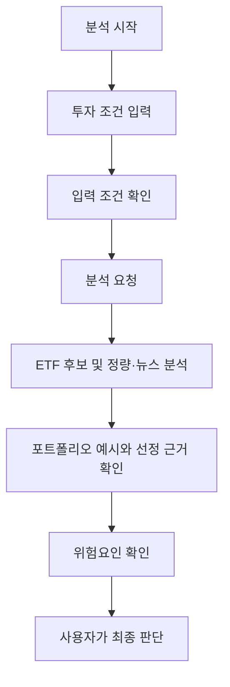
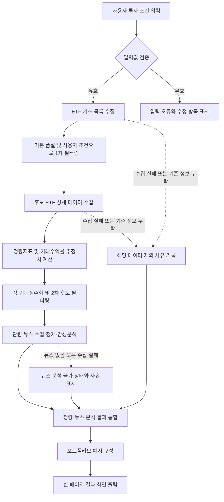

# 요구사항 정의서

## 1. 프로젝트 개요

| 항목 | 내용 |
| --- | --- |
| 프로젝트명 | AI 에이전트를 활용한 금융 데이터 분석 및 추천 시스템 |
| 한 줄 설명 | 사용자의 투자 조건과 ETF의 정량·뉴스 데이터를 종합하여 ETF 포트폴리오 예시와 분석 근거를 제공하는 시스템 |
| 프로젝트 범위 | ETF 기초·가격 데이터, 정량 지표, 최근 뉴스 감성 분석을 종합한 정보 제공 및 투자 판단 보조 |

본 프로젝트는 사용자의 투자금, 투자 기간, 위험 성향 등 투자 조건을 바탕으로 ETF 후보를 분석하고, 이해하기 쉬운 포트폴리오 예시와 근거를 제공하는 AI 에이전트 기반 금융 데이터 분석 시스템이다. 시스템은 ETF의 기초 정보와 가격 데이터를 수집한 뒤, 기본 품질 기준과 사용자 조건에 맞춰 분석 대상을 축소한다. 이후 수익률, 변동성, 최대낙폭(MDD), 샤프지수, 유동성과 같은 정량 지표를 분석하고, 관련 최근 뉴스의 감성 분석 결과를 함께 검토한다.

분석 결과는 단일 지표나 단기 시장 전망에 의존하지 않고, 정량 분석과 뉴스 분석을 종합하여 제시한다. 최종 결과에는 ETF 포트폴리오 예시, 각 후보의 선정 근거, 주요 위험요인을 포함하며, 제공 내용은 정보 제공과 투자 판단 보조를 위한 자료로 한정한다.

## 2. 문제 정의

| 항목 | 내용 |
| --- | --- |
| 현재 문제 | 개인 투자자가 자신의 투자 조건에 맞는 ETF를 찾기 위해 여러 금융 지표와 뉴스를 각각 확인하고 해석해야 한다. |
| 사용자가 겪는 불편 | 서로 다른 형식의 수치와 비정형 뉴스 정보를 함께 비교해야 하므로 시간과 금융 지식이 필요하며, 수익률 중심 비교 시 중요한 위험 요소를 놓칠 수 있다. |
| 해결 방향 | 사용자 조건을 일관된 기준으로 반영하고, ETF의 정량 지표와 최신 뉴스 흐름을 함께 검토하여 후보별 근거와 위험요인을 비교할 수 있도록 한다. |

개인 투자자는 자신의 투자금 규모, 투자 가능 기간, 위험 감수 수준에 맞는 ETF를 찾기 위해 여러 상품의 가격 흐름, 변동성, 손실 위험, 거래 편의성 및 시장 관련 뉴스를 각각 확인해야 한다. 이 과정에서 서로 다른 형식의 수치와 비정형 뉴스 정보를 함께 해석해야 하므로, 분석에 시간과 금융 지식이 필요하다. 또한 수익률만으로 ETF를 비교하면 변동성이나 최대 손실 가능성, 유동성, 최근 시장 이슈와 같은 중요한 위험 요소를 놓칠 수 있다.

따라서 사용자의 조건을 일관된 기준으로 반영하고, ETF의 정량 지표와 최신 뉴스 흐름을 함께 검토하여 후보를 비교할 수 있는 분석 과정이 필요하다. 특히 분석 결과가 단순한 종목 나열에 그치지 않고, 선택 근거와 함께 고려해야 할 위험요인을 명확히 전달해야 한다.

## 3. 프로젝트 목적

본 프로젝트의 목적은 사용자가 자신의 투자 조건에 맞는 ETF 후보를 보다 체계적으로 탐색하고 비교할 수 있도록 지원하는 것이다. 이를 위해 사용자 조건과 기본 품질 기준을 적용하여 분석 대상을 축소하고, 수익성과 위험을 함께 보여 주는 정량 지표 및 관련 뉴스의 감성 분석 결과를 종합한다.

시스템은 최종적으로 ETF 포트폴리오 예시, 선정 근거, 위험요인을 함께 제공하여 사용자가 분석 과정과 결과의 한계를 이해한 상태에서 투자 판단에 참고할 수 있도록 한다. 본 시스템의 결과는 투자 수익이나 특정 성과를 보장하지 않으며, 최종 투자 결정과 그에 따른 책임은 사용자에게 있다.

## 4. 사용자 정의

현재 MVP는 회원가입이나 로그인 없이 한 명의 사용자가 일회성으로 투자 조건을 입력하고 분석 결과를 확인하는 단일 사용자 흐름으로 한정한다.

| 구분 | 내용 |
| --- | --- |
| 핵심 사용자 | 자신의 투자 조건에 맞는 ETF 후보를 비교하려는 개인 투자자 |
| 시스템 사용 목적 | 투자금, 투자 기간, 위험 성향에 맞는 ETF 포트폴리오 예시를 확인하고, 후보별 선정 근거와 위험요인을 비교하기 위함 |
| 이용 범위 | 조건 입력부터 분석 결과 확인까지의 단일 흐름으로 제한하며, 회원 정보 저장·로그인·다중 사용자 기능은 MVP 범위에 포함하지 않음 |

### 4.1 사용자 입력 조건

| 입력 조건 | 설명 | 사용자가 확인할 사항 |
| --- | --- | --- |
| 투자금 | 분석에 적용할 총 투자 가능 금액 | 실제 투자에 사용할 수 있는 금액인지 확인 |
| 투자 기간 | 자금을 유지할 예정인 기간 | 중도 인출 가능성과 목표 시점을 고려해 입력 |
| 위험 성향 | 가격 변동과 손실 가능성을 감수할 수 있는 수준 | 안정형·중립형·공격형 중 본인의 감수 수준을 선택 |
| 허용 손실 | 감수 가능한 최대 손실 범위 | 손실 발생 시에도 유지할 수 있는 수준인지 확인 |
| 선호 자산 | 우선 검토하고 싶은 자산군 또는 ETF 특성 | 특정 자산군 선호가 분산 투자 원칙과 충돌하지 않는지 확인 |
| 현금성 비중 | 투자금 중 현금성 자산으로 유지하려는 비율 | 사용자가 직접 0~100% 범위에서 선택하며 미입력 시 임의 기본값을 적용하지 않음 |

### 4.2 사용자가 직접 판단해야 하는 항목

| 판단 항목 | 사용자의 판단 내용 |
| --- | --- |
| 입력 조건의 적절성 | 투자금, 기간, 위험 성향, 허용 손실, 선호 자산과 현금성 비중이 자신의 실제 상황을 반영하는지 판단 |
| 포트폴리오 예시의 채택 여부 | 분석 결과는 참고 자료이므로 제시된 ETF 또는 비중을 실제로 활용할지 직접 결정 |
| 위험요인 수용 여부 | 변동성, 최대낙폭, 뉴스 이슈, 유동성 등 각 ETF의 위험을 수용할 수 있는지 판단 |
| 최종 투자 결정 | 투자 실행 시점, 금액, 상품 선택에 대한 최종 결정과 책임을 직접 부담 |

## 5. 사용자 흐름

사용자는 회원가입이나 로그인 없이 조건을 입력하고 분석을 요청한 뒤, 결과와 위험요인을 확인하여 스스로 투자 판단에 참고한다.

| 단계 | 사용자 행동 | 사용자가 확인해야 하는 결과 |
| --- | --- | --- |
| 1. 분석 시작 | 분석 기능을 실행한다. | 회원가입·로그인 없이 조건 입력을 시작할 수 있는지 확인한다. |
| 2. 투자 조건 입력 | 투자금, 투자 기간, 위험 성향, 허용 손실, 선호 자산을 입력한다. | 입력값이 자신의 실제 투자 계획과 위험 감수 수준을 반영하는지 확인한다. |
| 3. 입력 조건 확인 | 입력 내용을 검토하고 분석을 요청한다. | 누락된 조건이나 의도와 다른 선택이 없는지 확인한다. |
| 4. 분석 결과 확인 | ETF 후보, 주요 정량 지표, 뉴스 분석 결과를 확인한다. | 후보별 수익률·변동성·MDD·샤프지수·유동성 및 뉴스 흐름의 차이를 확인한다. |
| 5. 포트폴리오 예시 검토 | 제시된 ETF 구성과 선정 근거를 비교한다. | 제안된 구성과 선정 근거가 입력한 투자 조건에 부합하는지 확인한다. |
| 6. 위험요인 확인 및 최종 판단 | 위험요인을 검토하고 결과를 투자 판단의 참고 자료로 활용한다. | 예상 손실 범위, 시장 변동성, 뉴스 이슈 및 분석의 한계를 수용할 수 있는지 확인한다. |

## 6. 처리 흐름 및 핵심 기능 정의

### 6.1 전체 시스템 처리 흐름

| 순서 | 처리 단계 | 대략적 처리 내용 | 다음 단계로 전달되는 결과 |
| --- | --- | --- | --- |
| 1 | 사용자 조건 입력 및 검증 | 투자금, 투자 기간, 위험 성향, 허용 손실, 선호 자산을 입력받고 필수값·형식·허용 범위를 검증한다. | 검증된 사용자 투자 조건 |
| 2 | ETF 목록 수집 | 분석 대상 ETF의 기초 데이터를 수집하고 출처와 수집 기준 시점을 기록한다. | ETF 기초 목록 |
| 3 | 1차 후보 필터링 | 기본 품질 기준과 사용자 조건을 적용하여 분석에 적합하지 않은 ETF를 제외한다. | 1차 후보 ETF 목록과 제외 사유 |
| 4 | 상세 데이터 수집 | 1차 후보별 가격·거래·상품 상세 데이터와 구성 종목·편입 비중을 수집하고 데이터 누락 여부를 확인한다. | 분석 가능한 후보별 상세 데이터 |
| 5 | 정량 분석 | 수익률, 변동성, MDD, 샤프지수, 유동성과 기대수익률 추정치를 동일한 기간·통화·단위 기준으로 계산한다. | 후보별 정량지표와 기대수익률 추정 결과 |
| 6 | 점수화 및 2차 후보 필터링 | 과거 MDD가 허용 손실을 초과한 후보를 제외하고, 최소–최대 정규화와 위험 성향별 가중치를 적용한 정량 점수순으로 뉴스 분석 후보를 최대 30개 선정한다. | 점수화된 상위 30개 이내 뉴스 분석 후보와 제외 사유 |
| 7 | 뉴스 수집 및 감성분석 | 후보 ETF와 관련된 최근 뉴스를 수집·정제하고, 관련성 및 감성 결과를 출처와 함께 정리한다. | 후보별 뉴스 감성 결과 또는 뉴스 없음 상태 |
| 8 | 결과 통합 | 정량 점수와 뉴스 분석 결과를 후보별로 통합하고, 상충 정보와 데이터 한계를 구분한다. | 후보별 통합 분석 결과 |
| 9 | 포트폴리오 구성 준비 | 사용자 조건과 통합 분석 결과를 바탕으로 ETF 구성 후보와 확정된 제약조건을 제시한다. ETF별 배분 산식은 보류 상태이므로 실제 비중은 산식 확정 전 생성하지 않는다. | 포트폴리오 후보와 배분 산식 보류 상태 |
| 10 | 결과 화면 출력 | 사용자 입력 요약, 포트폴리오, 기대수익률 추정치와 범위, 선정 근거, 주요 종목의 ETF 편입률·총 ETF 자산 비중, 위험요인, 데이터 출처·기준 정보·책임 제한 안내를 한 페이지에 표시한다. | 최종 분석 결과 화면 |

아래 기능은 사용자의 투자 조건을 반영하여 ETF 후보를 분석하고, 포트폴리오 예시와 위험요인을 제공하기 위해 필요한 MVP 핵심 기능으로 한정한다.

### 6.2 사용자 조건 입력

- **기능명:** 사용자 조건 입력
- **기능 목적:** 분석 기준이 되는 개인의 투자 조건을 수집한다.
- **입력:** 투자금, 투자 기간, 위험 성향, 허용 손실, 선호 자산
- **처리 내용:** 입력값의 누락 여부와 값의 일관성을 확인하고 분석 기준으로 정리한다.
- **출력:** 검증된 사용자 투자 조건
- **선행 기능:** 없음
- **완료 조건:** 필수 조건이 누락되지 않았으며, 사용자가 입력 내용을 확인한 상태이다.

### 6.3 ETF 기초 데이터 수집

- **기능명:** ETF 기초 데이터 수집
- **기능 목적:** 분석 대상이 될 ETF의 기본 정보를 확보한다.
- **입력:** 분석 대상 시장 또는 ETF 목록 기준
- **처리 내용:** ETF명, 종목 코드, 거래소·시장, 추종 자산·지수 등 후보 식별과 1차 필터링에 필요한 기초 정보를 수집한다.
- **출력:** ETF별 기초 데이터 목록
- **선행 기능:** 사용자 조건 입력
- **완료 조건:** 분석 대상 ETF마다 필수 기초 정보가 확보되었고, 데이터 출처와 수집 기준 시점이 식별된다.

### 6.4 기본 품질 및 사용자 조건 필터링

- **기능명:** ETF 후보 필터링
- **기능 목적:** 기본 품질 기준과 사용자 조건에 맞지 않는 ETF를 제외하여 분석 후보를 줄인다.
- **입력:** 검증된 사용자 투자 조건, ETF 기초 데이터와 가격 데이터 목록
- **처리 내용:** 유동성, 거래 가능 여부 등 기본 품질 기준을 적용하고, 투자 기간·위험 성향·선호 자산과의 적합성을 검토한다.
- **출력:** 필터링된 ETF 후보 목록과 제외 사유
- **선행 기능:** ETF 기초 데이터 수집
- **완료 조건:** 모든 분석 대상 ETF에 대해 포함 또는 제외 여부와 그 근거가 기록된다.

### 6.5 후보 ETF 상세 데이터 수집

- **기능명:** 후보 ETF 상세 데이터 수집
- **기능 목적:** 필터링된 후보의 정량 분석, 위험 검토와 주요 구성 종목의 ETF 편입 현황 계산에 필요한 데이터를 확보한다.
- **입력:** 필터링된 ETF 후보 목록
- **처리 내용:** 후보별 과거 가격 흐름, 거래량·유동성 관련 데이터, 순자산 규모, 구성 종목 식별 정보·편입 비중·구성 기준일을 수집한다.
- **출력:** 후보 ETF별 가격·거래·상품 및 구성 종목 상세 데이터
- **선행 기능:** ETF 후보 필터링
- **완료 조건:** 모든 후보 ETF에 대해 수익률·변동성·MDD·샤프지수·유동성 분석에 필요한 데이터가 확보되고, 구성 종목 데이터의 수집 성공 여부와 누락 사유가 기록된다.

### 6.6 정량지표 및 기대수익률 추정치 계산

- **기능명:** ETF 정량지표 및 기대수익률 추정치 계산
- **기능 목적:** 후보 ETF의 수익성과 위험 수준을 동일한 기준으로 비교하고, 사용자 투자 기간에 대응하는 기대수익률 추정치를 정보 제공 목적으로 산출한다.
- **입력:** 후보 ETF별 상세 분석 데이터
- **처리 내용:** 수익률, 변동성, 최대낙폭(MDD), 샤프지수와 유동성 지표를 계산한다. 기대수익률 추정에는 월말 조정 종가로 계산한 월간 단순 수익률과 ETF의 기하연환산 수익률을 사용한다. 기본 연환산 기대수익률은 ETF의 최근 5년 기하연환산 수익률 40%와 동일 자산군 ETF의 같은 기간 기하연환산 수익률 중앙값 60%를 결합하여 산출한다. 5년 데이터가 없고 3년 이상이면 ETF와 자산군 모두 3년 기준을 사용하며, 3년 미만이면 기대수익률을 산출하지 않는다. 최근 6개월 또는 12개월 추세는 검증된 기간·가중치·상한·하한이 모두 확정된 경우에만 기본 기대수익률에 제한적으로 반영하며, 확정 전에는 기본 기대수익률을 최종 연환산 추정치로 사용하고 `trend_adjustment_pending` 상태를 표시한다. 투자 기간 누적 기대수익률은 `(1 + 연환산 기대수익률)^투자 기간(연수) - 1`로 계산하고, 투자 기간이 월 단위이면 개월 수를 12로 나누어 연수로 변환한다. 하락·기준·상승 범위는 월간 수익률의 시계열 연속성을 일부 보존하는 블록 재표본추출로 사용자 투자 기간의 누적수익률 분포를 생성한 뒤 10·50·90백분위 값으로 산출한다. 블록 길이·반복 횟수·난수 시드가 확정되지 않았거나 유효 월간 관측값이 부족하면 범위를 산출하지 않고 사유를 표시한다. 뉴스 감성 결과는 기대수익률 수치에 가감하지 않으며 신뢰도·시나리오의 수치도 직접 변경하지 않는다. 뉴스는 별도 위험요인과 주의 상태 설명에만 사용하고, 기대수익률 추정치는 MVP의 정량 점수와 2차 후보 필터링에는 사용하지 않는다.
- **추정 신뢰도:** 동일 자산군의 유효 ETF가 3개 미만이면 기대수익률을 산출하지 않는다. 가격 이력이 10년 이상이고 동일 자산군 유효 ETF가 10개 이상이면 '높음', 가격 이력이 5년 이상이고 유효 ETF가 5개 이상이면 '중간', 가격 이력이 3년 이상이고 유효 ETF가 3개 이상이면 '낮음'으로 표시한다. 가능한 경우 과거 검증 구간의 예측 오차를 함께 표시하되, 검증 구간과 오차 지표가 확정되지 않은 동안에는 오차를 산출하지 않고 `validation_pending`으로 표시한다.
- **출력:** 후보 ETF별 정량지표, 연환산 기대수익률 추정치, 투자 기간 누적 기대수익률, 하락·기준·상승 범위, 추정 신뢰도와 산출 근거
- **선행 기능:** 후보 ETF 상세 데이터 수집
- **완료 조건:** 각 후보의 필수 정량지표가 동일한 기간과 단위 기준으로 계산되고, 기대수익률 추정 결과 또는 데이터 부족에 따른 산출 불가 사유가 생성된다.

### 6.7 지표 정규화 및 점수화·2차 후보 필터링

- **기능명:** 정량지표 정규화 및 점수화·2차 후보 필터링
- **기능 목적:** 서로 다른 단위의 정량지표를 비교 가능한 형태로 변환하여 점수를 산출하고, 사용자 조건에 맞는 최종 분석 후보를 선정한다.
- **입력:** 후보 ETF별 정량지표 결과, 사용자 투자 조건
- **처리 내용:** 같은 비교 후보 집합에서 높을수록 유리한 지표는 `(값-최솟값)/(최댓값-최솟값)`, 낮을수록 유리한 지표는 `1-(값-최솟값)/(최댓값-최솟값)`으로 최소–최대 정규화한다. 위험 성향별 가중치를 적용해 정량 점수를 계산하고, 과거 MDD의 절댓값이 사용자 허용 손실을 초과한 후보를 제외한 뒤 정량 점수 내림차순으로 뉴스 분석 후보를 최대 30개 선정한다. 점수가 같으면 평균 거래량 내림차순, 종목 코드 오름차순으로 순서를 정한다. 최댓값과 최솟값이 같은 경우의 정규화 값은 구현 전에 확정한다.
- **출력:** 2차 필터 통과 ETF 목록, 후보별 정규화 값·정량 점수·순위, 제외 ETF와 제외 사유
- **선행 기능:** ETF 정량지표 및 기대수익률 추정치 계산
- **완료 조건:** 모든 입력 후보에 대해 통과 또는 제외 여부와 근거가 기록되고, 뉴스 분석 후보가 최대 30개로 확정된다.

### 6.8 관련 뉴스 수집

- **기능명:** 관련 뉴스 수집
- **기능 목적:** 후보 ETF 및 관련 자산군의 최근 시장 이슈를 분석 대상으로 확보한다.
- **입력:** 2차 필터를 통과한 ETF 목록, 후보 ETF의 추종 자산 또는 관련 주제
- **처리 내용:** 각 후보와 관련된 최근 뉴스의 제목, 본문 요약 또는 원문 정보, 발행 시점, 출처를 수집한다.
- **출력:** 후보 ETF별 관련 뉴스 목록
- **선행 기능:** 정량지표 정규화 및 점수화·2차 후보 필터링
- **완료 조건:** 모든 후보에 대해 출처와 발행 시점이 확인되는 뉴스 목록 또는 '분석 가능한 뉴스 없음' 상태가 생성된다.

### 6.9 뉴스 정제 및 감성분석

- **기능명:** 뉴스 정제 및 감성분석
- **기능 목적:** 중복·무관한 뉴스를 제외하고 후보별 뉴스 흐름을 긍정·중립·부정 관점으로 요약한다.
- **입력:** 후보 ETF별 관련 뉴스 목록
- **처리 내용:** 뉴스의 중복성과 관련성을 검토하고, 정제된 뉴스에 대해 감성 및 주요 이슈를 분석한다.
- **출력:** 후보 ETF별 뉴스 감성 결과와 주요 이슈 요약
- **선행 기능:** 관련 뉴스 수집
- **완료 조건:** 분석에 사용한 뉴스가 식별되고, 각 후보별 감성 결과와 주요 이슈가 정리된다.

### 6.10 정량·뉴스 결과 통합

- **기능명:** 정량·뉴스 분석 결과 통합
- **기능 목적:** 정량 성과·위험 정보와 최근 뉴스 흐름을 함께 고려한 후보 비교 결과를 만든다.
- **입력:** 후보 ETF별 정량 점수와 지표별 비교 결과, 뉴스 감성 결과와 주요 이슈 요약
- **처리 내용:** 정량 점수와 뉴스 분석 결과를 후보별로 연결하고, 긍정 요인·주의 요인·분석 한계를 구분하여 정리한다.
- **출력:** 후보 ETF별 종합 분석 결과
- **선행 기능:** 정량지표 정규화 및 점수화·2차 후보 필터링, 뉴스 정제 및 감성분석
- **완료 조건:** 모든 후보에 대해 정량 결과와 뉴스 결과 또는 '분석 가능한 뉴스 없음' 상태가 함께 제시되고, 서로 상충하는 신호가 있으면 별도로 표시된다.

### 6.11 포트폴리오 구성 준비

- **기능명:** ETF 포트폴리오 구성 후보 및 제약조건 제공
- **기능 목적:** 종합 분석 결과와 사용자 조건을 바탕으로 비교 가능한 ETF 포트폴리오 예시를 제시한다.
- **입력:** 검증된 사용자 투자 조건, 후보 ETF별 종합 분석 결과
- **처리 내용:** 사용자 위험 성향, 투자 기간, 허용 손실, 선호 자산과 사용자가 선택한 현금성 비중을 보존하고 포트폴리오 구성 후보와 확정된 제약조건을 정리한다. ETF별 배분 산식은 보류 상태로 두며 실제 비중은 생성하지 않는다.
- **출력:** ETF 구성 후보, 확정된 포트폴리오 제약조건, 사용자 선택 현금성 비중, 배분 산식 보류 상태
- **선행 기능:** 정량·뉴스 분석 결과 통합
- **완료 조건:** 구성 후보와 제약조건이 사용자 조건에 연결되고, ETF별 배분 산식이 확정되지 않았음을 명확히 표시한다.

### 6.12 선정 근거와 위험요인 출력

- **기능명:** 분석 결과 및 위험요인 출력
- **기능 목적:** 사용자가 포트폴리오 예시, 후보별 근거·위험과 주요 구성 종목의 ETF 편입 현황을 이해하고 최종 판단에 참고할 수 있도록 한다.
- **입력:** ETF 포트폴리오 예시, 후보 ETF별 종합 분석 결과와 기대수익률 추정 결과, 분석 대상 ETF의 구성 종목·편입 비중·순자산 규모 데이터
- **처리 내용:** 포트폴리오 구성, 후보별 정량·뉴스 기반 근거, 주요 위험요인, 분석 데이터의 기준 시점과 한계를 정리한다. 주요 종목은 포트폴리오 예시에 포함된 각 ETF에서 구성 기준일의 편입 비중 상위 10개 종목을 추출한 뒤 종목 식별자를 기준으로 중복을 제거한 목록으로 정의한다. 구성 종목이 10개 미만인 ETF는 확인 가능한 종목 전체를 사용한다. 전체 ETF는 해당 분석 요청에서 구성 종목 데이터가 유효한 ETF 집합으로 정의한다. ETF 편입률은 해당 종목 보유 ETF 수를 유효 ETF 수로 나눈 백분율로 계산한다. 총 ETF 자산 비중은 각 ETF의 동일 통화 환산 순자산 규모에 해당 종목 편입 비중을 곱한 금액의 합을 유효 ETF 순자산 규모 합계로 나눈 백분율로 계산한다.
- **출력:** 포트폴리오 예시, ETF별·포트폴리오 연환산 및 투자 기간 누적 기대수익률 추정치와 범위, 선정 근거, 주요 종목별 보유 ETF 수·ETF 편입률·총 ETF 자산 비중, 위험요인, 분석 유의사항
- **선행 기능:** ETF 포트폴리오 예시 구성
- **완료 조건:** 사용자가 각 ETF와 포트폴리오의 기대수익률 추정치·범위·신뢰도·산출 기준, 선정 근거와 위험요인을 확인할 수 있고, 주요 종목별 계산값·분모가 된 유효 ETF 수·구성 기준일을 확인할 수 있으며, 결과가 투자 수익을 보장하지 않는 참고 정보임이 명확히 표시된다.

## 7. 출력 결과 및 입력·출력 데이터 요구사항

본 항목은 요구사항 정의 수준의 데이터 구조이다. 가격·거래 데이터에는 출처·가격 기준일·수집 기준 시점을 기록하고, 뉴스에는 출처·발행 시점을 기록한다. 계산 결과와 AI가 생성하는 설명은 아래 원천 또는 중간 결과 데이터로 추적 가능해야 한다.

### 7.1 최종 결과 화면 구성

최종 결과는 별도 화면 이동 없이 한 페이지에서 확인할 수 있어야 한다. 각 영역에는 결과값뿐 아니라 데이터 출처, 가격 기준일·데이터 수집 기준 시점 또는 뉴스 발행 시점, 시간대와 분석 한계를 표시하고, 금액·가격·거래량 등 수치 데이터에는 해당 통화와 단위를 함께 표시한다.

| 화면 영역 | 표시 내용 | 시각적 표현 | 사용자가 확인할 사항 |
| --- | --- | --- | --- |
| 사용자 입력 요약 | 투자금, 투자 기간, 위험 성향, 허용 손실, 선호 자산 | 조건 요약 카드 또는 표 | 분석에 적용된 조건이 입력값과 일치하는지 |
| 포트폴리오 구성 준비 결과 | ETF 종목 코드·명칭, 자산군, 확정 제약조건, 사용자 선택 현금성 비중, 배분 산식 보류 상태 | 구성 후보 및 제약조건 표 | 실제 ETF 비중이 아직 산출되지 않았으며 배분 산식 확정이 필요함을 확인하는지 |
| 기대수익률 추정 결과 | ETF별·포트폴리오 연환산 기대수익률, 투자 기간 누적 기대수익률, 하락·기준·상승 범위, 신뢰도, 산출 기간·기준일·산출 불가 사유 | ETF별 비교 표와 시나리오 범위 막대그래프 | 추정치와 실제 성과가 다를 수 있다는 안내, 산출 공식·표본 기간·신뢰도를 확인할 수 있는지 |
| ETF 선정 근거 | 수익률, 변동성, MDD, 샤프지수, 유동성, 정량 점수, 뉴스 감성 결과 및 출처 | ETF별 지표 비교 표와 막대형 점수 비교 | 각 설명이 지표값 또는 뉴스 출처와 연결되는지 |
| 주요 종목 ETF 편입 현황 | 주요 종목명·식별자, 보유 ETF 수, 계산 대상 ETF 수, ETF 편입률, 총 ETF 자산 비중, 구성 기준일 | 종목별 비교 표와 가로 막대그래프 | 계산 대상 ETF의 범위와 데이터 누락 여부, 두 비율의 분모가 명확한지 |
| 위험요인 | 변동성·MDD·유동성 관련 유의사항, 뉴스 기반 주의 요인, 데이터 누락·제외 사유 | 위험요인 목록과 상태 표기 | 위험요인이 누락 없이 표시되고, 뉴스 없음 상태가 구분되는지 |
| 데이터 및 책임 안내 | 데이터 출처, 가격 기준일·수집 기준 시점·뉴스 발행 시점, 시간대, 해당 수치의 통화·단위, 분석 한계, 책임 제한 안내 | 데이터 기준 정보 표 | 결과가 투자 성과를 보장하지 않으며 최종 판단은 사용자에게 있음을 확인하는지 |

ETF별 비중 차트는 배분 산식이 확정된 이후 적용한다. 현재 MVP 요구사항에서는 구성 후보와 제약조건, 사용자 선택 현금성 비중 및 배분 산식 보류 상태까지만 표시한다.

### 7.2 사용자 입력 데이터

| 데이터명 | 필드명 | 데이터 의미 | 필수 여부 | 데이터 형식 | 생성 또는 수집 위치 | 사용하는 기능 | 값이 없을 때 처리 방법 |
| --- | --- | --- | --- | --- | --- | --- | --- |
| 사용자 투자 조건 | 투자금 | 분석에 적용할 총 투자 가능 금액 | 필수 | 양의 숫자와 통화 | 사용자 조건 입력 | 사용자 조건 입력, 지표 정규화 및 점수화·2차 후보 필터링, 포트폴리오 구성 | 분석 요청을 막고 투자금 입력을 요청 |
| 사용자 투자 조건 | 투자 기간 | 투자 자금을 유지할 예정인 기간 | 필수 | 양의 정수와 기간 단위 | 사용자 조건 입력 | 사용자 조건 입력, ETF 후보 필터링, 포트폴리오 구성 | 분석 요청을 막고 투자 기간 입력을 요청 |
| 사용자 투자 조건 | 위험 성향 | 가격 변동과 손실을 감수할 수 있는 수준 | 필수 | 선택값(안정형·중립형·공격형) | 사용자 조건 입력 | ETF 후보 필터링, 지표 정규화 및 점수화·2차 후보 필터링, 포트폴리오 구성 준비 | 분석 요청을 막고 선택을 요청 |
| 사용자 투자 조건 | 허용 손실 | 감수 가능한 최대 손실 범위 | 필수 | 0 이상 100 이하의 백분율 | 사용자 조건 입력 | 사용자 조건 입력, 지표 정규화 및 점수화·2차 후보 필터링, 포트폴리오 구성 | 분석 요청을 막고 허용 손실 입력을 요청 |
| 사용자 투자 조건 | 선호 자산 | 우선 검토할 자산군 또는 ETF 특성 | 선택 | 선택값 또는 목록 | 사용자 조건 입력 | ETF 후보 필터링, 포트폴리오 구성 | 미입력 시 선호 자산 조건 없이 전체 후보를 분석 |
| 사용자 투자 조건 | 현금성 비중 | 투자금 중 현금성 자산으로 유지하려는 비율 | 선택 | 0 이상 100 이하의 백분율 | 사용자 조건 입력 | 포트폴리오 구성 준비 | 미입력 시 현금성 비중 미선택 상태로 표시하고 임의 기본값을 적용하지 않음 |

### 7.3 ETF 기초 데이터

| 데이터명 | 필드명 | 데이터 의미 | 필수 여부 | 데이터 형식 | 생성 또는 수집 위치 | 사용하는 기능 | 값이 없을 때 처리 방법 |
| --- | --- | --- | --- | --- | --- | --- | --- |
| ETF 기초 정보 | ETF명 | ETF의 공식 명칭 | 필수 | 텍스트 | ETF 기초 데이터 수집 | ETF 후보 필터링, 결과 및 위험요인 출력 | 해당 ETF를 분석 후보에서 제외하고 제외 사유 기록 |
| ETF 기초 정보 | 종목 코드 | ETF를 식별하는 거래소 기준 코드 | 필수 | 텍스트 | ETF 기초 데이터 수집 | 모든 ETF 분석 기능 | 해당 ETF를 분석 후보에서 제외하고 제외 사유 기록 |
| ETF 기초 정보 | 거래소·시장 | ETF가 거래되는 시장 식별 정보 | 필수 | 텍스트 | ETF 기초 데이터 수집 | ETF 후보 필터링, 결과 및 위험요인 출력 | 해당 ETF를 분석 후보에서 제외 |
| ETF 기초 정보 | 추종 자산 또는 지수 | ETF가 추종하는 자산군·지수 정보 | 필수 | 텍스트 | ETF 기초 데이터 수집 | ETF 후보 필터링, 관련 뉴스 수집, 포트폴리오 구성 | 선호 자산 필터링과 뉴스 연결에서 제외하고, ETF 분석 가능 여부를 별도 표시 |
| ETF 기초 정보 | 총보수 | ETF 보유에 따른 연간 비용 정보 | 선택 | 백분율 | ETF 기초 데이터 수집 | ETF 후보 필터링, 결과 및 위험요인 출력 | 총보수 비교 항목을 '정보 없음'으로 표시하고 점수 계산에는 사용하지 않음 |
| ETF 기초 정보 | 데이터 출처·수집 기준 시점 | 기초 정보의 제공처와 수집 시점 | 필수 | 출처명, 날짜·시간, 시간대 | ETF 기초 데이터 수집 | 모든 ETF 분석 기능, 결과 및 위험요인 출력 | 출처 또는 수집 기준 시점이 없으면 해당 ETF를 분석 후보에서 제외 |

### 7.4 가격 및 거래 데이터

| 데이터명 | 필드명 | 데이터 의미 | 필수 여부 | 데이터 형식 | 생성 또는 수집 위치 | 사용하는 기능 | 값이 없을 때 처리 방법 |
| --- | --- | --- | --- | --- | --- | --- | --- |
| 가격 시계열 | 기준일 | 가격 또는 거래량이 기록된 날짜 | 필수 | YYYY-MM-DD | 후보 ETF 상세 데이터 수집 | 정량지표 및 기대수익률 추정치 계산 | 날짜가 누락된 행은 계산에서 제외하고, 분석 가능 기간이 부족하면 해당 ETF를 제외 |
| 가격 시계열 | 종가 | 기준일의 ETF 종가 | 필수 | 0보다 큰 숫자와 통화 | 후보 ETF 상세 데이터 수집 | 정량지표 및 기대수익률 추정치 계산 | 해당 일자 데이터를 제외하고, 유효 가격 데이터가 부족하면 해당 ETF를 제외 |
| 가격 시계열 | 조정 종가 여부 | 분배금·분할 등 조정 반영 여부 | 필수 | 참·거짓 또는 선택값 | 후보 ETF 상세 데이터 수집 | 정량지표 및 기대수익률 추정치 계산 | 조정 여부가 확인되지 않으면 계산 기준을 명시하고, 동일 기준 데이터를 확보하지 못하면 해당 ETF를 제외 |
| 거래 데이터 | 거래량 | 기준일 거래된 수량 | 선택 | 0 이상 정수 | 후보 ETF 상세 데이터 수집 | 정량지표 및 기대수익률 추정치 계산, ETF 후보 필터링 | 유동성 지표를 '정보 부족'으로 표시하고 유동성 점수는 산출하지 않음 |
| 거래 데이터 | 거래대금 또는 평균 거래대금 | 거래 규모를 나타내는 금액 | 선택 | 0 이상 숫자와 통화 | 후보 ETF 상세 데이터 수집 | ETF 후보 필터링, 정량지표 및 기대수익률 추정치 계산 | 거래량과 함께 없으면 유동성 기준을 적용할 수 없으므로 해당 ETF를 제외 |
| 가격 및 거래 데이터 | 통화·단위·시간대·수집 기준 시점 | 가격·거래 수치의 해석 기준과 수집 시점 | 필수 | 통화 코드, 단위, 시간대, 날짜·시간 | 후보 ETF 상세 데이터 수집 | 정량지표 및 기대수익률 추정치 계산, 결과 및 위험요인 출력 | 기준 정보가 없으면 해당 데이터를 계산에 사용하지 않음 |

### 7.5 상품 상세 데이터

| 데이터명 | 필드명 | 데이터 의미 | 필수 여부 | 데이터 형식 | 생성 또는 수집 위치 | 사용하는 기능 | 값이 없을 때 처리 방법 |
| --- | --- | --- | --- | --- | --- | --- | --- |
| ETF 상품 상세 정보 | 순자산 규모 | ETF의 운용 자산 규모 | 조건부 필수 | 0 이상 숫자와 통화 | 후보 ETF 상세 데이터 수집 | ETF 후보 필터링, 결과 및 위험요인 출력 | 규모 비교 항목은 '정보 없음'으로 표시하고, 해당 ETF는 총 ETF 자산 비중 계산에서 제외 |
| ETF 상품 상세 정보 | 설정일 | ETF가 설정된 날짜 | 선택 | YYYY-MM-DD | 후보 ETF 상세 데이터 수집 | ETF 후보 필터링, 결과 및 위험요인 출력 | 운용 기간 비교 항목을 '정보 없음'으로 표시 |
| ETF 상품 상세 정보 | 자산군·섹터·지역 분류 | ETF의 투자 대상 특성을 설명하는 분류 정보 | 필수 | 텍스트 또는 목록 | 후보 ETF 상세 데이터 수집 | ETF 후보 필터링, 관련 뉴스 수집, 포트폴리오 구성 | 분류가 없으면 선호 자산 조건을 적용할 수 없으므로 해당 ETF를 제외 |
| ETF 상품 상세 정보 | 분배 정책 | 분배금 지급 관련 특성 | 선택 | 텍스트 또는 선택값 | 후보 ETF 상세 데이터 수집 | 결과 및 위험요인 출력 | 분배 정책을 '정보 없음'으로 표시하고 포트폴리오 구성 기준에는 사용하지 않음 |
| ETF 구성 종목 정보 | 구성 종목 식별자·명칭 | 여러 ETF의 동일 구성 종목을 식별하고 연결하는 정보 | 조건부 필수 | 종목 코드와 텍스트 | 후보 ETF 상세 데이터 수집 | 결과 및 위험요인 출력 | 식별할 수 없는 구성 종목은 편입률과 총 ETF 자산 비중 계산에서 제외 |
| ETF 구성 종목 정보 | 종목별 편입 비중 | ETF 안에서 해당 구성 종목이 차지하는 비율 | 조건부 필수 | 0 초과 100 이하의 백분율 | 후보 ETF 상세 데이터 수집 | 결과 및 위험요인 출력 | 편입 비중이 없거나 범위를 벗어나면 해당 종목·ETF 조합을 계산에서 제외 |
| ETF 구성 종목 정보 | 구성 기준일 | 구성 종목과 편입 비중이 유효한 날짜 | 조건부 필수 | YYYY-MM-DD | 후보 ETF 상세 데이터 수집 | 결과 및 위험요인 출력 | 기준일이 없으면 해당 ETF의 구성 종목 데이터를 계산에서 제외 |
| ETF 구성 종목 정보 | 구성 데이터 출처·수집 기준 시점 | 구성 종목 정보의 제공처와 수집 시점 | 조건부 필수 | 출처명, 날짜·시간, 시간대 | 후보 ETF 상세 데이터 수집 | 결과 및 위험요인 출력 | 출처 또는 수집 기준 시점이 없으면 해당 ETF의 구성 종목 데이터를 계산에서 제외 |
| ETF 상품 상세 정보 | 상세 데이터 출처·수집 기준 시점 | 상세 정보의 제공처와 수집 시점 | 필수 | 출처명, 날짜·시간, 시간대 | 후보 ETF 상세 데이터 수집 | 모든 상세 데이터 사용 기능 | 출처 또는 수집 기준 시점이 없으면 해당 상세 데이터는 사용하지 않음 |

### 7.6 뉴스 데이터

| 데이터명 | 필드명 | 데이터 의미 | 필수 여부 | 데이터 형식 | 생성 또는 수집 위치 | 사용하는 기능 | 값이 없을 때 처리 방법 |
| --- | --- | --- | --- | --- | --- | --- | --- |
| 원천 뉴스 | 뉴스 식별자 또는 원문 주소 | 뉴스 항목을 중복 없이 식별하고 출처를 확인하는 정보 | 필수 | 텍스트 또는 URL | 관련 뉴스 수집 | 뉴스 정제 및 감성분석, 결과 및 위험요인 출력 | 출처 확인이 불가능한 뉴스는 분석에서 제외 |
| 원천 뉴스 | 제목 | 뉴스의 핵심 제목 | 필수 | 텍스트 | 관련 뉴스 수집 | 뉴스 정제 및 감성분석 | 제목과 본문 요약이 모두 없으면 분석에서 제외 |
| 원천 뉴스 | 본문 요약 또는 원문 내용 | 감성 및 이슈 분석에 사용할 내용 | 필수 | 텍스트 | 관련 뉴스 수집 | 뉴스 정제 및 감성분석 | 해당 뉴스는 분석에서 제외 |
| 원천 뉴스 | 발행 시점 | 뉴스의 최신성과 분석 기준 시점을 판단하는 정보 | 필수 | 날짜·시간과 시간대 | 관련 뉴스 수집 | 뉴스 정제 및 감성분석, 결과 및 위험요인 출력 | 발행 시점이 없으면 분석에서 제외 |
| 원천 뉴스 | 관련 ETF 또는 관련 자산 주제 | 뉴스와 후보 ETF를 연결하는 기준 | 필수 | 종목 코드 또는 텍스트 목록 | 관련 뉴스 수집 | 뉴스 정제 및 감성분석, 정량·뉴스 결과 통합 | 연결 대상이 없으면 후보별 감성 분석에 사용하지 않음 |
| 뉴스 분석 결과 | 감성 분류·근거 문장 | 뉴스별 긍정·중립·부정 분류와 이를 뒷받침하는 원문 내용 | 필수 | 선택값과 텍스트 | 뉴스 정제 및 감성분석 | 정량·뉴스 결과 통합, 결과 및 위험요인 출력 | 근거 문장이 없으면 감성 분류 결과를 사용하지 않음 |

### 7.7 기능별 중간 결과 데이터

| 데이터명 | 필드명 | 데이터 의미 | 필수 여부 | 데이터 형식 | 생성 또는 수집 위치 | 사용하는 기능 | 값이 없을 때 처리 방법 |
| --- | --- | --- | --- | --- | --- | --- | --- |
| 필터링 결과 | 후보 포함 여부·제외 사유 | ETF별 필터 통과 여부와 판단 근거 | 필수 | 참·거짓과 텍스트 | ETF 후보 필터링 | 후보 ETF 상세 데이터 수집, 관련 뉴스 수집 | 결과가 없으면 다음 분석 단계로 진행하지 않고 필터링을 다시 수행 |
| 정량지표 결과 | 수익률·변동성·MDD·샤프지수·유동성 | ETF별 수익성과 위험을 비교하는 계산 결과 | 필수 | 숫자, 백분율, 지수값 | 정량지표 및 기대수익률 추정치 계산 | 지표 정규화 및 점수화·2차 후보 필터링, 정량·뉴스 결과 통합 | 필수 지표가 하나라도 없으면 해당 ETF의 정량 점수를 산출하지 않음 |
| 기대수익률 기초 결과 | ETF 기하연환산 수익률·동일 자산군 중앙값·적용 가중치 | ETF 자체 수익률 40%와 동일 자산군 중앙값 60%를 결합하기 위한 기초값 | 조건부 필수 | 백분율, 기간과 숫자 | 정량지표 및 기대수익률 추정치 계산 | 결과 및 위험요인 출력 | 가격 이력이 3년 미만이거나 동일 자산군 유효 ETF가 3개 미만이면 기대수익률을 산출하지 않고 사유를 표시 |
| ETF 기대수익률 추정 결과 | 연환산 추정치·투자 기간 누적 추정치 | 보정된 연환산 기대수익률과 사용자 투자 기간에 맞춰 복리 환산한 누적 추정치 | 조건부 필수 | 백분율과 기간 | 정량지표 및 기대수익률 추정치 계산 | 결과 및 위험요인 출력 | 기초 결과가 없거나 연환산 추정치가 -100% 이하이면 산출하지 않고 사유를 표시 |
| ETF 기대수익률 범위 | 하락·기준·상승 값·월간 관측값 수·블록 설정 | 월간 수익률 블록 재표본추출로 생성한 투자 기간 누적수익률 분포의 10·50·90백분위 값 | 조건부 필수 | 백분율, 0 이상 정수와 설정값 | 정량지표 및 기대수익률 추정치 계산 | 결과 및 위험요인 출력 | 블록 길이·반복 횟수·난수 시드가 미확정이거나 월간 관측값이 부족하면 범위를 산출하지 않고 사유를 표시 |
| 기대수익률 추정 신뢰도 | 신뢰도·가격 이력·자산군 표본 수·과거 검증 오차 | 가격 데이터 기간, 동일 자산군 유효 ETF 수와 확정된 과거 검증 기준에 따른 오차 | 조건부 필수 | 선택값(높음·중간·낮음), 숫자와 상태 | 정량지표 및 기대수익률 추정치 계산 | 결과 및 위험요인 출력 | 기대수익률을 산출하지 못하면 신뢰도도 산출하지 않고, 검증 기준이 미확정이면 오차를 `validation_pending`으로 표시 |
| 정량 점수 결과 | 정규화 값·정량 점수·점수 산출 근거 | 지표를 공통 기준으로 변환한 값과 후보별 점수 | 필수 | 0 이상 1 이하의 숫자와 텍스트 | 지표 정규화 및 점수화·2차 후보 필터링 | 정량·뉴스 결과 통합, 포트폴리오 구성 | 점수 또는 근거가 없으면 해당 ETF를 포트폴리오 구성에서 제외 |
| 2차 필터링 결과 | 통과 여부·순위·제외 사유 | 허용 손실, 정량 점수와 동점 처리 기준을 적용한 최종 분석 후보 선정 결과 | 필수 | 참·거짓, 정수와 텍스트 | 지표 정규화 및 점수화·2차 후보 필터링 | 관련 뉴스 수집, 정량·뉴스 결과 통합, 포트폴리오 구성 | 결과가 없으면 뉴스 수집과 포트폴리오 구성을 수행하지 않음 |
| 뉴스 정제 결과 | 사용 뉴스 목록·제외 사유·주요 이슈 | 중복·무관 뉴스 제거 후 분석에 사용한 뉴스 정보 | 필수 | 목록과 텍스트 | 뉴스 정제 및 감성분석 | 정량·뉴스 결과 통합, 결과 및 위험요인 출력 | 유효 뉴스가 없으면 뉴스 결과를 '분석 가능한 뉴스 없음'으로 표시 |
| 종합 분석 결과 | 정량 요인·뉴스 요인·주의 요인·분석 한계 | ETF별 정량과 뉴스 결과를 연결한 비교 정보 | 필수 | 구조화된 텍스트와 숫자 | 정량·뉴스 결과 통합 | 포트폴리오 구성, 결과 및 위험요인 출력 | 종합 결과가 없으면 포트폴리오 구성을 수행하지 않음 |

### 7.8 최종 포트폴리오 결과 데이터

| 데이터명 | 필드명 | 데이터 의미 | 필수 여부 | 데이터 형식 | 생성 또는 수집 위치 | 사용하는 기능 | 값이 없을 때 처리 방법 |
| --- | --- | --- | --- | --- | --- | --- | --- |
| 포트폴리오 예시 | 구성 ETF 목록 | 포트폴리오에 포함된 ETF의 종목 코드와 명칭 | 필수 | 목록 | ETF 포트폴리오 예시 구성 | 결과 및 위험요인 출력 | 후보가 없으면 포트폴리오를 생성하지 않고 후보 부족 사유를 표시 |
| 포트폴리오 구성 준비 | 구성 후보·제약조건 | 배분 산식 확정 후 포트폴리오에 사용할 ETF 후보와 편입 제약 | 필수 | 목록과 구조화된 값 | 포트폴리오 구성 준비 | 결과 및 위험요인 출력 | 후보가 없으면 후보 부족 사유를 표시 |
| 포트폴리오 구성 준비 | 사용자 조건 연결 정보 | 투자 기간·위험 성향·허용 손실·선호 자산·사용자 선택 현금성 비중 | 필수 | 구조화된 텍스트 또는 선택값 | 포트폴리오 구성 준비 | 결과 및 위험요인 출력 | 연결 정보가 없으면 구성 준비 결과를 출력하지 않음 |
| 포트폴리오 구성 준비 | 생성 기준 시점·정책 상태 | 분석 기준 시점과 ETF별 배분 산식 보류 상태 | 필수 | 날짜·시간·시간대와 상태값 | 포트폴리오 구성 준비 | 결과 및 위험요인 출력 | 기준 시점을 확인할 수 없으면 '기준 시점 확인 불가'로 표시 |
| 포트폴리오 비중·기대수익률 | ETF별 비중·포트폴리오 기대수익률 | ETF별 배분 산식 확정 후 생성할 결과 | 미확정 | 백분율과 기간 | 향후 포트폴리오 구성 | 결과 및 위험요인 출력 | 현재는 생성하지 않고 배분 산식 보류 상태 표시 |
| 주요 종목 ETF 편입 현황 | 분석 대상 ETF 수·보유 ETF 수 | 구성 종목 데이터가 유효한 전체 ETF 수와 해당 종목을 보유한 ETF 수 | 필수 | 0 이상 정수 | 결과 및 위험요인 출력 | 결과 및 위험요인 출력 | 유효 ETF가 0개이면 비율을 계산하지 않고 '구성 종목 데이터 부족'으로 표시 |
| 주요 종목 ETF 편입 현황 | ETF 편입률 | 해당 종목 보유 ETF 수 ÷ 구성 종목 데이터가 유효한 전체 ETF 수 × 100 | 필수 | 0 이상 100 이하의 백분율 | 결과 및 위험요인 출력 | 결과 및 위험요인 출력 | 분모와 분자를 확인할 수 없으면 계산하지 않고 산출 불가 사유를 표시 |
| 주요 종목 ETF 편입 현황 | 자산 비중 계산 대상 ETF 수 | 구성 종목·편입 비중·동일 통화 환산 순자산 규모가 모두 유효하여 총 ETF 자산 비중 계산에 사용된 ETF 수 | 조건부 필수 | 0 이상 정수 | 결과 및 위험요인 출력 | 결과 및 위험요인 출력 | 유효 ETF가 0개이면 총 ETF 자산 비중을 계산하지 않고 '순자산 데이터 부족'으로 표시 |
| 주요 종목 ETF 편입 현황 | 총 ETF 자산 비중 | 합계(동일 통화로 환산한 ETF 순자산 규모 × 종목 편입 비중) ÷ 유효 ETF 순자산 규모 합계 × 100 | 조건부 필수 | 0 이상 100 이하의 백분율 | 결과 및 위험요인 출력 | 결과 및 위험요인 출력 | 순자산 규모·편입 비중·통화 환산 기준 중 하나라도 없으면 계산하지 않고 산출 불가 사유를 표시 |
| 주요 종목 ETF 편입 현황 | 계산 기준 정보 | 계산에 사용한 ETF 목록·제외 ETF와 사유·구성 기준일·공통 통화·환율 출처와 기준 시점 | 필수 | 목록과 텍스트 | 결과 및 위험요인 출력 | 결과 및 위험요인 출력 | 기준 정보를 확인할 수 없으면 해당 계산 결과를 출력하지 않음 |

### 7.9 선정 근거와 위험요인 데이터

| 데이터명 | 필드명 | 데이터 의미 | 필수 여부 | 데이터 형식 | 생성 또는 수집 위치 | 사용하는 기능 | 값이 없을 때 처리 방법 |
| --- | --- | --- | --- | --- | --- | --- | --- |
| 선정 근거 | 정량 근거 | 수익률·변동성·MDD·샤프지수·유동성 결과 중 후보 선정에 사용한 값 | 필수 | 숫자와 지표명 | 정량·뉴스 결과 통합 | 결과 및 위험요인 출력 | 수치 근거가 없으면 해당 ETF의 선정 근거를 생성하지 않음 |
| 선정 근거 | 뉴스 근거 | 감성 결과와 주요 이슈 중 후보 선정에 반영한 출처 기반 정보 | 선택 | 뉴스 식별자 목록과 텍스트 | 정량·뉴스 결과 통합 | 결과 및 위험요인 출력 | 유효 뉴스가 없으면 '뉴스 근거 없음'으로 표시하고 정량 근거만 제시 |
| 선정 근거 | 설명 문장과 근거 참조 | 사용자에게 제시하는 설명과 연결된 계산 결과·뉴스 출처 식별 정보 | 필수 | 텍스트와 참조 목록 | 결과 및 위험요인 출력 | 결과 및 위험요인 출력 | 계산 결과 또는 출처 참조가 없는 설명 문장은 출력하지 않음 |
| 위험요인 | 변동성·MDD 위험 | 가격 변동과 과거 최대 손실 수준에 관한 위험 정보 | 필수 | 숫자와 텍스트 | 정량·뉴스 결과 통합 | 결과 및 위험요인 출력 | 수치가 없으면 해당 ETF를 결과에서 제외하거나 위험 정보 부족을 명확히 표시 |
| 위험요인 | 유동성·상품·뉴스 이슈 | 거래 편의성, 상품 특성, 최근 뉴스에서 확인된 주의 요인 | 선택 | 텍스트와 출처 참조 | 정량·뉴스 결과 통합 | 결과 및 위험요인 출력 | 데이터가 없으면 '확인 가능한 정보 없음'으로 표시하며 위험이 없다고 해석하지 않음 |
| 분석 유의사항 | 데이터 한계·비보장 안내 | 데이터 누락, 기준 시점, 계산 한계 및 투자 수익 비보장 안내 | 필수 | 텍스트 | 결과 및 위험요인 출력 | 결과 및 위험요인 출력 | 항상 출력하며 생략하지 않음 |

## 8. MVP 범위 및 기능별 인수 기준

모든 인수 기준은 테스트 데이터로 재현할 수 있어야 하며, 외부 데이터 또는 계산 근거가 없는 설명은 결과에 포함하지 않는다.

### MVP에 포함되는 기능

MVP의 분석 시장은 국내 상장 ETF로 제한한다. ETF 목록·가격·거래 데이터는 KRX, 상품 상세정보는 운용사 공식 자료, 공시는 DART, 일반 뉴스는 뉴스 API를 사용하며 뉴스 요약·감성 및 종합 설명에는 AI 분석을 포함한다.

| 순서 | MVP 기능 | 범위 및 완료 기준 |
| --- | --- | --- |
| 1 | 사용자 투자조건 입력 | 투자금, 투자 기간, 위험 성향, 허용 손실을 필수 입력으로 받고 선호 자산과 현금성 비중은 선택 입력으로 받는다. 형식 또는 범위가 맞지 않으면 분석을 시작하지 않는다. |
| 2 | ETF 목록 수집 | 국내 상장 ETF를 대상으로 KRX에서 종목 코드, 명칭, 자산군 등 기초 정보를 수집하고 출처·수집 기준 시점을 기록한다. 상품 상세정보는 운용사 공식 자료로 보완한다. |
| 3 | ETF 1차 후보 필터링 | 기본 품질 기준과 사용자 조건에 맞지 않는 ETF를 제외하고 후보별 제외 사유를 남긴다. |
| 4 | ETF 상세 데이터 수집 | 1차 후보의 가격·거래·상품 상세 데이터와 구성 종목·편입 비중을 수집하며 필수 데이터가 누락된 후보는 제외 사유와 함께 분리한다. |
| 5 | 정량 데이터 분석 | 수익률, 변동성, MDD, 샤프지수, 유동성과 기대수익률 추정치를 동일한 분석 기간·통화·단위 기준으로 계산한다. 기대수익률은 ETF 자체 기하연환산 수익률 40%와 동일 자산군 중앙값 60%를 결합하며, 범위·신뢰도·산출 불가 사유를 함께 생성한다. |
| 6 | 2차 후보 필터링 | 최소–최대 정규화와 위험 성향별 가중치를 적용한다. 과거 MDD의 절댓값이 허용 손실을 초과한 후보를 제외하고 정량 점수 내림차순으로 뉴스 분석 후보를 최대 30개 선정한다. 점수가 같으면 평균 거래량 내림차순과 종목 코드 오름차순을 적용하며 제외 사유를 표시한다. |
| 7 | 관련 뉴스 데이터 수집 | 상위 30개 이내 후보와 관련된 최근 뉴스 및 DART 공시의 제목, 발행 시점, 출처, 원문 주소 또는 본문 정보를 뉴스 API와 DART에서 수집한다. |
| 8 | 뉴스 데이터 감성분석 | 중복·무관 뉴스는 제외하고 근거 문장과 출처가 확인되는 뉴스 감성 결과만 후보별로 정리한다. |
| 9 | 최종 결과 통합 | 정량 점수와 뉴스 분석 결과를 통합하고 뉴스 데이터 없음·상충 정보·분석 한계를 구분해 표시한다. |
| 10 | 포트폴리오 구성 준비 | ETF 구성 후보와 확정 제약조건, 사용자가 선택한 현금성 비중을 제공한다. ETF별 배분 산식은 보류하며 산식 확정 전 실제 ETF 비중은 생성하지 않는다. |
| 11 | 결과 화면 출력 | 사용자 입력 요약, 포트폴리오, ETF별·포트폴리오 기대수익률 추정치와 범위·신뢰도, 선정 근거, 주요 종목별 보유 ETF 수·ETF 편입률·총 ETF 자산 비중, 위험요인, 데이터 기준 정보 및 책임 제한 안내를 한 페이지에 출력한다. |

### MVP에서 제외되는 기능

- 회원가입·로그인 및 사용자 계정 관리
- 결제 기능
- 실시간 주문, 자동매매, 증권 계좌 연동
- 실시간 시세 기반의 주문 체결 또는 알림
- 관리자 기능과 사용자별 이력 관리

### 8.1 사용자 조건 입력

| 구분 | Given: 사전 조건 | When: 사용자 행동 또는 시스템 처리 | Then: 확인해야 하는 결과 |
| --- | --- | --- | --- |
| 정상 입력 조건 | 투자금은 0보다 크고, 투자 기간은 양의 정수이며, 위험 성향·허용 손실이 입력 가능 범위에 있다. | 사용자가 모든 필수 투자 조건을 입력한다. | 입력값이 사용자 투자 조건으로 저장되고 확인 화면에 그대로 표시된다. |
| 정상 처리 결과 | 모든 필수 조건이 입력되어 있다. | 사용자가 분석 요청을 선택한다. | 검증된 사용자 투자 조건이 ETF 기초 데이터 수집 단계에 전달된다. |
| 잘못된 입력 조건 | 투자금이 0 이하이거나, 투자 기간이 0 이하이거나, 허용 손실이 0 미만 또는 100 초과이다. | 사용자가 분석 요청을 선택한다. | 분석은 시작되지 않고, 범위를 벗어난 항목과 허용 범위가 표시된다. |
| 오류 처리 결과 | 필수 값의 형식이 숫자 또는 선택값으로 해석되지 않는다. | 시스템이 입력값을 검증한다. | 형식 오류가 발생한 항목만 수정 요청 상태가 되며 다른 유효 입력값은 유지된다. |
| 데이터 누락 시 처리 결과 | 투자금·투자 기간·위험 성향·허용 손실 중 하나 이상이 비어 있다. | 사용자가 분석 요청을 선택한다. | 분석은 시작되지 않고 비어 있는 필수 항목이 모두 표시된다. |
| 완료로 판단하는 조건 | 필수 조건이 유효한 형식과 범위로 입력되어 있다. | 시스템이 입력 검증을 완료한다. | 투자금, 투자 기간, 위험 성향, 허용 손실이 모두 포함된 검증 완료 상태가 생성된다. |

### 8.2 ETF 기초 데이터 수집

| 구분 | Given: 사전 조건 | When: 사용자 행동 또는 시스템 처리 | Then: 확인해야 하는 결과 |
| --- | --- | --- | --- |
| 정상 입력 조건 | 검증된 사용자 투자 조건과 분석 대상 시장 또는 ETF 목록 기준이 있다. | 시스템이 ETF 기초 데이터 수집을 시작한다. | 각 ETF에 ETF명, 종목 코드, 거래소·시장, 추종 자산 또는 지수, 출처·수집 기준 시점이 수집된다. |
| 정상 처리 결과 | ETF별 필수 기초 정보가 수집 가능하다. | 시스템이 수집 결과를 정리한다. | ETF별 기초 데이터 목록이 다음 필터링 단계에 전달된다. |
| 잘못된 입력 조건 | 분석 대상 목록에 종목 코드가 비어 있거나 동일 종목 코드가 중복되어 있다. | 시스템이 대상 목록을 읽는다. | 종목 코드가 비어 있는 항목은 제외되고, 중복 코드는 하나의 ETF로 식별되어 처리 결과에 기록된다. |
| 오류 처리 결과 | 외부 데이터 수집 과정에서 응답 오류가 발생한다. | 시스템이 ETF 데이터를 수집한다. | 수집 실패한 ETF와 실패 사유가 기록되며, 수집에 성공한 ETF만 다음 단계로 전달된다. |
| 데이터 누락 시 처리 결과 | ETF명, 종목 코드, 거래소·시장, 추종 자산 또는 지수, 출처·수집 기준 시점 중 하나가 없다. | 시스템이 수집 결과를 검증한다. | 필수 값이 없는 ETF는 분석 후보에서 제외되고 제외 사유가 기록된다. |
| 완료로 판단하는 조건 | 분석 후보에 남은 모든 ETF에 필수 기초 정보와 데이터 출처·수집 기준 시점이 있다. | 시스템이 수집 결과 검증을 마친다. | 후보 ETF 목록과 제외 ETF 목록이 각각 생성된다. |

### 8.3 기본 품질 및 사용자 조건 필터링

| 구분 | Given: 사전 조건 | When: 사용자 행동 또는 시스템 처리 | Then: 확인해야 하는 결과 |
| --- | --- | --- | --- |
| 정상 입력 조건 | 검증된 사용자 조건과 ETF별 기초 정보·가격·거래 데이터가 있다. | 시스템이 기본 품질 기준과 사용자 조건을 적용한다. | 각 ETF에 포함 또는 제외 여부가 하나씩 결정된다. |
| 정상 처리 결과 | ETF가 기본 품질 기준을 충족하고 사용자 조건과 일치한다. | 시스템이 필터링 결과를 확정한다. | 해당 ETF가 후보 목록에 포함되고 포함 근거가 기록된다. |
| 잘못된 입력 조건 | 위험 성향 또는 선호 자산 값이 정의된 선택값과 일치하지 않는다. | 시스템이 사용자 조건을 필터 기준으로 사용한다. | 필터링을 시작하지 않고 잘못된 사용자 조건 항목을 입력 단계로 반환한다. |
| 오류 처리 결과 | 필터 기준을 적용하는 중 ETF별 판단 결과를 생성할 수 없다. | 시스템이 해당 ETF를 평가한다. | 해당 ETF는 후보 목록에 포함하지 않고 처리 오류 사유를 기록한다. |
| 데이터 누락 시 처리 결과 | 유동성 판단에 필요한 거래량과 거래대금이 모두 없거나, 선호 자산 판단에 필요한 분류 정보가 없다. | 시스템이 품질 및 사용자 조건을 검증한다. | 유동성 기준을 적용할 수 없는 ETF와 선호 자산을 판단할 수 없는 ETF를 제외하고 사유를 기록한다. |
| 완료로 판단하는 조건 | 모든 수집 ETF에 포함 또는 제외 결과와 근거가 있다. | 시스템이 필터링을 완료한다. | 후보 목록과 제외 사유 목록이 생성되어 후속 수집 기능에 전달된다. |

### 8.4 후보 ETF 상세 데이터 수집

| 구분 | Given: 사전 조건 | When: 사용자 행동 또는 시스템 처리 | Then: 확인해야 하는 결과 |
| --- | --- | --- | --- |
| 정상 입력 조건 | 필터링을 통과한 ETF 후보 목록이 있다. | 시스템이 후보별 상세 데이터를 수집한다. | 후보별 가격 시계열, 거래량 또는 거래대금, 자산군·섹터·지역 분류, 출처·기준 시점이 수집된다. |
| 정상 처리 결과 | 각 후보의 상세 데이터가 분석 기간에 대해 유효하다. | 시스템이 상세 데이터를 정리한다. | 정량지표 계산에 필요한 후보별 상세 분석 데이터가 생성된다. |
| 잘못된 입력 조건 | 후보 목록에 종목 코드가 없거나 ETF 기초 정보에 없는 종목 코드가 포함되어 있다. | 시스템이 후보별 상세 데이터를 요청한다. | 해당 항목은 수집하지 않고 종목 코드 오류로 기록한다. |
| 오류 처리 결과 | 특정 후보의 상세 데이터 수집 요청이 실패한다. | 시스템이 해당 후보를 수집한다. | 실패 후보는 상세 분석 대상에서 제외되고, 다른 후보의 수집 결과는 유지된다. |
| 데이터 누락 시 처리 결과 | 수익률·변동성·MDD·샤프지수·유동성 중 하나를 계산하는 데 필요한 데이터가 없다. | 시스템이 상세 데이터의 완전성을 검증한다. | 해당 후보는 정량지표 계산 대상에서 제외되고 부족한 데이터 항목이 기록된다. |
| 완료로 판단하는 조건 | 분석 대상 후보마다 필수 가격 데이터와 정량지표 계산에 필요한 상세 데이터가 있다. | 시스템이 상세 데이터 검증을 완료한다. | 유효 후보별 상세 분석 데이터 목록이 생성된다. |

### 8.5 정량지표 및 기대수익률 추정치 계산

| 구분 | Given: 사전 조건 | When: 사용자 행동 또는 시스템 처리 | Then: 확인해야 하는 결과 |
| --- | --- | --- | --- |
| 정상 입력 조건 | 후보별 기준일·종가·조정 종가 여부·가격 단위·기준 시점이 있고, 기대수익률 산출 대상에는 3년 이상의 가격 이력과 동일 자산군 유효 ETF가 3개 이상 있다. | 시스템이 정량지표와 기대수익률 추정치를 계산한다. | 각 후보에 수익률, 변동성, MDD, 샤프지수, 유동성 결과와 기대수익률 추정 결과 또는 산출 불가 사유가 생성된다. |
| 정상 처리 결과 | ETF와 동일 자산군의 유효한 5년 가격 데이터가 있다. | 시스템이 기대수익률 추정치를 산출한다. | 연환산 기대수익률은 ETF 5년 기하연환산 수익률 × 40% + 동일 자산군 5년 기하연환산 수익률 중앙값 × 60%와 일치하고, 투자 기간 누적 추정치는 `(1 + 연환산 추정치)^투자 기간 - 1`과 일치한다. |
| 3년 대체 처리 결과 | ETF 또는 동일 자산군에 5년 데이터는 없지만 양쪽 모두 3년 이상의 유효 가격 데이터가 있다. | 시스템이 기대수익률 추정치를 산출한다. | ETF와 동일 자산군 모두 3년 기하연환산 수익률을 사용하며 5년·3년 기준을 혼합하지 않는다. |
| 시나리오 범위 처리 결과 | 유효 월간 수익률과 확정된 블록 길이·반복 횟수·난수 시드가 있다. | 시스템이 사용자 투자 기간 길이의 블록 재표본추출 분포를 생성한다. | 하락·기준·상승 값이 생성 분포의 10·50·90백분위 값과 각각 일치하고 월간 관측값 수·블록 길이·반복 횟수·난수 시드가 표시된다. |
| 추세 조정 보류 결과 | 기본 기대수익률은 유효하지만 추세 기간·가중치·상한·하한 중 하나 이상이 확정되지 않았다. | 시스템이 기대수익률 추정치를 산출한다. | 추세 조정을 적용하지 않고 ETF 40%·동일 자산군 60%의 기본 기대수익률을 반환하며 `trend_adjustment_pending`을 표시한다. |
| 뉴스 미반영 처리 결과 | 가격과 자산군 입력은 동일하고 뉴스 감성 결과만 다르다. | 시스템이 기대수익률 추정치를 다시 계산한다. | 연환산·누적 기대수익률과 시나리오 범위는 변경되지 않으며 뉴스 감성은 별도 정성 설명에만 표시된다. |
| 잘못된 입력 조건 | 종가가 0 이하이거나 기준일이 날짜 형식이 아니거나 동일 날짜에 상충하는 종가가 있다. | 시스템이 가격 데이터를 계산에 사용한다. | 잘못된 가격 행은 계산에서 제외되고, 제외 후 데이터가 부족하면 해당 후보는 계산 대상에서 제외된다. |
| 오류 처리 결과 | 지표 또는 기대수익률 계산 결과가 숫자가 아니거나 무한대이거나 연환산 기대수익률이 -100% 이하이다. | 시스템이 산출값을 검증한다. | 잘못된 값은 점수·포트폴리오 기대수익률 계산과 출력에 사용하지 않고 계산 실패 항목과 사유를 기록한다. |
| 데이터 누락 시 처리 결과 | 필수 가격 데이터가 정량지표 계산에 부족하거나, 기대수익률 산출에 필요한 가격 이력이 3년 미만이거나 동일 자산군 유효 ETF가 3개 미만이다. | 시스템이 정량지표와 기대수익률 추정치를 계산한다. | 정량지표 필수 데이터가 부족한 후보는 제외한다. 기대수익률 조건만 충족하지 못하면 후보 분석은 계속하되 기대수익률을 '산출 불가'로 표시하고 사유를 기록한다. |
| 완료로 판단하는 조건 | 유효 후보마다 필수 정량지표가 있고 기대수익률 기초값 또는 산출 불가 사유가 있다. | 시스템이 계산 결과를 확정한다. | 후보별 지표값, 기대수익률 추정치·범위·신뢰도 또는 산출 불가 사유, 계산 기준 기간과 데이터 기준 시점이 함께 생성된다. |

### 8.6 지표 정규화 및 점수화·2차 후보 필터링

| 구분 | Given: 사전 조건 | When: 사용자 행동 또는 시스템 처리 | Then: 확인해야 하는 결과 |
| --- | --- | --- | --- |
| 정상 입력 조건 | 후보별 필수 정량지표 결과와 검증된 위험 성향·허용 손실이 있다. | 시스템이 지표를 정규화하고 점수를 계산한다. | 각 후보에 0 이상 1 이하의 정규화 값·정량 점수와 점수 산출 근거가 생성된다. |
| 정상 처리 결과 | 모든 후보의 지표가 동일한 기간과 단위 기준으로 계산되어 있다. | 시스템이 최소–최대 정규화와 2차 후보 필터링을 수행한다. | 과거 MDD의 절댓값이 허용 손실을 초과한 후보는 제외되고, 나머지 후보 중 정량 점수 내림차순으로 뉴스 분석 후보가 최대 30개 선정된다. 동점은 평균 거래량 내림차순, 종목 코드 오름차순으로 정렬된다. |
| 잘못된 입력 조건 | 정량지표 값이 숫자가 아니거나 위험 성향·허용 손실이 검증되지 않았다. | 시스템이 점수 산출을 시작한다. | 해당 후보 또는 전체 요청의 점수 산출을 시작하지 않고 오류 대상 항목을 표시한다. |
| 오류 처리 결과 | 정규화 또는 점수 산출 결과가 정의된 점수 범위를 벗어난다. | 시스템이 산출값을 검증한다. | 범위를 벗어난 후보의 점수는 사용하지 않고 산출 오류 사유를 기록한다. |
| 데이터 누락 시 처리 결과 | 후보의 필수 정량지표 또는 지표 산출 근거가 하나라도 없다. | 시스템이 후보별 점수와 2차 필터 결과를 산출한다. | 해당 후보는 정량 점수와 후속 분석 대상에서 제외되고 제외 사유가 기록된다. |
| 완료로 판단하는 조건 | 모든 입력 후보에 정량 점수 또는 점수 산출 불가 사유가 있고, 허용 손실과 후보 수 제한을 적용할 수 있다. | 시스템이 점수화와 2차 후보 필터링을 완료한다. | 뉴스 분석 후보 목록은 최대 30개이며, 모든 입력 후보의 통과 또는 제외 여부와 근거가 생성된다. |

### 8.7 관련 뉴스 수집

| 구분 | Given: 사전 조건 | When: 사용자 행동 또는 시스템 처리 | Then: 확인해야 하는 결과 |
| --- | --- | --- | --- |
| 정상 입력 조건 | 2차 필터를 통과한 ETF 목록과 각 후보의 종목 코드 또는 관련 자산 주제가 있다. | 시스템이 관련 뉴스를 수집한다. | 뉴스별 식별자 또는 원문 주소, 제목, 본문 요약 또는 원문, 발행 시점, 관련 대상이 수집된다. |
| 정상 처리 결과 | 후보별로 출처와 발행 시점이 있는 뉴스가 수집된다. | 시스템이 뉴스 목록을 정리한다. | 후보 ETF별 관련 뉴스 목록이 뉴스 정제 및 감성분석 기능에 전달된다. |
| 잘못된 입력 조건 | 후보 ETF의 종목 코드와 관련 자산 주제가 모두 없다. | 시스템이 해당 후보의 뉴스를 수집한다. | 해당 후보에 대한 뉴스 수집을 수행하지 않고 연결 기준 부족으로 기록한다. |
| 오류 처리 결과 | 외부 뉴스 수집 과정에서 응답 오류가 발생한다. | 시스템이 후보별 뉴스를 수집한다. | 수집 실패 후보와 실패 사유가 기록되고, 수집에 성공한 뉴스만 다음 단계로 전달된다. |
| 데이터 누락 시 처리 결과 | 뉴스의 출처, 발행 시점, 제목·본문 내용, 관련 대상 중 하나가 없다. | 시스템이 수집한 뉴스를 검증한다. | 필수 항목이 없는 뉴스는 분석에서 제외된다. |
| 완료로 판단하는 조건 | 후보별 뉴스 목록 또는 '분석 가능한 뉴스 없음' 상태가 있다. | 시스템이 뉴스 수집을 완료한다. | 모든 후보에 대해 수집 결과 상태와 사용 가능한 뉴스 목록이 생성된다. |

### 8.8 뉴스 정제 및 감성분석

| 구분 | Given: 사전 조건 | When: 사용자 행동 또는 시스템 처리 | Then: 확인해야 하는 결과 |
| --- | --- | --- | --- |
| 정상 입력 조건 | 출처·발행 시점·제목·본문 내용·관련 대상이 있는 뉴스 목록이 있다. | 시스템이 중복·무관 뉴스를 제거하고 감성을 분석한다. | 사용 뉴스 목록, 제외 사유, 뉴스별 감성 분류, 근거 문장, 주요 이슈가 생성된다. |
| 정상 처리 결과 | 하나 이상의 유효 뉴스가 후보와 연결되어 있다. | 시스템이 뉴스 분석을 완료한다. | 후보별 긍정·중립·부정 감성 결과와 주요 이슈 요약이 생성된다. |
| 잘못된 입력 조건 | 뉴스의 관련 ETF 또는 관련 자산 주제가 후보 목록과 일치하지 않는다. | 시스템이 뉴스의 관련성을 확인한다. | 해당 뉴스는 무관 뉴스로 제외되고 제외 사유가 기록된다. |
| 오류 처리 결과 | 감성 분류는 생성되었으나 이를 뒷받침하는 근거 문장을 생성할 수 없다. | 시스템이 뉴스 분석 결과를 검증한다. | 해당 감성 분류는 종합 분석에 사용하지 않고 근거 부족으로 기록한다. |
| 데이터 누락 시 처리 결과 | 후보에 연결된 유효 뉴스가 0건이다. | 시스템이 후보별 뉴스 분석을 수행한다. | 후보의 뉴스 결과는 '분석 가능한 뉴스 없음'으로 표시되며 정량 결과만으로 다음 단계가 진행된다. |
| 완료로 판단하는 조건 | 사용한 모든 뉴스에 식별자 또는 원문 주소·발행 시점·감성 근거가 있다. | 시스템이 뉴스 분석을 완료한다. | 후보별 감성 결과와 주요 이슈가 출처 뉴스 목록과 연결되어 생성된다. |

### 8.9 정량·뉴스 결과 통합

| 구분 | Given: 사전 조건 | When: 사용자 행동 또는 시스템 처리 | Then: 확인해야 하는 결과 |
| --- | --- | --- | --- |
| 정상 입력 조건 | 후보별 정량 점수·점수 근거와 뉴스 감성 결과 또는 뉴스 없음 상태가 있다. | 시스템이 정량·뉴스 결과를 후보별로 통합한다. | 후보별 정량 요인, 뉴스 요인, 주의 요인, 분석 한계가 하나의 종합 결과로 생성된다. |
| 정상 처리 결과 | 정량 결과와 뉴스 결과의 기준 대상 ETF가 일치한다. | 시스템이 통합 결과를 확정한다. | 각 설명은 사용한 정량 수치 또는 뉴스 출처 식별자와 연결되어 표시된다. |
| 잘못된 입력 조건 | 정량 결과의 종목 코드와 뉴스 결과의 종목 코드가 다르다. | 시스템이 결과를 연결한다. | 일치하지 않는 뉴스 결과는 해당 후보의 통합 결과에 사용하지 않고 연결 오류로 기록한다. |
| 오류 처리 결과 | 통합 설명에 연결할 계산 결과와 뉴스 출처를 모두 찾을 수 없다. | 시스템이 설명을 생성한다. | 근거가 없는 설명 문장은 출력하지 않고, 해당 후보의 종합 결과는 근거 부족 상태로 기록한다. |
| 데이터 누락 시 처리 결과 | 뉴스 감성 결과가 없지만 유효한 정량 점수가 있다. | 시스템이 통합을 수행한다. | 뉴스 결과는 '분석 가능한 뉴스 없음'으로 표시하고 정량 근거만으로 종합 결과를 생성한다. |
| 완료로 판단하는 조건 | 포트폴리오 후보마다 정량 근거와 뉴스 상태, 주의 요인, 분석 한계가 있다. | 시스템이 통합을 완료한다. | 포트폴리오 구성에 사용할 후보별 종합 분석 결과가 생성된다. |

### 8.10 포트폴리오 구성 준비

| 구분 | Given: 사전 조건 | When: 사용자 행동 또는 시스템 처리 | Then: 확인해야 하는 결과 |
| --- | --- | --- | --- |
| 정상 입력 조건 | 검증된 사용자 조건과 후보별 종합 분석 결과가 있다. | 시스템이 포트폴리오 구성 준비 결과를 생성한다. | 구성 후보, 사용자 선택 현금성 비중, 확정 제약조건, 생성 기준 시점과 `배분 산식 보류` 상태가 생성된다. |
| 정상 처리 결과 | 포트폴리오 배분 산식이 아직 확정되지 않았다. | 시스템이 결과를 조립한다. | ETF별 실제 비중과 포트폴리오 기대수익률을 생성하지 않고 산식 확정이 필요하다는 안내를 표시한다. |
| 잘못된 입력 조건 | 사용자 조건이 검증되지 않았거나 후보별 종합 분석 결과에 종목 코드가 없다. | 시스템이 포트폴리오 구성을 시작한다. | 포트폴리오를 생성하지 않고 부족한 입력 항목을 표시한다. |
| 오류 처리 결과 | 배분 산식이 보류 상태인데 ETF별 비중이 생성되었다. | 시스템이 포트폴리오 결과를 검증한다. | 생성된 비중을 사용하지 않고 정책 위반과 배분 산식 보류 상태를 기록한다. |
| 데이터 누락 시 처리 결과 | 포트폴리오 구성에 사용할 유효 후보가 0개이다. | 시스템이 포트폴리오 구성을 수행한다. | 포트폴리오 예시 대신 후보 부족으로 구성할 수 없다는 사유를 출력한다. |
| 기대수익률 처리 결과 | 배분 산식이 보류 상태이다. | 시스템이 포트폴리오 기대수익률 출력을 구성한다. | 포트폴리오 기대수익률을 계산하지 않고 ETF별 기대수익률만 제공한다. |
| 완료로 판단하는 조건 | 구성 후보·제약조건·사용자 선택 현금성 비중·생성 기준 시점·정책 상태가 있다. | 시스템이 포트폴리오 구성 준비를 완료한다. | ETF별 실제 비중 없이 검증된 구성 준비 결과가 출력 기능에 전달된다. |

### 8.11 선정 근거와 위험요인 출력

| 구분 | Given: 사전 조건 | When: 사용자 행동 또는 시스템 처리 | Then: 확인해야 하는 결과 |
| --- | --- | --- | --- |
| 정상 입력 조건 | 검증된 포트폴리오 예시, 후보별 종합 분석 결과와 기대수익률 추정 결과 또는 산출 불가 사유, 구성 종목 데이터가 유효한 ETF 목록이 있다. | 시스템이 최종 결과를 출력한다. | 포트폴리오 구성, ETF별·포트폴리오 기대수익률 추정치와 범위·신뢰도, 정량 근거, 뉴스 근거 또는 뉴스 없음 상태, 주요 종목 ETF 편입 현황, 위험요인, 데이터 기준 시점이 표시된다. |
| 정상 처리 결과 | 주요 종목마다 구성 종목 데이터가 유효한 전체 ETF 수, 해당 종목 보유 ETF 수, 종목별 편입 비중과 동일 통화로 환산한 ETF 순자산 규모가 있다. | 시스템이 ETF 편입률과 총 ETF 자산 비중을 계산한다. | ETF 편입률은 보유 ETF 수 ÷ 구성 종목 데이터 유효 ETF 수 × 100과 일치하고, 총 ETF 자산 비중은 합계(ETF 순자산 규모 × 종목 편입 비중) ÷ 순자산 데이터 유효 ETF의 순자산 규모 합계 × 100과 일치한다. 각 계산에 사용된 ETF 수·제외 ETF·구성 기준일이 함께 표시된다. |
| 잘못된 입력 조건 | 포트폴리오에 포함된 ETF가 종합 분석 결과에 없다. | 시스템이 최종 결과를 생성한다. | 해당 ETF는 출력하지 않고 결과 불일치 사유를 기록한다. |
| 오류 처리 결과 | 선정 근거나 위험요인 설명의 참조 데이터가 없거나, 순자산 규모를 동일 통화로 환산할 기준을 확인할 수 없다. | 시스템이 설명과 주요 종목 ETF 편입 현황을 생성한다. | 근거 없는 설명은 출력하지 않는다. 통화 환산이 불가능하면 ETF 편입률만 출력하고 총 ETF 자산 비중은 '산출 불가'와 사유를 표시한다. |
| 데이터 누락 시 처리 결과 | 뉴스 근거·유동성·상품 상세 정보가 없거나 일부 ETF의 구성 종목·편입 비중·순자산 규모가 없다. | 시스템이 위험요인, 근거와 주요 종목 ETF 편입 현황을 출력한다. | 뉴스는 '뉴스 근거 없음', 기타 항목은 '확인 가능한 정보 없음'으로 표시한다. 누락 ETF는 해당 계산의 분모에서 제외하고 ETF별 제외 사유와 실제 계산 대상 ETF 수를 표시하며, 위험이 없다고 표시하지 않는다. |
| 완료로 판단하는 조건 | 포트폴리오 예시, ETF별·포트폴리오 기대수익률 추정치·범위·신뢰도 또는 산출 불가 사유, ETF별 선정 근거, 주요 종목별 보유 ETF 수·편입률 계산 대상 ETF 수·자산 비중 계산 대상 ETF 수·ETF 편입률·총 ETF 자산 비중 또는 산출 불가 사유, 위험요인, 데이터 출처·가격 기준일·수집 기준 시점·구성 기준일·뉴스 발행 시점, 분석 한계·비보장 안내가 있다. | 시스템이 최종 결과를 확정한다. | 사용자가 추정 공식·표본 기간·신뢰도와 주요 종목 계산의 모집단·제외 데이터를 확인할 수 있고, 모든 수익률 수치가 실제 투자 성과를 보장하지 않는 추정치라는 안내가 함께 표시된다. |

## 9. 추가 기능 및 비기능 요구사항

### 9.1 MVP 이후 추가 기능

| 추가 기능 | 기능 설명 | 기대 효과 | 우선순위 |
| --- | --- | --- | --- |
| 사용자별 분석 이력 저장 | 사용자가 이전 분석 조건과 결과를 다시 조회·비교할 수 있도록 한다. | 조건 변경에 따른 결과 차이를 검토할 수 있다. | 중간 |
| 관심 ETF 비교 및 즐겨찾기 | 여러 ETF를 직접 선택하여 지표·뉴스 결과를 비교하고 관심 목록으로 관리한다. | 사용자의 최종 판단을 위한 비교 편의성이 높아진다. | 중간 |
| 조건 변경 시나리오 비교 | 투자 기간, 허용 손실, 위험 성향을 바꿨을 때 후보와 포트폴리오 예시의 변화를 비교한다. | 조건과 결과의 관계를 확인할 수 있다. | 중간 |
| 데이터 갱신 알림 | 사용자가 지정한 ETF의 데이터 기준일 변경 또는 주요 뉴스 수집 사실을 알린다. | 최신 정보 확인을 돕는다. | 낮음 |
| 결과 내보내기 | 분석 결과와 데이터 기준 정보를 문서 또는 파일 형태로 내보낸다. | 결과를 보관하고 검토할 수 있다. | 낮음 |
| 고급 필터 조건 | 보수, 추종 지수, 운용 규모, 지역·섹터 등 추가 조건을 제공한다. | 사용자의 분석 범위를 더 세밀하게 조정할 수 있다. | 낮음 |

추가 기능은 MVP의 데이터 출처·기준일 표시, 설명 가능성, 책임 제한 안내 원칙을 동일하게 적용한다. 분석 이력 저장, 즐겨찾기, 데이터 갱신 알림은 사용자 식별 방식과 입력·결과 저장 정책을 확정한 이후 적용한다.

### 9.2 비기능 요구사항

| 영역 | 요구사항 | 필요한 이유 | 측정 또는 확인 방법 | 적용 대상 기능 |
| --- | --- | --- | --- | --- |
| 성능 | 단일 사용자 MVP에서 필수 입력 검증 결과는 분석 요청 후 5초 이내에 표시되어야 하며, 외부 데이터 수집이 진행되는 동안 분석 진행 상태가 표시되어야 한다. | 사용자가 입력 오류를 빠르게 수정하고, 외부 데이터 수집으로 인한 대기 상태를 인지할 수 있어야 한다. | 유효·무효 입력으로 분석 요청 후 검증 결과 표시 시간을 측정하고, 외부 수집 중 진행 상태 표시 여부를 확인한다. | 사용자 조건 입력, ETF·뉴스 데이터 수집, 결과 및 위험요인 출력 |
| 안정성 | 하나의 ETF 또는 뉴스 항목 수집 실패가 다른 ETF 또는 뉴스 항목의 분석 결과를 중단시키지 않아야 한다. | 일부 외부 데이터 실패로 전체 분석 요청이 무효화되는 것을 방지한다. | 여러 후보 중 하나의 데이터 수집을 실패시킨 뒤, 나머지 후보의 분석 결과와 실패 사유가 함께 생성되는지 확인한다. | ETF 기초 데이터 수집, 후보 ETF 상세 데이터 수집, 관련 뉴스 수집 |
| 데이터 정확성과 일관성 | 동일 분석 요청 안에서 비교되는 ETF의 정량지표와 기대수익률 추정치는 동일한 분석 기간, 통화, 단위와 조정 종가 기준을 사용해야 한다. 기대수익률에는 ETF 자체 40%·동일 자산군 중앙값 60%의 고정 가중치를 적용해야 한다. | 서로 다른 기준의 수치를 비교하거나 임의 가중치를 적용해 잘못된 추정치가 생성되는 것을 방지한다. | 결과의 모든 후보에 분석 기간·통화·단위·조정 종가 여부와 기대수익률 적용 가중치가 존재하고 동일한지 확인한다. | 후보 ETF 상세 데이터 수집, 정량지표 및 기대수익률 추정치 계산, 지표 정규화 및 점수화·2차 후보 필터링 |
| 외부 API 장애 대응 | 외부 데이터 수집이 실패하거나 기준 시점·출처를 확인할 수 없는 경우, 해당 데이터는 계산 또는 설명에 사용하지 않고 실패 또는 제외 사유를 표시해야 한다. | 확인되지 않은 외부 데이터를 근거로 분석 결과가 생성되는 것을 방지한다. | 외부 응답 오류와 출처·기준 시점 누락 데이터를 각각 주입하여, 결과에서 제외되고 사유가 기록되는지 확인한다. | ETF 기초 데이터 수집, 후보 ETF 상세 데이터 수집, 관련 뉴스 수집, 결과 및 위험요인 출력 |
| 보안과 API 키 관리 | 외부 서비스 접근 키·토큰·비밀번호는 소스 코드, 요구사항 문서, 사용자 화면, 오류 메시지, 로그에 포함되어서는 안 된다. | 민감한 접근 정보 노출과 외부 서비스의 무단 사용을 방지한다. | 코드·문서·화면·오류 메시지·로그에서 키 형식의 실제 값이 출력되지 않는지 점검한다. | ETF·뉴스 데이터 수집, 오류 메시지와 로그 |
| 개인정보 및 사용자 입력 보호 | 사용자가 입력한 투자금·투자 기간·위험 성향·허용 손실·선호 자산은 분석 요청과 결과 표시 목적 외에 사용하지 않으며, 회원가입·로그인 없는 MVP에서는 개인 식별 정보와 연결하지 않는다. | 사용자의 투자 성향 정보가 불필요하게 수집되거나 개인을 식별하는 데 사용되는 것을 방지한다. | 입력 화면·결과 화면·로그에서 이름, 연락처, 계정 정보 같은 개인 식별 정보 입력을 요구하지 않는지 확인하고, 사용자 조건이 분석 결과 외에 표시되지 않는지 확인한다. | 사용자 조건 입력, 포트폴리오 구성, 결과 및 위험요인 출력, 오류 메시지와 로그 |
| 결과 설명 가능성 | ETF별 선정 근거와 위험요인 설명은 하나 이상의 정량 계산 결과 또는 출처가 식별되는 뉴스 데이터와 연결되어야 한다. 기대수익률 추정치에는 공식, ETF·자산군 기초값, 적용 가중치, 표본 기간·수, 범위와 신뢰도를 표시해야 하며 뉴스 감성을 수치에 직접 반영하지 않아야 한다. | 사용자가 결과와 기대수익률 추정치의 판단 근거를 확인하고, 검증할 수 없는 AI 설명이나 전망을 결과로 오인하지 않도록 한다. | 각 설명 문장의 지표값 또는 뉴스 출처 참조를 확인하고, 기대수익률 추정 결과에서 공식·기초값·가중치·표본·신뢰도와 뉴스 미반영 여부를 확인한다. | 뉴스 정제 및 감성분석, 정량지표 및 기대수익률 추정치 계산, 정량·뉴스 결과 통합, 결과 및 위험요인 출력 |
| 데이터 최신성과 기준일 표시 | 가격·거래·상품·뉴스·최종 포트폴리오 결과에는 데이터 출처, 가격 기준일·데이터 수집 기준 시점 또는 뉴스 발행 시점과 시간대를 표시해야 한다. 금액·가격·거래량 등 수치 데이터에는 적용되는 통화와 단위를 표시해야 한다. | 금융 정보가 언제·어떤 기준으로 제공되었는지 사용자가 판단할 수 있어야 한다. | 결과 화면에서 ETF별 가격·거래 데이터 기준일, 뉴스 발행 시점, 데이터 출처와 시간대를 확인하고, 금액·가격·거래량에 해당 통화와 단위가 표시되는지 확인한다. | ETF 기초 데이터 수집, 후보 ETF 상세 데이터 수집, 관련 뉴스 수집, 결과 및 위험요인 출력 |
| 오류 메시지와 로그 | 사용자에게는 실패한 기능과 다음 행동을 알 수 있는 오류 메시지를 표시하고, 기록에는 발생 시각·기능명·대상 ETF 또는 뉴스 식별자·실패 유형을 남겨야 한다. 기대수익률을 산출하지 못한 경우에는 부족한 가격 이력·자산군 표본·이동 구간을 구분해 기록하며, 민감한 키나 개인 식별 정보를 포함하지 않는다. | 사용자가 실패 원인을 이해하고, 개발자는 재현·분석에 필요한 최소 정보를 확보해야 한다. | 입력 오류, 외부 수집 실패, 계산 실패와 기대수익률 데이터 부족을 발생시킨 뒤 사용자 메시지와 기록 항목을 확인하고 민감한 값이 없는지 점검한다. | 사용자 조건 입력, ETF·뉴스 데이터 수집, 정량지표 및 기대수익률 추정치 계산, 결과 및 위험요인 출력 |
| 테스트 가능성과 재현성 | 동일한 사용자 조건, 동일한 ETF·가격·뉴스 원천 데이터, 동일한 데이터 기준 시점으로 분석을 다시 실행하면 후보 목록·정량지표·점수·기대수익률 추정치·범위·신뢰도·포트폴리오 비중이 동일해야 한다. | 계산 결과의 차이가 입력·원천 데이터·기준 시점 변화 때문인지 구분하고, 오류를 재현할 수 있어야 한다. | 고정된 입력과 원천 데이터 사본으로 분석을 두 번 실행하여 후보 목록, 지표, 점수, 기대수익률 추정 결과와 포트폴리오 비중이 동일한지 비교한다. | 사용자 조건 입력, 정량지표 및 기대수익률 추정치 계산, 지표 정규화 및 점수화·2차 후보 필터링, 정량·뉴스 결과 통합, 포트폴리오 구성 |
| 금융 정보 제공의 책임 제한 안내 | 최종 결과에는 정보 제공과 투자 판단 보조 목적임을 명시하고, 기대수익률과 시나리오 범위는 과거 데이터와 고정 가정에 따른 추정치일 뿐 수익·손실·특정 투자 성과를 보장하지 않으며 최종 투자 결정과 책임은 사용자에게 있음을 항상 표시해야 한다. | 분석 예시와 기대수익률 추정치가 투자 조언 또는 성과 보장으로 오인되는 것을 방지한다. | 정상 결과, 기대수익률 산출 불가 결과, 뉴스 데이터 없음 결과, 일부 후보 제외 결과에서 모두 책임 제한 안내가 표시되는지 확인한다. | 정량지표 및 기대수익률 추정치 계산, 포트폴리오 구성, 결과 및 위험요인 출력 |

## 10. 확정 정책 및 남은 확인 사항

### 10.1 확정 정책

| 영역 | 확정 내용 |
| --- | --- |
| 분석 후보 | 최소–최대 정규화와 위험 성향별 가중치를 적용하고 평균 거래량을 유동성 점수로 사용하여 상위 30개를 뉴스 분석 대상으로 선정 |
| 분석 시장·외부 서비스 | 국내 상장 ETF, KRX·운용사 공식 자료·DART·뉴스 API·AI를 모두 MVP에 포함 |
| 포트폴리오 | ETF별 배분 산식은 보류하고 현금성 비중은 사용자가 선택; 유효 후보가 30개 이상일 때만 구성 준비 진행 |
| 변동성 | 주간 표본 표준편차에 `sqrt(52)`를 곱해 연환산 |
| 최소 관측값 | 주간 변동성·샤프지수는 최소 30개 주간 관측값을 사용하고, 별도 최소 기준이 없는 정량지표도 최소 30개 유효 관측값을 적용; 누적 수익률·유동성 선택 기간·기대수익률처럼 별도 기준이 있는 항목은 해당 기준을 우선 적용 |
| 샤프지수 | 주간 단순 수익률과 한국예탁결제원 KOFR를 사용하고 KOFR 연율은 단리 방식으로 주간 환산 |
| 이상값 | `Q1-1.5×IQR` 미만 또는 `Q3+1.5×IQR` 초과 관측값을 이상값으로 판정 |
| 비용 | 실제 출처 조건을 우선하고 확인 불가 시 국내 자산 편도 0.015% 거래비용과 매도 시 0.15% 세금 가정을 구분 표시; 수익률에서는 차감하지 않음 |
| 출처 충돌 | DART → KRX/KSD SEIBro → 운용사 공식 웹사이트 순으로 우선 적용 |
| 뉴스 관련성 | 텍스트 파싱·자산 분류·지수 가중치 매핑 후 TF-IDF와 코사인 유사도로 산출 |
| 뉴스 범위 | 상위 30개 ETF 전체 통합 최대 100건, 영업일 기준 최근 1주일에서 부족 시 1개월까지 확장 |
| DART 연결 | 운용사(제출인)와 ETF(펀드 상품)까지만 연결 |
| ETF 감성 | 구성 종목의 최근 5영업일 또는 20영업일 평균 감성 점수에 ETF 편입 비중을 곱한 가중합 |
| 처리 상태 | 동기식 요청·응답 방식으로 처리하며 공개 Endpoint는 `POST /api/analyses` 하나만 사용; 요청 후 최대 3분(180초) 안에 완료·부분 결과·실패 중 하나를 반환 |
| 재분석 | 사용자 분석 결과를 저장·재사용하지 않으므로 동일 조건도 새로운 요청으로 처리한다. 단, 갱신 기준을 충족하는 ETF 기준 데이터 캐시는 재사용할 수 있다. |
| 데이터 보존 | ETF 목록·가격·거래·상품 정보 등 ETF 기준 데이터는 갱신 정책에 따라 운영상 캐시로 보존한다. 사용자 입력, 요청별 중간 결과와 최종 분석 결과는 응답을 구성하는 동안에만 임시로 사용하고 요청 종료 후 영구 보존하지 않는다. 사용자별 분석 이력 조회 기능은 MVP에 포함하지 않는다. |

### 10.2 남은 확인 사항

| 항목 | 확인할 내용 |
| --- | --- |
| 최종 산출물 | 제출 문서, 필수 화면과 평가 기준 |
| 주간 가격 | 주간 표본일과 휴장일 대체 규칙 |
| 투자금 적합도 | 포트폴리오 배분 산식과 계좌 유형에 의존하지 않는 MVP 판정 규칙 |
| 위험 성향 대응 | 안정형·중립형·공격형 3단계와 ETF 유형의 대응표 |
| 선호 자산 | 최대 선택 수, 직접 종목 입력의 비중 상한과 자산군 치환 규칙 |
| 일반 뉴스 API | 사용할 서비스, 언어, 이용 조건 |
| 관련성 임계값 | TF-IDF·코사인 유사도 기반 제외 기준 |
| AI 호출 | 재시도 3~5회와 제한시간 10~15초 중 단일값 |
| 정규화 예외 | 최댓값과 최솟값이 같은 지표에 부여할 값 |
| 포트폴리오 | ETF별 배분 산식, 반올림과 잔여금 처리 |
| 기대수익률 추세 조정 | 최근 6개월·12개월 중 적용 기간, 반영 가중치, 조정값 상한·하한과 과거 검증 통과 기준 |
| 기대수익률 시나리오 | 월간 블록 재표본추출의 블록 길이, 반복 횟수, 고정 난수 시드와 최소 월간 관측값 |
| 기대수익률 과거 검증 | 검증 구간, 오차 지표와 신뢰도에 반영할 경계값 |
